# 常用快捷键

ctrl+alt+v     能够自动生成变量

ctrl+alt+m   能够将代码抽取为方法

ctrl+alt+t 生成try{}catch{}等包围方式

Ctrl+o 子类选择实现父类的什么方法

ctrl+h 查看某类的子类型

ctrl +shift+t  在启动类处使用这个快捷键能够直接创建一个

# Java能干什么？

按使用平台开始分：

## 1.java se

是java的标准版，用于桌面应用的开发，是其他两个版本的基础，对比c，c++在桌面应用方面不占优势

因为是基础所以要学。我们学习的语法什么的，核心类库，基础API都是javase，而javaee就是javase

+servlet、JSP,这些东西为javaee

## 2.java me

java的小型版，主要是做嵌入式的

## 3.java ee

用于web方向的网站开发，做浏览器和服务器开发

# 高级语音的编译运行方式

大致就是分为，编程、编译、运行

编程：就是写代码的过程

编译：就是将高级语言编译为机器语言

运行：就是让机器执行编译后的指令

# JDK和JRE

JRE：java运行环境

jvm、核心类库、运行工具

开发时的工具用不到的给去除掉。

JDK：java开发工具包

jvm、核心类库、开发工具

# 字面量

就是数据在代码中的书写格式

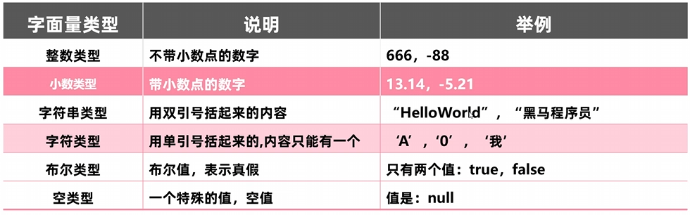

# 特殊字符

\t 又叫制表符，就是增加一个tab的空格，就是在打印的时候，把前面的字符串的长度补齐到8，或8的倍数，主要用于对齐

\r **回车符**

```java
for (int i = 0; i <= 100; i++) {
    System.out.printf("\r进度：%d%%", i); // \r 让每次输出覆盖上一次
    Thread.sleep(100);
}
```

\n**换行符**

# 变量

在程序执行过程中有可能，其值改变的量就是变量

变量的定义格式：

变量类型 变量名=值;

也可以一条语句定义多个变量。

变量类型 变量名1=值，变量2=值；

# 进制

就是0而不是o

二进制，由0b开头

十进制为，不加前缀

8进制，由0开头

16进制有。0x开头

十进制转其他，方法就是除基取余法。

比如转为2进制，一直让这种10进制除于2，得到其余数，直至该十进制数被除为0，将余数倒着拼接。就能得到二进制结果

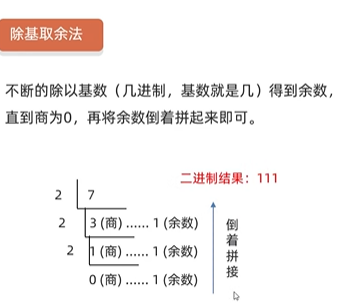

其他进制转0进制比较简单，就不提了

# ASCII

全称，美国信息交换标准码表。

在其中A代表65

a代表97

上面这个ASCII因为出的比较早，就没有汉字，还是外国人编写的。

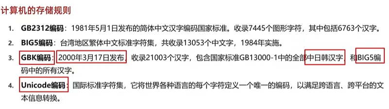

GB2312,里面存的汉字都是简体的。然后台湾仿造这个出了一个BIG5编码，里面收录的都是繁体字。

后来中国将其整合出了一个GBK编码，里面有简体，繁体，还包括中日韩文字。中文的win就是用的GBK编码

Unicode号称万国表，应该国际组织编写的将大多数国家的文字都收录进去了。

# 图片数据

分为黑白图，灰度图，彩色图

分辨率，比如显示屏为1920*1080，表示在显示器中宽有1920个像素点，长有1080个像素点

像素

三原色：红黄蓝称为美学三原色，可以通过这三种颜色搭配出所有颜色

红绿蓝，表示光学三原色也被称为RGB，都是0-255，越大颜色越深，全是255就是白色，也可以使用16进制表示，比如FF就是代表255，

黑白图：就是为每个像素涂抹了黑色不涂抹，其中涂抹了黑色代表0，不涂抹代表1

灰度图：就是在每个像素中不存0或1了，变为0—255了，255代表纯白，与黑白图类似

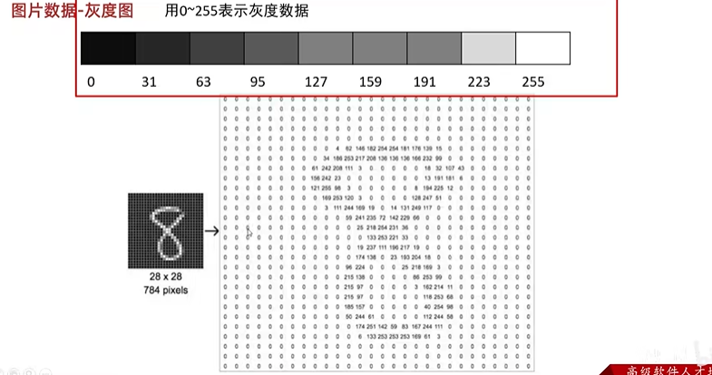


彩色图：计算机内部就是由红绿蓝三个元器件组成的一个像素点

# 声音数据

声音数据就是通过波形图展示出来的，比如说不同的音质，差一点的就是采用点比较少，波形图比较很多不能完全复原就导致音质差

# 数据类型

不同数据类型占用的字节大小为：

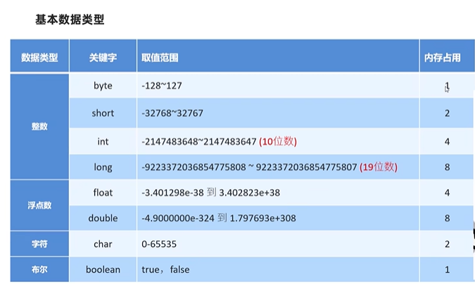

字符类型占用的大小为2字节

特别需要注意的：

对于long类型后面需要加上l或L，不过一般是L，因为l不容易区分

float类型的值后面也要加f或F,否则就会报错，因为不加f，默认的值的类型就double,出现类型不对的情况

# 标识符

就是为类名，方法名，变量名等起的名字

其命名规范为：

硬性要求：

有数字，字母，_,$符号组成

不能以数字开头，

不能是关键字

包名，方法变量使用小驼峰

类为大驼峰

# 隐式转换显示转换

隐式转换：在进行算术运算时对于取值范围小的，可以自动隐式转换为大的，再运算。

而byte,short,chat需要先转换为int再运算

原因：

**1. 统一运算规则，提高效率**

因为JVM里面的运算相关指令（iapp），针对int类型有优化，如果直接支持 `byte` 或 `short` 运算，可能需要额外的指令来处理较小的数据类型，反而会降低性能。

2.并且这也是规范里面明确规定的，如果操作数是 `byte`、`short` 或 `char`，它们会先被隐式转换为 `int`，然后再进行运算

大小关系为：byte<short<int<long<float<double

强制转换，就是强制将一个范围大的数据类型转换为另一个小的数据类型，对于基本数据类型，看范围，对于对象类型，父类强制转换为子类（容易因为范围不同，出现问题）

# 字符运算

当+操作中出现字符串就会，+就会变味字符串连接符，而不是算术运算符

当进行字符+字符,

字符+数字的运算的时候，会通过ASCII码表，查找相对应的数字，'a',97,'A'65,

整数和整数运算操作只能得到整数，要是想要得到浮点数就需要有浮点数参与运算

# 运算符

比如1+1中的+就是运算符，1+1就是表达式

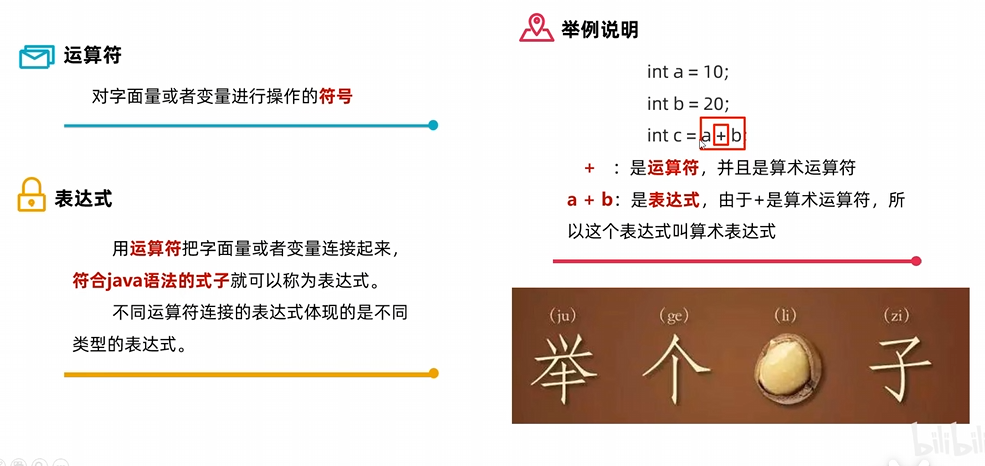

在代码中，如果有小数参与计算，结果又可能不精确，出现小数点很多位。

原理大概就是，需要将10进制的数据转换为二进制存储到内存中。而0.1转换为二进制，是一个无限循环的数，因为double和float存储有限，只能进行截断存储一部分。经过每一次的偶数舍入，就会由两个不精确的数相加，转化成一个更加不精确的数


以 **64位的 `double`** 为例，它的64个比特位是这样分工的：

- **符号位（1位）**：0代表正数，1代表负数。
- **指数位（11位）**：决定小数点的位置（范围很大）。
- **尾数位（52位）**：**这是关键**。它只存储小数部分（即 `1.` 后面的那52位二进制数字）

内部层面（硬件/虚拟机）：每一步都在舍入

当你写 `double result = 0.1 + 0.2;` 时，舍入发生了**3次**：

1. **第1次（加载时）**：把 `0.1` 从十进制转成二进制，53位放不下，**此时立刻进行“向偶数舍入”**，存成一个近似值。
2. **第2次（加载时）**：把 `0.2` 转成二进制，同样**立刻进行“向偶数舍入”**，存成另一个近似值。
3. **第3次（计算时）**：CPU 把这两个近似值相加，得到一个二进制结果。如果这个结果的小数位依然超过53位，**再次立即进行“向偶数舍入”**，才能放回内存里。

> **结论**：这个舍入是**“即时发生”**的，发生在每次赋值和每次加减乘除的瞬间。最后的 `0.30000000000000004` 是**已经舍入过之后**的最终二进制近似值，而不是最后打印时才舍入的

解决这个问题使用BigDecimal类型

既然知道了原因，在金融、货币等场景下，绝对不能使用 `double`。Java 提供了两种解决方案：

1. **使用 `BigDecimal`**（推荐）：
   必须使用 **`String` 参数的构造方法**，否则依然会带入浮点误差。

   java

   ```
   BigDecimal a = new BigDecimal("0.1");
   BigDecimal b = new BigDecimal("0.2");
   System.out.println(a.add(b)); // 输出 0.3
   ```

   

2. **使用整数（int/long）**：
   将“元”换算成“分”或“厘”，用整数存储，展示时再手动加小数点。

# 赋值运算符

比如+=,/=,*=,%=,=,+=,-=这些都是赋值运算符，意如其名，就是可以直接复制的运算符。其底层会自动强制转换

# 关系运算符/比较运算符

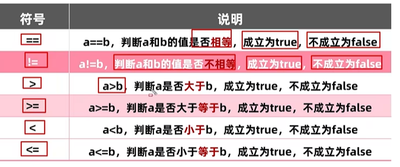

即可以进行比较的运算符，返回值都为true或flase

# 逻辑运算符

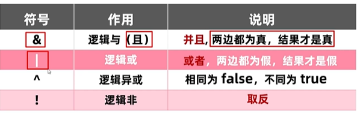

还有短路逻辑运算符

# 三元运算符

关系表达式?表达式1:表达式2

就是满足关系表达式的话结果为表达式1，不满足就是表达式2

# 原码，反码，补码

原码是一个二进制数，最左边为符号为0正，1负

正数，反码和补码都是原码本身

负数，反码为原码符号位不变，其他位取反，补码为其+1


反码是因为原码不能解决计算负数问题出现的。

补码是解决（负数计算跨0的问题）+0和-0的对应的反码不一样，这样就会导致计算过程中出现误差，比如二进制数11111110加1的话为11111111为-0，再+1为00000000还是0，就是是0只能有一个表现形式，+0补码还是00000000，-0，因为补码是+1，还是00000000。所有数字的存储和计算都是采用补码进行的。对于补码11111111+1=100000000，因为只去8位，所以就是0


-128只有补码，没有原码和补码

不同类型的数字在计算机中的存储为

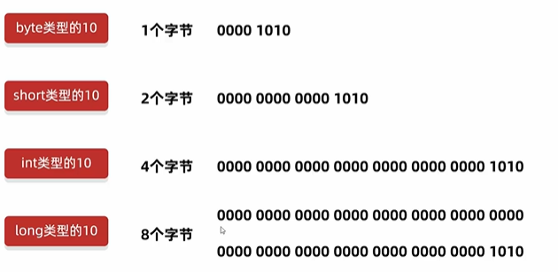

数字的逻辑运算

&  逻辑与    0为false，1为true，两个都true才为true，0错1对

|   逻辑或    一true就为true 如果数小的话还是会有越界的情况

比如

```
  System.out.println((byte)0b10000001<<1);
```

这个就是代表的补码

<< 左移   就是将二进制数向左移动，然后低位补0，就相当于*2，只不过效率更高，

.>> 右移  类似/2,高为补0或1，分正负

.>>> 无符号右移  向右移动，无论正负都高位补0

没有无符号左移

# break

在不同位置的作用。

在Switch里，表示结束

在循环内表示强制结束循环，但只能结束一层

# return

写在方法里面的关键字

对于有返回值的返回数据。没有的结束该方法

# continue

只能在循环内，表示跳过该次循环

# 数组

是一个容器，用于存储多个同一类型的数据。当然这个同种类型如果自动的进行隐式转换，也能行

因为方便计算位置下一个地址值，所以存储的都是同一类型

也能存对象类型的数据

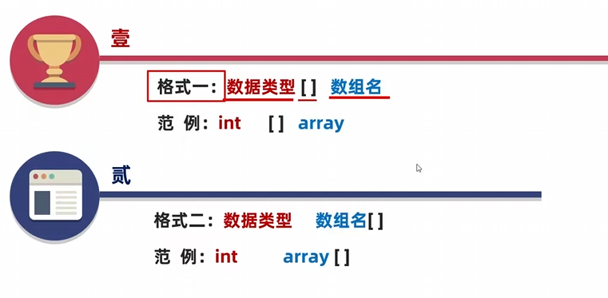

静态初始化

也可以cat c={c,c1}

```java
cat c = new cat("hao",1);
        cat c1 = new cat("hao",12);

        cat[] a  = new cat[]{c,c1};
```

动态初始化

```
cat[] a=new cat[10];
```

其各数据类型的默认值

整数类型为0

小数为0.0

字符为'\u0000' 也就是表示空格

布尔类型为false

引用数据类型为null

对象的成员变量的默认值也是这个

# java的内存分配

将JVM分为以下几个部分

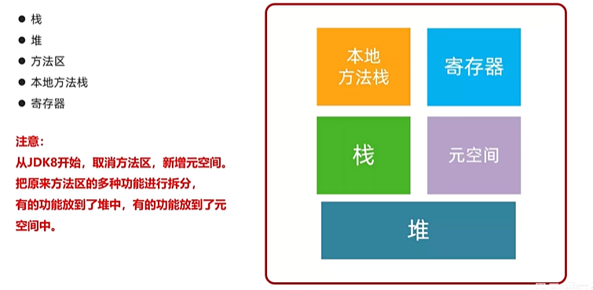

JDK7及之前，方法区和堆连在一起，空间也连续

便于理解还是使用方法区的名字

栈：就是方法运行时所用的的内存，比如main方法进入方法栈里面运行，方法运行完出栈

堆：就是new出来的放到这里面

方法区:存储可以运行的class文件

本地方法栈：JVM在使用操作系统功能的时候使用的，和我们的开发无关

寄存器：给CPU使用，跟开发无关


堆：new出来的在堆里面开辟空间并有地址值

# 数组的内存

对于基本数据类型，随着方法进入栈内，方法内变量开始声明，基本数据类型其值和变量名都在栈内存储，引用数据类型只保存变量名和在堆空间里面的地址值，

对于数组在堆空间中存储了，数组的长度这些

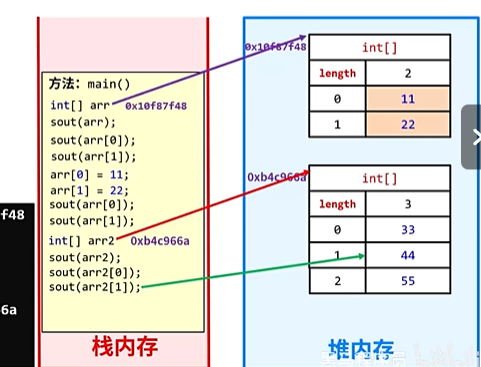

# 方法

方法是程序中最小的执行单元，对于方法内的语句并不能单独执行，引用完这个方法才会执行方法里面的语句

提高代码的复用性和可维护性

# 方法重载

在同一个类中方法名相同，但参数的个数或类型不同，与返回值无关，是与参数的类型有关的，与参数的形参名无关

# 方法调用的基本内存原理

就是就是方法不断入栈和出栈的过程。当前方法在栈中，那么当前方法就在运行

# 基本数据类型和引用数据类型的区别

基本数据类型：数据值存在自己的空间中。

引用数据类型是自己空间中存储的是地址

# 面向对象

面向过程：就是你自己一步步去完成一件事

面向对象：就是相当于找一个事物去让这个事物去完成一件事

# 类和对象

类：相当于一个设计图，是对象共同特征的描述

对象：是类的实例，具有状态和行为，真实存在的事物

# 类内的东西

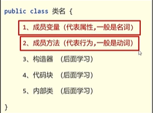

一个java文件中可以定义多个class类，但只能一个类是通过public修饰，且该类名必须为文件名

# 标准javabean类

描述一类事物的类，叫javabean类

里面没有main方法

一般里面有成员变量，成员方法，构造器等

标准：

成员变量使用private修饰

提供至少两个构造方法，一个全参，一个无参

成员方法，set,get方法和其他方法

# 工具类

不是描述一类事物的类，而是帮我们做一些事情的类

私有化构造方法，不让创建对象

# 测试类

用于检查其他类是否书写正确，带有main方法的类，是程序的主入口

# 封装

告诉我们应该如何正确的设计对象的属性和方法

对象代表什么，就要封装对应的数据，并提供数据对应的行为

封装就是将对象内部的数据隐藏起来，不能直接访问，而是提供相应的接口去访问，并将零散的数据封装为一个整体

# 成员变量和局部变量

成员变量在类内方法外，局部变量在方法内

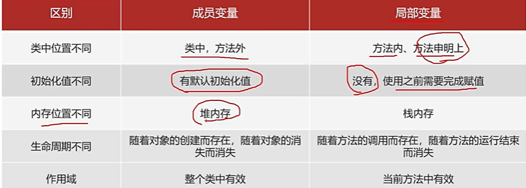

成员变量的内存存在位置，因为存在对象这个地址里面，所以在堆内存内，作为对象的一部分

# 就近原则

如果同时有相同变量名的成员和局部变量，直接访问该变量就是获得的成员变量的值

set方法里面的this就是这个意思

在继承关系中

也可以使用就近原则，，如果父子都有某一个字段，在子类里面有一个方法，需要访问该字段，就需要会直接访问子中的字段

需要使用super来访问父类

# this关键字

本质;所在方法调用者的地址值

# super

代表父类存储空间

# API

应用程序编程接口

简单理解：就是别人写好的东西，我们不需要自己编写，直接使用即可


# 字符串

字符串内容不会改变，不能更改，改变过后就是新创建的一个字符串

构造方法有：直接赋值

使用字符串赋值

使用字符数组

使用字节数组

字符串常量池（串池），jdk7以前在方法区内，jdk7以后放到了堆内存中。只要是自己赋值的字符串都是放到串池里面。对于直接赋值的字符串，会先在串池里面寻找，没有再创建新的，有则复用，将其地址给该字符串

字符串不能变，**就是因为底层使用了final修饰的一个字节数组，但是这样只能保证地址不能变。不重要**

**其还使用了private修饰，外界直接不能访问，并且并没有提供get，set方法。重要**

# ==比较

对于基本数据类型，比较的内容，引用数据类型比较的地址值。

对于比较字符串这些引用数据类型，使用equals()方法和equalsIgnoreCase()忽略大小写

其本质是字符串类重写了继承object的equals()方法，object里面的equals()方法还是直接比较的地址值。而字符串里面的equals()重写后先比较其地址值，相同直接返回true，不同再比较内容是否相同

# StringBuilder

可变字符串，创建后其内容可变。解决字符串频繁创建的问题，并且有很多提供的API。

构造方法：

new StringBuilder()创建一个空的对象

与字符串一样new，并增加内容

常见方法

append()进行拼接，并返回对象本身

reverse()反转容器中的内容

length()返回长度

toString()将StringBuilder对象转换为String对象

# StringJoiner

产生的原因就是简便StringBuild有开始结尾，以及分割符。

# 链式编程

当我们调用一个方法时，不将其赋值其他变量后再调用方法，而是直接调用其他方法

# 字符串原理

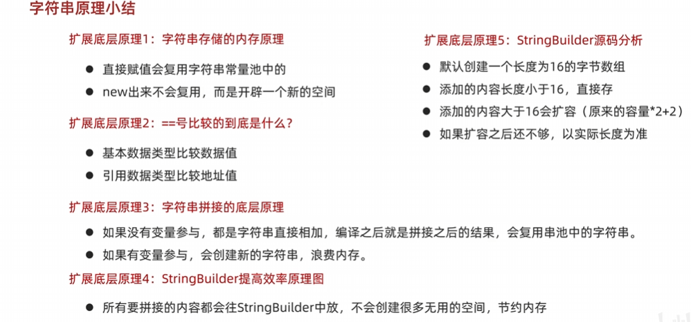

字符串拼接的原理

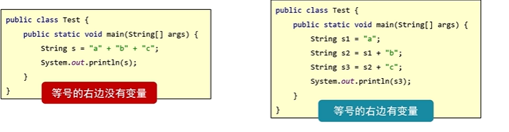

没有变量参与的情况下：会进行优化，在编译时就已经是最终结果。与s="abc"一样

有变量参与：在jdk8以前是底层通过StringBuilder进行拼接，但是确是创建了多个StringBuilder对象再toString

jdk8时：先去预估字符串的最终的长度创建一个数组，将字符放入进去，再变成字符串。

不过性能还是差，字符串拼接还是要使用StringBuilder.

如果很多字符串变量拼接，不要直接+，底层会创建多个对象，浪费时间。

StringBuilder提高效率原理：

所有拼接的内容都会往StringBuilder中放，减少创建内存，不会创建很多无用的空间，节约内存

StringBuilder源码：

刚创建时，是一个默认容量为16的数组

扩容机制：超过后容量变为2*原+2

过多，按实际多少就多少。


# 集合简介

解决数组长度不可变的情况。

与数组的差别

数组长度固定，集合长度可变


集合不能存基本数据类型，想要存，只能放基本数据类型的包装类。

集合类的底层数据结构（如`ArrayList`的`Object[]`数组，`HashMap`的`Node<K,V>`对象数组）在JVM中都是**引用类型数组**。

并且使用泛型是因为基本数据类型不是Object的子类，无法进行复原

数组，既可以存引用也可以存基本


再没有为集合声明泛型时，里面能同时存不同的数据类型。数组就不能


常用的方法

add()  

remove()  分别有根据索引和根据元素

set(index，a)  修改指定索引的元素

get(index)获取指定索引的元素

size获取集合的长度

# static静态

是java的一个修饰符，可以修饰成员方法，和成员变量

被static修饰的变量为成员变量，是属于类的，跟随类的创建而创建，可以通过类或对象调用。

修饰的方法，为静态方法，也是属于类，一般用于工具类，不需要创建对象就能使用方法

有main方法的类是测试类

注意事项：

静态方法**只能**访问静态变量和静态方法，因为静态方法里面没有this，怎么访问非静态的啊。

非静态方法可以访问静态变量或静态方法，也可以访问非静态。因为静态方法属于类，所有谁都能访问

静态方法中没有this关键字


非静态的方法，什么都能访问。静态的只能访问静态。因为静态方法里面没有this关键字

非静态方法是需要对象去调用，静态方法不能创建


非静态方法里面隐含的this关键字，在参数中，只不过是JVM自动赋值的。

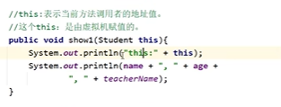

静态方法就不能这样

从内存方面理解

静态的属性和方法跟类有关系，会随着类的加载而加载。

非静态跟对象有关系，会随着对象的创建而加载

因为静态的东西已经存在于内存中了，故可以相互调用，也就是静态可以调用静态

静态方法不能调用非静态变量：静态属性是存储于堆内存中的静态存储区中的 ，而静态方法调用时无法从静态区中找到非静态变量


# 继承

可以让类与类之间产生父子关系

通过extends关键字

在父类的基础上增强，共性抽取，提高复用性

多层继承

子类只能访问父类中非私有的成员


子类能继承父类的内容

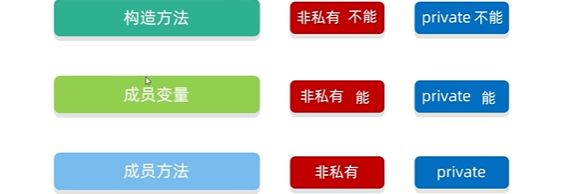

构造方法不能继承的原因是，如果能继承下来，构造方法名和子类的类名又不一样，就没有意义。


成员变量，对于private的成员变量虽然能继承，但是不能使用，通过get和set才能使用

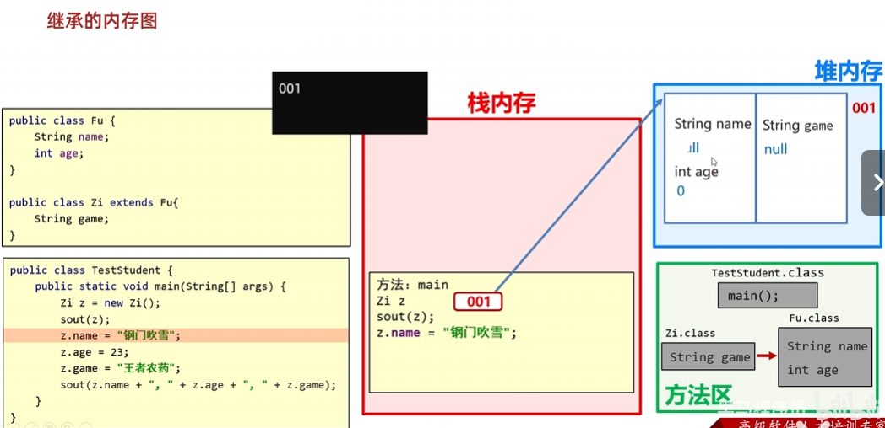

会先在子对象的内存里面寻找，找不到再去父里面找

其在堆空间中分为两块区域，一块存当前类的变量，一块存父类的变量

成员方法，是在虚方法表里面就能继承

而非私有

非静态

非final（final就是表示不能被重写，继承不下来）

进放入虚方法表里面

# 构造方法的访问特点

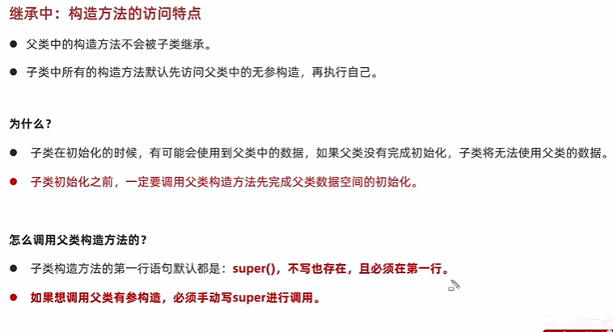


# 方法重写

在继承体系中，子类出现了一模一样的方法声明，我们就称子类这个方法是重写方法

重写方法上面有@Override注解，用于检查重写方法是否正确

重写会覆盖虚方法表里面的方法

# 多态 

在继承或实现体系中，同种类型的对象，表现出不同的形态

对象的多种形态

表现形式：

父类类型 对象名称=子类对象;

前提：

有继承或实现

表现形式

有方法的重写（不然没意义）

好处：

使用父类类型作为参数，可以接收所有子类类型

缺点：

不能使用子类的特有功能

需要把父类对象强转为子类

使用instanceof关键字进行判断

多态调用成员的特点


变量调用：

如果使用多态方式，创建的还是父类对象，由就近原则来确定，如果父类里面没有，则编译失败，并且运行也是看的左边

方法调用：


理解：因为多态关系中本质上创建的还是父类对象，所有编译时都要看看，父类里面有没有。

故对于变量调用，运行之后还是父类的变量。

成员方法;因为子类对方法进行了重写，在虚方法变里面的方法改变了所以运行结果看子类里面的

# 包5

就是文件夹，用用于管理不同功能的java类，分别维护。

命名规则：域名反写+包的作用

如果多个包内有相同的类：需要使用全类名调用：

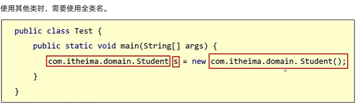

# final4

方法：不能被子类重写

类：不能被继承

变量：不能改变，为常量，全部为大写

修饰基本类型;不能改变

引用类型：地址不能变，内容能变

字符串不能变，就是因为底层使用了final修饰的一个字节数组，但是这样只能保证地址不能变。

其还使用了private修饰，外界直接不能访问，并且并没有提供get，set方法。

# 权限修饰符4

用来控制一个成员能被访问的范围的

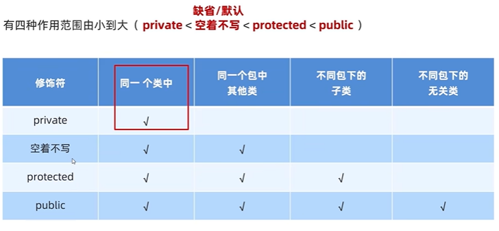

# 局部代码块4

处于方法里面的位置的，代码块{}，作用就是提前结束代码的生命周期，节约内存，用完就回收

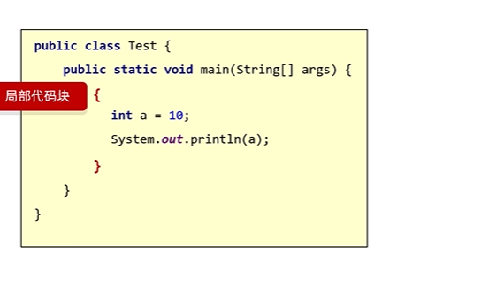

现在用不到

# 构造代码块5

在成员位置的代码块，优先于构造方法执行，将构造方法里面的重复的代码，抽取到构造代码块里面。优先于构造方法执行。

每次执行构造方法创建对象，就会先执行该方法。

现在也不用，可以抽出一个方法，也能完成。

# 静态代码块5


作用：就是初始化数据

# 抽象类3

解决的是子类内容不匹配的问题，如果子类不重写也不报错，不能强制子类重写方法。

适用于方法体不确定的方法或想让子类强制重写

抽象方法，没有方法体，子类必须强制重写。

使用abstract修饰。

抽象类：如果类中存在一个抽象方法，那么该类必须声明为抽象类。 

抽象类不能被实例化，也不一定有抽象方法

子类要么是抽象类，要么重写所有抽象方法，

可以有构造方法，其子类为父类属性进行赋值

# 接口3

接口就是一种规则。为某一个对象提供一个功能，就是一个功能

抽象类，就是一类事物，

使用interface定义

接口不能实例化

与子类之间是实现类。

其子类（实现类）

要么是抽象类

要么实现所有方法

可多实现

接口中成员的特点：

成员变量：

只能是常量

默认修饰符：public static final

因为接口就是提供的一个功能，是一个规则，不能发生改变

构造方法：

没有构造方法，是为了方便为成员变量赋值，但是成员变量都是常量

成员变量：

只能是抽象方法

默认修饰符：public abstract

jdk7以前：全部都是抽象方法

jdk8：可以定义有方法体的方法（默认，静态）

jdk9：可以定义私有方法


接口与接口之间，是继承关系，可以多继承


jdk8特性产生的原因，只要接口里面增加或修改了新的抽象方法，实现类必须要更改，否则会报错。为了让实现类不报错，只要添加有方法体的方法就行了。


接口升级：在接口内增加了新的方法。

允许在接口中定义**默认方法**，需要使用关键字default修饰，解决接口升级问题

格式:public default 返回值类型 方法名(参数类型){}

注意事项：

不是抽象方法，不强制重写，但是如果被重写，就必须去掉default关键字

public能省略，default不能

如果实现了多个接口，里面有同名的方法，就必须重写


也运行定义**静态方法**

public能省略，static不能

通过接口名进行调用

但是不能被实现类继承，不能重写，强行的就是实现类，自己写的方法，不叫重写

 

jdk9特点

抽取出来的共有方法，但是也不想让别人用

格式

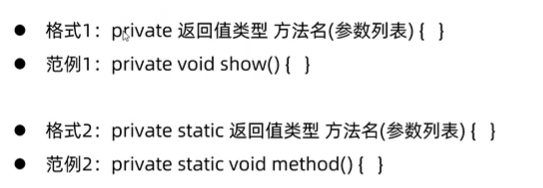

格式1为默认代码服务

格式2为静态代码服务

毕竟静态修饰的只能调用静态


接口代表规则，是行为的抽象。想要那个类拥有那个行为，就实现相应的接口。

当一个方法的参数为接口时，就能传递接口所有的实现类对象，这种方式称为接口多态


# 适配器设计模式4

设计模式就是一种套路

这个模式，是为了解决接口与接口实现类之间的矛盾问题

一个接口中抽象方法过多，但是我只要使用其中一部分的时候，使用适配器设计模式

就是一个接口里面有很多抽象方法，但是我又不想全部都实现。于是就在其中间增加一个适配器，就是实现接口里面全部的方法，但是没有实际的代码功能，再有其子类，也就是我们最初想要的类，去实现想要实现的类。


# 内部类5

类里面的类


# 匿名内部类4

就是没有名字的类

适应于：只使用一次的情况

在可以直接创建类的子类或接口的实现类。对其内部的方法进行重写。减少了重新创建新类的麻烦

格式：new 类名或接口名(){

重写的方法

}

一般用在参数是一个抽象类或接口的地方

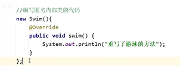

# 常用的API

# Math3

是lang包内的

是用于数学计算的类

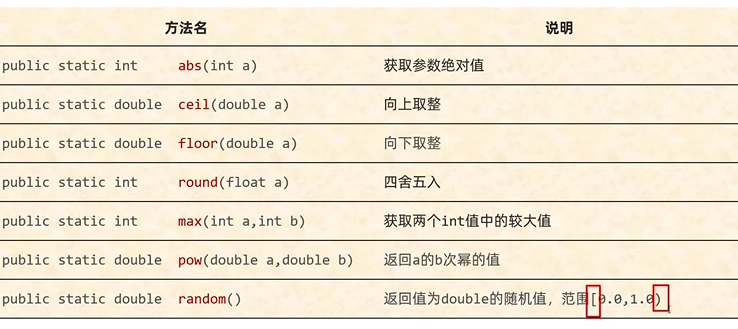

# System4

提供了一些与系统相关的方法

计算机实际的原点:1970年1.1 0.0.0

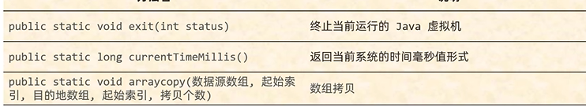

exit里面的status=0是是正常退出，其他的是异常退出

# Runtime3

表示当前虚拟机的运行环境，可以获得当前虚拟机相关的性能等

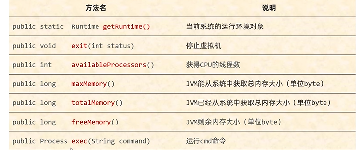

使用方法Runtime.getRuntime()来获取对象，然后再调用方法

# Object4


顶级父类


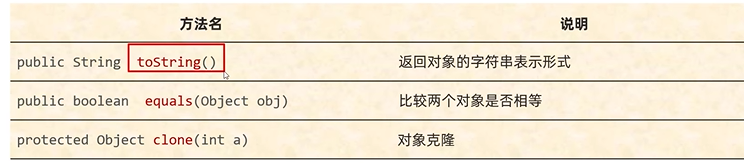

toString()需要类自己去重写，不然结果就是包名类名@地址值

equals类不自己重写，就是比较的地址值，默认使用==比较

clone默认是浅克隆，深克隆一般转为json再转回来就行，不然使用默认的太麻烦了

# 对象克隆4

把a对象的属性值完全拷贝给b对象，也叫对象拷贝，对象复制

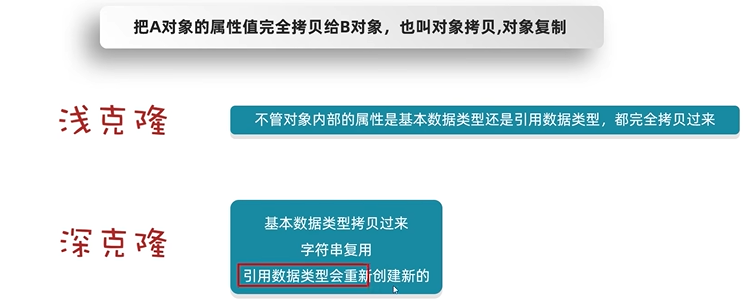

浅克隆，

对于对象里面的属性

基本的：把属性值拷贝过来

引用的：把地址拷贝过来

深克隆：

基本的：把属性值拷贝过来

引用的：创建一个新的

但是存在串池里面的数据，还是会直接拷贝地址值

# Objects4

对象工具类

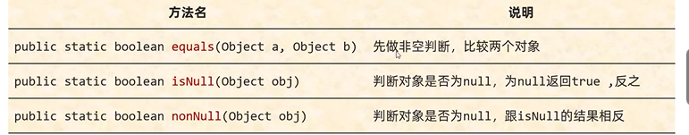

equals底层先是比较其地址值，然后再调用a内的equals方法类比较

# 包装类5

就是基本数据类型对应的引用数据类型

解决基本数据类不能调用方法的问题，丰富功能

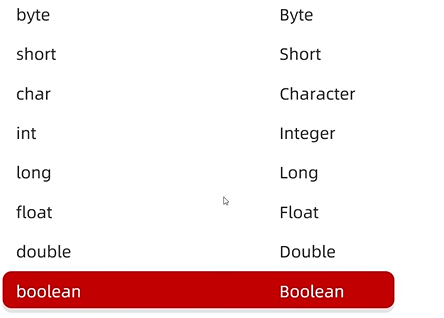

JDK1.5的时候，出现了一个新特性，自动装箱，自动拆箱

自动装箱，基本类型变为包装类

获得包装类对象，自动赋值就行了

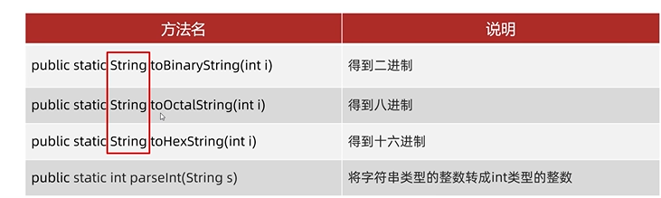


# 基本查找/顺序查找5

就是一个个从左到右去比对，是否一样

# 插入排序5

有一个数组，里面都是数字，把前几个认为是有序的，比如前两个，后面的所有数据都认为是无序的。然后从后面的数据中逐个的拿出来从有序的数据，从后向前，就是从大到小，一个个比对，直到找到合适的位置，如果有一个是相同数据，就排在这个数据的后面，直至完全排完

# Arrays3

操作数组的工具类

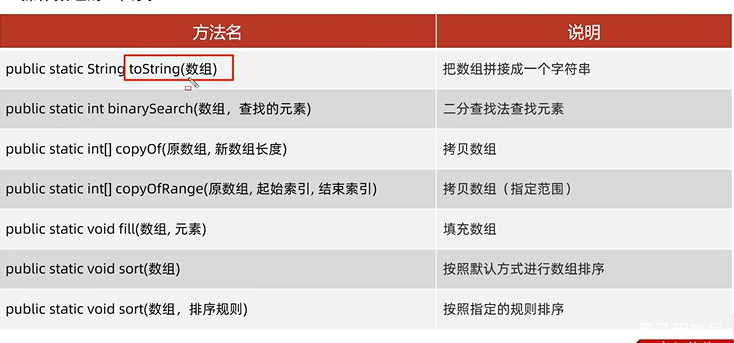

toString()方法就是底层使用stringBuilder来拼接数组里面的各部分

binarySearch()方法，因为是二分查找，必须要求数组内有序

如果存在就是返回其值所在索引，没有就是索引（-插入点-1），什么叫插入点，就是应该在什么位置，因为是按顺序的的所以能找到插入点，为什么要-1呢。因为如果要插入的位置是索引0，这样就不好区分

copyOf()底层就是使用的System的arraycopy


copyOfRange()方法就是包头不包尾，包左不包右

如;0-9就是取0,1,2,3,4,5,6,7,8几个索引的数据

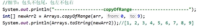

fill()将该元素就是覆盖数组里面的所有位置，底层就是

sort()默认根据基本类型升序

可以使用排序规则

如果要使用排序规则，必须要把类型转换为其包装类，第二个参数时一个接口，可定义排序规则

```java
    Integer[] arr = {2,5,8,7,1,9,2,8};
       Arrays.sort(arr, new Comparator<Integer>() {
           @Override
           public int compare(Integer o1, Integer o2) {
               System.out.println("----------------------------");
               System.out.println("o1:"+o1);
               System.out.println("o2:"+o2);
               return o1 - o2;
           }
       });
       System.out.println(Arrays.toString(arr));
```

排序底层原理：

利用插入排序和二分查找的方式进行排序

默认把0所有的数据当做有序的序列，1索引到最后都认为是无序的序列。，根据插入排序进行排序，但是将无序的元素与有序数据使用二分查找进行比对，提高性能

比较的规则就是compare方法的方法体

如果方法的返回值是负数，拿着A跟前面的数据进行比对

如果是正数就和后面进行比对

如果是0，也和后面比对

参数o1:表示在无序序列中，遍历得到的每一个元素

o2：表示有序序列中的元素


o1-o2升序

o2-o1降序

这个在进行对象比较是可以在类里面重写这个方法

如果想要自定义其他的排序规则，

返回的结果这里定义排序规则，就是一个递归

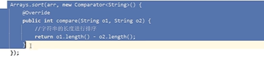

# lambda表达式4

函数式编程思想：强调干什么，谁干的不关心

面向对象思想：是找对象，然后让对象干事情

格式：()->{

}

注意：

简化匿名内部类的书写

只能简化函数式接口的匿名内部类的写法

函数式接口：有且仅有一个抽象方法的接口叫函数式接口，其接口上方需要@FunctionalInterface注解


省略规则：可推导可省略

参数类型可以省略不写，因为一一对应，可以推导出来

如果只有一个参数，参数类型可以省略，同时()也可以省略，没有参数的话()一定不能省略

如果方法体只有一行大括号，分号，return可以省略不写，但必须同时省略

# 单列集合4

Collection是单列集合的顶层接口

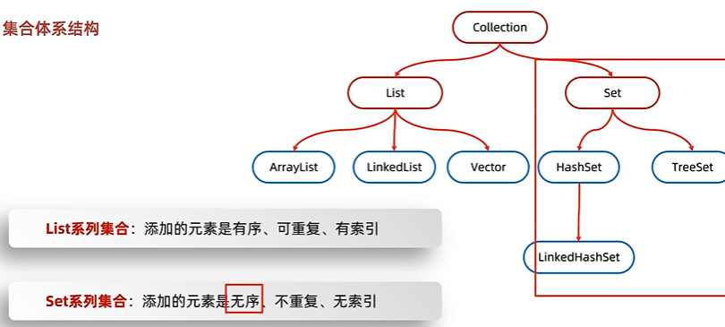

红色为接口，蓝色为实现类

list：有序（指放入和取出的顺序一致）是因为例如ArrayList底层是数组肯定有序，还可以重复，有索引，LinkedList底层是链表，也是如此

Set:例如HashSet是数组，链表，红黑树，因为需要哈希运算，所以无序，不重复，并且还没有索引，TreeSet底层是一个树，也是这样没有序，不重复，无索引

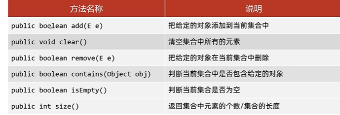

注意点

add()方法对于list分支没有false这一说，对于set添加重复的时候才会有true

remove()因为是共性的接口，所有里面只能通过元素删除，有则删除成功，无则删除失败，返回false

contains(),底层是通过equals()方法就行比较的，所以自定义对象类型需要重写toString方法

# 迭代器4

迭代器在java中的类是Iterator，迭代器是集合专用的遍历方式

在集合中一般使用的遍历方式为：

迭代器

增强for

lambda也就是forEach

以为其顶层接口实现了Iterator接口，必须实现该接口才能获得迭代器对象。

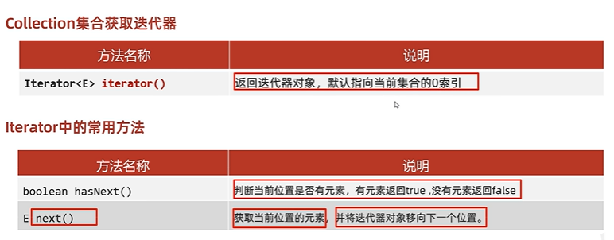

注意点：

变量完成之后，指针不会复原，再获取一个迭代器对象就行了。

循环里面只能用一次next方法，避免超出范围，出现异常

不能使用集合的方式进行增加或删除。应为迭代器的底层原理，记录的原来的集合的长度

可以使用迭代器自带的remove()方法根据条件进行删除指定的元素

```java
ArrayList<cat> a=new ArrayList<>();
a.add(new cat("1",  2));
a.add(new cat("2",  1));
a.remove(new cat("1",  2));
       Iterator<cat> i= a.iterator();
       while(i.hasNext()){
           cat c=i.next();
           i.remove();
           System.out.println(c.getName());
       }
```

# 增强for5

增强for的底层就是迭代器，为了简化迭代器的代码的书写

所有的单列集合和数组，才能用增强否进行遍历

但是数组却不能使用迭代器遍历，因为没有实现迭代器对象。

但是又为什么能够使用增强for呢，因为数组使用增强for在其底层优化了，其没有使用迭代器对象，而是与普通的使用索引进行循环一样。只不过是写法不一样而已

虽然增强 for 循环在语法上看起来一致，但 Java 对数组和集合的处理在底层是不同的：

- **集合**：使用迭代器（通过 `iterator()` 方法）
- **数组**：被编译为传统的索引循环

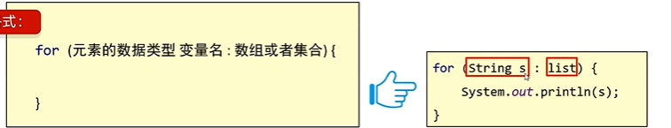

# lambda遍历5

其利用的是forEach这个方法


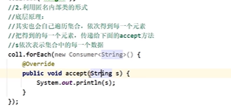

调用其自身带的forEach方法

其底层还是基于迭代器实现的

# List集合4

List集合有索引，所以多了很多有索引的方法，根据索引删除，增加，修改，查询

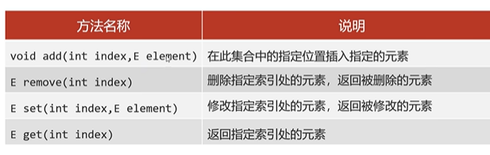

删除元素有一个注意点：

list.remove(1)

表示的是删除索引1还是元素1。

根据方法的重载，根据参数的类型进行调用，虽然会自动装箱，但是如果不装箱也能调用，肯定选择不装箱的那个，集合里面存的都是包装类，直接根据1删除，很明显删的是索引1。如果将1转为包装类再删的话，就是删的元素


根据索引增加元素，当前索引及后面元素会向后移动


set()返回修改前的元素


# List集合的遍历的方式4

5种迭代器遍历，增强for遍历，lambda表达式遍历，普通for，列表迭代器遍历

列表迭代器

```java
     List<Integer> list = new ArrayList<>();
        list.add(1);
        list.add(2);
        list.add(3);
        list.add(4);
        ListIterator<Integer> it = list.listIterator();
        while (it.hasNext()) {
            it.add(5);
            System.out.println(it.next());
        }
```

但是结果却是为

```
1
2
3
4
```

这要看迭代器的源码，就是一个备份

# ArrayList源码分析3

底层有一个size属性记录元素个数

扩容机制：

1.使用空参构造方法创建集合时，其底层会创建一个长度为0的数组。

2.当添加第一个元素时，会将其扩容为10

3.当添加满10元素后，再添加就会触发扩容机制，变为1.5倍

4.如果一次性添加多个元素，触发1.5倍扩容机制后容量还不够，那么就会将容量扩容到实际要存入的元素个数+当前元素个数的容量


该扩容就是新创建一个数组，使用Arrays工具类copyOf()方法进行拷贝

# LinkedList集合4

其底层是双向链表，查询慢，增删快，如果操作的是首尾元素，速度也很快。所以有特有操作首尾元素的API

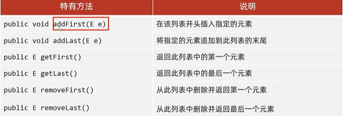

底层源码

其底层就是每次新添加一个元素，就新增一个节点，并将size++并设置为尾节点

# 迭代器底层源码2

下面的方法都是ArrayList的内部类里面的方法，所以能够直接获得集合的长度

iterator()

其底层就是创建一个内部类（ArrayList的内部类）Itr对象，多次调用就是相当于创建多个迭代器对象

cursor属性，表示当前所指索引，默认初始化为0

lastRet=-1表示上一次操作所指索引

hasNext

```java
 public boolean hasNext() {
            return cursor != size;
        }
```

底层就是判断是否达到上限

next（）

底层就是先判断是否cursor>size，是的话抛异常

然后将cursor+1

再根据lastRet（因为在这个方法里面先赋值给了这个，再+1）获取上一个的值，返回


modCount属性，该属性与并发有关

集合删除或添加这个数据的时候就会修改这个属性

该属性记录的是集合变化的次数

再创建迭代器对象的时候，会将该属性赋予一个expectedModCount

如果再迭代器迭代过程中使用集合的方式增加或删除数据。就会导致这两个值不一样

报出并发修改异常

每一次调用next()方法都会校验这个属性是否一致


迭代器对象里面的remove()底层还是调用的ArrayList里面的remove对象

```java
 public void remove() {
            if (lastRet < 0)
                throw new IllegalStateException();
            checkForComodification();

            try {
                ArrayList.this.remove(lastRet);
                cursor = lastRet;
                lastRet = -1;
                expectedModCount = modCount;
            } catch (IndexOutOfBoundsException ex) {
                throw new ConcurrentModificationException();
            }
        }
```

不过调用这个remove方法时，不能还没有执行next()方法就使用会报出IllegalStateException()异常，也不能连续两次调用

目的是避免cursor=-1出现异常

# 泛型3

JDK5引入的特性，可以在在编译阶段约束操作的数据类型，并进行检查

就是将出错的时间，从运行时期提前到编译时期

泛型只能写引用数据类型（因为基本数据类型是不能转为Object类型的，因为基本数据类型根本就不是一个类，就是一个是语言内置的、**非对象**的简单类型。

统一数据类型


java中的泛型是伪泛型，只在编译时期是有效的。

就是相当于是一个门，向集合中存数据的时候检验是否为该类型，但是存入到集合内还是Object类型。

取出的时候，会强转回来

泛型在编译为字节码文件的时候就会消失，叫泛型的擦除

# 泛型类3

当一个类中有某个变量的数据类型不确定的时候，就可以使用定义带有泛型的类

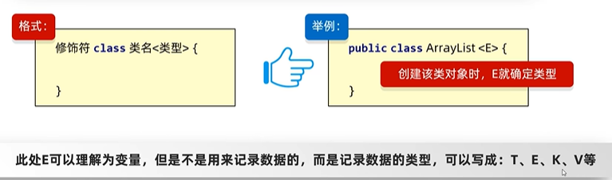

当然这个E可以使用任何东西都行，只不过，这个用的比较多而已。

**`T`（Type）**

- **场景**：表示任意类型，通常用于泛型类或泛型方法的通用类型。

**`E`（Element）**

- **场景**：通常用于集合类中，表示集合中的元素类型。

k,v:表示定义这个类型

```
HashMap<K,V>
```

在创建对象的时候就能为其赋值

# 泛型方法3

适应于一个方法中形参的类型不确定的时候使用。

```
public <T> T[] toArray(T[] a) 
```

，如果所有的都不确定，一般都是使用类里面定义的泛型

能够接收任意的数据类型

# 泛型接口3

就是在接口里面使用的泛型

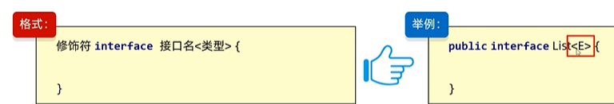

使用方式1：实现类给出具题的类型

```
public interface List extends Collection<String>
```


方式2：实现类延续泛型，创建对象的时候再确定

例：比如ArrayList继承的List接口

```java
public class ArrayList<E> extends AbstractList<E>
        implements List<E>, RandomAccess, Cloneable, java.io.Serializable
```

或者接口继承接口

```
public interface List<E> extends Collection<E>
```

# 泛型的基础和通配符3

这个泛型通配符就是为了解决泛型方法的弊端的，可以传入任意的数据类型，因为是E

即使 `Integer` 继承自 `Number`，`List<Integer>` 和 `List<Number>` **没有继承关系**。

```
List<Number> numbers = new ArrayList<Integer>(); // 编译错误！
```

编译器会报错，因为 `ArrayList<Integer>` 不是 `List<Number>` 的子类型。

泛型不具备继承性，但数据具有

泛型不具备继承性

意思是比如说，定义一个方法参数的泛型为父类，就只能传递为父类，

数据具有

比如集合中，设定了父类的泛型，但是还能能够存入子类对象


解决这个问题的方法就是泛型的通配符

?也表示不确定的类型与E类似

? extends E  表示可以传递E或者E的所有子类类型

? super E 表示可以传递E或者E的所有父类类型

用法

单使用?做限定时，对与泛型方法而言


```
List<? extends Number> list = new ArrayList<Integer>(); // ✅ 允许
```


不需要在前面再次声明

```
  public <T> void add( T t)
```


解决的就是不确定类型，但是却只能传递有继承关系的

# 二叉查找树4

规则就是：

小的存左边，大的存右边，一样的不存

弊端，容易变为一条链表

# 二叉平衡树4

解决这个，容易变为一条链表的弊端

任意节点左右子树高度差不超过1

当左右子树高度差大于1通过旋转来解决，二叉数不平衡的问题

# 红黑树4

不需要旋转，自平衡二叉树。

通过特有的红黑规则来平衡的

# HashSet4


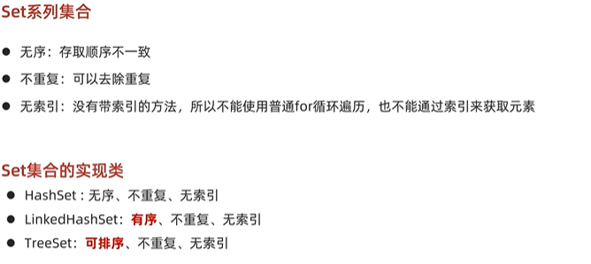

方法直接使用Collection里的方法

创建的HashSet底层就是创建的创建的HashMap

```java
private transient HashMap<E,Object> map;
```

```java
public HashSet() {
    map = new HashMap<>();
}
```

调用的HashSet里面的所有方法都是封装的HashMap里面的方法。

例如add()

```java
public boolean add(E e) {
    return map.put(e, PRESENT)==null;
}
```

就是将存入的数据为Key,

```java
private static final Object PRESENT = new Object();
```

在创建一个空对象为v


底层数据结构是哈希表。

哈希表是一种对于增删改查性能都不错的数据结构

哈希表组成

JDK8之前：数组+链表

JDK8开始：数组+链表+红黑树


哈希值：对象的整数表现形式

不是根据索引进行存储的

而是根据int index=(数组长度-1)&哈希值，进行逻辑运算

来计算应存入的位置

根据hashCode方法算出来的int类型的整数

该方法定义在Object类中，所有的对象都可以调用，默认使用地址值进行计算

一般情况下，会重写hashCode方法，利用对象内部的属性值计算哈希值

对象的哈希值的特点

如果没有重写hashCode方法，不同对象计算出来的哈希值是不同的

如果已经重写了hashCode方法，不同对象，只要属性值相同，那么哈希值就一样

在小部分情况下，不同属性值或不同地址值计算出来的哈希值也可能一样（哈希碰撞），因为int的取值范围内一共有42亿个


的原理

底层使用空参构造创建HashSet，就是创建的一个HashMap对象，因为是直接空参构造创建，所以其刚开始没有添加元素时为null

当添加第一个元素时才有数组，resize()通过该方法创建新数组以及扩容

1.创建一个默认长度16，默认加载因子为0.75，数组名为table

2.根据哈希值记录应存入的位置

3.判断当前位置是否为null,如果是null直接存

4.如果不为null,表示有元素，则调用equals方法比较属性值

5.一样不存，不一样存入数组，形成链表

JDK8以前：新元素存入数组，老元素挂在新元素下面，，头插法

JDK8以后：新元素直接挂在老元素下面   ----尾插法


6.当存入的元素大于容量*加载因子的长度时，会总容量*2进行扩容


7.JDK8以后，当链表长度超过8，且数组长度大于或等于64是会变为红黑树

8.如果变为红黑树后不满足就会退化


如果集合里面存入的是自定义对象，必须重写hashCode和equals方法


HashSet的存取顺序为什么不一致？

取的顺序，

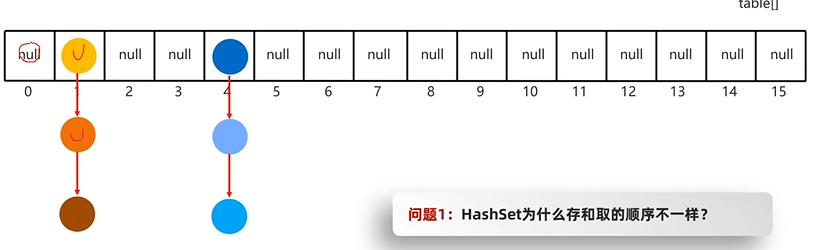

从数组上面一个个取找，到链表或红黑树时，逐个向下找


通过hashCode和equals方法进行去重

# LinkedHashSet4

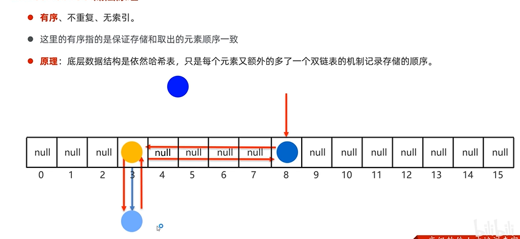

有序的原理就是;底层通过双向链表来保证有序的

# TreeSet4

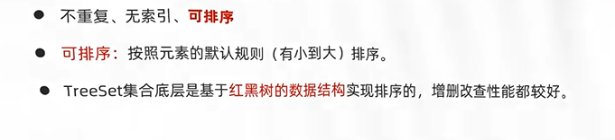

可排序：是底层根据默认排序规则进行排序的。

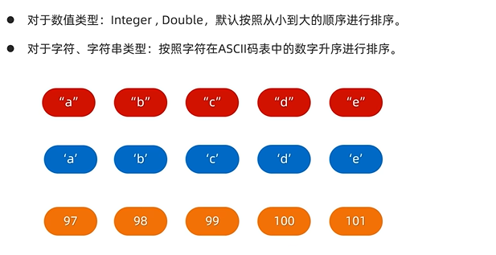

我们如果想要存入自定义数据类型，需要自己去指定排序规则。

如果不自定义排序规则就会抛出异常，表示TreeSet不知道怎么排序

存入自定义数据类型

定义排序规则

不需要重写hashCode和equal方法

方式1：默认排序/自然排序

实现Comparable接口，重写其compareTo方法

来定义排序规则

返回值小于0表示，要添加的元素是小的，存左边

大于0，存右边，

等于0，已存在，不存

```java
    @Override
    public int compareTo(cat o) {
        if (this.age > o.age)
            return 1;
        else if (this.age < o.age)
            return -1;
        return 0;
    }
```

方式二：

比较器排序：创建TreeSet对象是，传递Comparator比较器，指定规则


# 双列集合4


put()方法添加或覆盖

如果添加的键是不存在的，则其返回值为null

如果存在，则返回被覆盖了的值


remove()

返回值是删除键值对的值

# 遍历方式5

方式1：

通过键找值

1.找到所有的键的集合，利用keySet()方法，返回结果就是Set类型的集合

通过键去找值get()方法

```java
Set<String> strings = map.keySet();
for (String string : strings) {
    System.out.println(string + " " + map.get(string));
}
```

键值对

1.直接获取每一个键值对对象集合EntrySet()方法

2.直接遍历分别获取其k,v

```JAVA
Set<Map.Entry<String, Integer>> entries = map.entrySet();
for (Map.Entry<String, Integer> entry : entries) {
    System.out.println(entry.getKey() + " " + entry.getValue());
}
```

lambad表达式

就是使用forEach()其内部是一个匿名内部类

```java
map.forEach((k, v) -> System.out.println(k + " " + v));
```

# HashMap4


依赖hashCode()和equals()方法来保证key的自定义对象的不可重复

对于value的自定义对象就不需要了

# HashMap源码分析4

看HashSet的源码分析


# LinkedHashMap4

与LinkedHashSet是HashSet的儿子一样，他也是HashMap的儿子

其数据结构也类似，就是在其基础上加了一个双向链表

# TreeMap4

与TreeSet一样底层都是红黑树，因为创建TreeSet就是底层创建了一个TreeMap。不过只是使用了其Key


# TreeMap源码4


# 双列集合总结5

HashMap是哈希表结构，其底层有红黑树，其键是否需要实现Compareable接口或比较器对象呢？

不需要，因为在HashaMap底层通过哈希值来比较的。

选择情况

默认使用HashMap效率更高

如果要保证有序使用LinkedHashMap

需要排序，TreeMap

# 可变参数4

方法形参的个数可以变化

底层就是一个数组，故可以分开一个个的传也可以直接传一个数组

```java
int[] c=  {1,2,3,4,5,6,7,8,9,10};
pri(c);


    }
  static void pri(int...a){
        
    }
```

格式

属性类型... 名字

```java
    public static void main(String[] args) {
        print(1,2,3,4,5);
        print(1,2);
        print();
    }
    public static void print(int... a) {

    }
```


如果除了可变参数，还有其他形参，那么可变参数写到最后

# Collections工具类4


只有单列集合

基本是大多数都是List分支下的

# 不可变集合5

就是创建的集合里面的内容不可变

```java
        List.of(1, 2, 3, 4, 5, 6, 7, 8, 9, 10);
        Set.of(1, 2, 3, 4, 5, 6, 7, 8, 9, 10);
        Map.of("a", 1, "b", 2);
        HashMap<String, Integer> map = new HashMap<>();
        map.put("a", 1);
        map.put("b", 2);
        //通过entrySet()方法获取键值对集合，再通过toArray()方法将键值对集合转换为数组
        Set<Map.Entry<String, Integer>> entries = map.entrySet();
        //这个数组的大小不需要在意，如果大小不够的话，toArray()方法会创建一个为集合长度的大小的数组
        //如果够的话则不需要
        Map.Entry[] entry = new Map.Entry[0];
        Map.Entry[] entry1 = entries.toArray(entry);
        Map.ofEntries(entry1);
```

但是Map的不可变参数，最多只能传递20个参数，10个键值对

因为里面是通过可变参数来进行赋值的，故List,Set这些单列集合可以无限赋值。

因为不存在

两个可变参数的情况，所以，Map.of()里面固定只能最多传10个键值对。

如果想要传更多，就需要传入Entry对象了，

因为可变参数底层是数组

# Stream流4

简化数组，集合的操作

使用步骤：

1.先得到流对象

2.进行流的中间方法

3.使用流的终结方法

流对象的获取方法：


```java
//零散数据
Stream.of(1,2,3,4,5,6,7,8,"a",10).forEach(System.out::println);
//数组
int[] arr = {1,2,3,4,5,6,7,8,9,10};
Arrays.stream(arr).forEach(System.out::println);
//单列集合
ArrayList<Integer> list = new ArrayList<>();
list.add(1);
list.stream().forEach(System.out::println);
//双列集合,需要先转为单列集合，entrySet()或keySet()
HashMap<String,Integer> map = new HashMap<>();
map.put("a",1);
map.keySet().stream().forEach(System.out::println);
map.entrySet().stream().forEach(System.out::println);
```

中间过程


进行stream流操作不影响原来的数据。一般通过链式编程的方式进行操作

filter()使用lambda表达式，进行过滤与sprak类似

```java
       map.entrySet().stream().filter( entry -> entry.getValue() > 0).map( entry -> entry.getKey()).limit(5).distinct().skip(2).forEach(System.out::println);
```

filter()方法获取满足要求的数据

distinct()去重

map()转换数据，只能接收一个参数，并将该数据转换为其他模样

```java
@Override
public String apply(Map.Entry<String, Integer> entry) {
    return entry.getKey();
}
```

concat()

合并两个流，可以格式不一样，但是格式不一样，进行中间方法时不方便

```java
Stream.concat( map.keySet().stream(),map.entrySet().stream()).filter(x-> x.toString().contains("a")).forEach(System.out::println);
```

终结方法


toArray()方法

```JAVA
                                                                     //表示返回数据的类型，类型必须要一致
final String[] array = map.keySet().stream().toArray(new IntFunction<String[]>() {
    @Override
                           //表示数据的个数
    public String[] apply(int value) {
        //               这个是返回数组的容量大小，是value刚刚好，小的话会报错
        return new String[value];
    }
});

System.out.println(Arrays.toString(array));
```

下面是lambda格式

```java
final String[] array = map.keySet().stream().toArray(value -> new String[value]);
```

collect()方法

收集数据放到List,Set,Map集合里面

对于List和Set集合容易收集（），但是Map集合就需要定义键和值的规则了

List和Set的不同在于Set能够自动去重

```java
final List<Map.Entry<String, Integer>> collect = map.entrySet().stream()
        .collect(Collectors.toList());
final Set<Map.Entry<String, Integer>> collect1 = map.entrySet().stream()
        .collect(Collectors.toSet());
----------------------------------------------------------------------------------------------------------
    //toMap()里面的两个参数都是函数式接口，分别用来定义键和值的规则,其每个函数式接口的形参都是表示流里面一个完整的数据
final Map<String, Integer> collect2 = map.entrySet().stream()
        .collect(Collectors.toMap(new Function<Map.Entry<String, Integer>, String>() {
                                      @Override
                                      public String apply(Map.Entry<String, Integer> stringIntegerEntry) {
                                          return stringIntegerEntry.getKey();
                                      }
                                  }, new Function<Map.Entry<String, Integer>, Integer>() {
                                      @Override
                                      public Integer apply(Map.Entry<String, Integer> stringIntegerEntry) {
                                          return stringIntegerEntry.getValue();
                                      }
                                  }
        ));
```

lambda简写

```java
final Map<String, Integer> collect2 = map.entrySet().stream()
        .collect(Collectors.toMap(stringIntegerEntry -> stringIntegerEntry.getKey(), stringIntegerEntry -> stringIntegerEntry.getValue()));
```

# 异常4

代表程序出现的问题


为什么要分为两类异常？

在编译阶段，java不会运行代码，自会检查语法错误，或做一些优化

所以能够找到一部分异常。运行时异常却不知道


编译时期异常，主要在提醒程序员出现问题，需要检查本地信息


代码出错而导致程序出现的问题

# 异常的作用3

1.用来查询bug的关键信息

2.作为方法内部的一种特殊的返回值，以便通知调用者底层的执行情况

对于情况2，比如，用于提示信息

```java
public void setName(String name) {
    if  (name == null) {
        throw new NullPointerException("Name cannot be null");
    }
    this.name = name;
    
}
```

# 异常的处理方式4

1.JVM默认的处理方式

把异常的名称，异常的原因及异常出现的位置等信息输出在控制台

并且，程序停止执行，下面的代码不会再执行了

只要不是自己处理或抛出，都是JVM默认处理

2.自己处理(捕获异常)

并处理

使用


这样的目的就是当代码出现异常时，可以让程序继续执行

这样便能继续执行

```java
try {
    cat1.setName(null);
}  catch (NullPointerException e) {
    System.out.println(e.getMessage());
}
System.out.println(cat1.getAge());
```


3.抛出异常


# try的灵魂4问5


1.会把try里面的代码都执行，但是catch里面的代码却不会执行，只有try里面出现了异常才执行catch里面代码

2.

```java
int[] arr = {1, 2, 3, 4, 5, 6, 7, 8, 9, 10};
//双列集合,需要先转为单列集合，entrySet()或keySet()
cat cat1 = new cat("小花", 1);
try {
    System.out.println(arr[10]);
    System.out.println(2/0);
} catch (ArrayIndexOutOfBoundsException e) {
    System.out.println("索引越界");
} catch (ArithmeticException e) {
    System.out.println("除数不能为0");
}catch (Exception e) {
    System.out.println("其他异常");
}
```

其运行结果为 索引越界

书写多个catch，来捕获异常，但是要切记，辈分越大的异常要写在最下面，因为其匹配异常的方式是从catch的异常里面从上到下去一个个寻找，如果把所有异常的父类直接写在最上面，就会导致下面的catch没有作用。

3.会直接使用JVM的方式处理异常，导致程序停止

4.下面的代码不执行，这就是2里面代码，会只输出索引越界的原因，下面的代码不执行了

# 异常中常见的方法4


printStackTrace()会把异常以红色的文字输出在控制台，但是不会停止程序。一般都是这个方式

```java
try {
    System.out.println(2/0);
} catch (ArithmeticException e) {
    e.printStackTrace();
}
System.out.println("Hello World");
```

getMessage()

```java
try {
    System.out.println(2/0);
} catch (ArithmeticException e) {
    System.out.println(e.toString());
    System.out.println(e.getMessage());
    e.printStackTrace();
}
System.out.println("Hello World");
```

结果

```md
java.lang.ArithmeticException: / by zero
/ by zero
Hello World
java.lang.ArithmeticException: / by zero
	at cs.main(cs.java:12)
```

一般都是使用printStackTrace()，比较显眼，还全面，当然这个打印的信息，是另开了一个线程去打印的，顺序有可能不一样

# 抛出异常4

这两个都叫抛出异常，这两种方式使用一个


但是只是一味的抛出的话，方法调用者没有进行捕获，还是会走默认的JVM进行异常处理，会导致程序停止

throw下面的代码不会执行，throw之后该方法就会结束

使用throw需要去使用throws声明，运行异常可以声明

# 三种方式总结4

JVM方式，默认但是会停止程序，不使用

2.捕获：try...catch：在调用处，能让代码继续往下运行，不走JVM的方式

3.这个放到方法里面，目的就是在方法里面出现了异常，方法就没有继续运行下去的意义了，采取抛出处理。让该方法结束，并告诉调用者出现了问题，并捕获

# 自定义异常3

就是为了解决有一些异常不能找到合适的异常去表示

步骤1.

创建一个异常类，类名要见名知意，例AgeFormatException

AgeFormat表示年龄编码问题

Exception表示是一个异常类

2.如果是运行时异常就继承RuntimeException类，编译时异常又是其他类型异常，直接继承Exception

3.在其内部编写构造方法

```java
public class AgeFormatException extends RuntimeException{
    public AgeFormatException() {
    }

    public AgeFormatException(String message) {
        super(message);
    }
}
```

4.在需要用的地方编写异常消息

```java
public void setAge(int age) {
    if  (age < 0) {
        throw new AgeFormatException("年龄不能小于0");
    }
    this.age = age;
}
```

5.进行捕获处理

```java
try {
    cat.setName(null);
    cat.setAge(-1);

} catch (AgeFormatException e) {
    e.printStackTrace();

}
```

# finally5

**finally**：有一些特定的代码无论异常是否发生，都需要执行。另外，因为异常会引发程序跳转，导致有些语句执行不到。而finally就是解决这个问题的，在finally代码块中存放的代码都是一定会被执行的。

# try-with-resources

你说的 `try-with` 通常指的是 Java 7 引入的 **try-with-resources** 语法。这是一种用于自动资源管理的语法糖，旨在简化代码并确保资源（如文件流、数据库连接等）在使用后能被正确关闭。

在 Java 7 之前，手动管理资源（如打开和关闭文件）通常需要使用 `try-catch-finally` 结构，并在 `finally` 块中编写大量防御性代码来确保资源被释放，即使发生异常也是如此。这导致代码冗长且容易出错。

`try-with-resources` 的出现解决了这个问题。它确保在 `try` 代码块执行结束时（无论是正常结束还是因异常而终止），所有声明的资源都会被自动关闭。

```java
public class TryWithResourcesDemo {
    public static void main(String[] args) {
        // 在 try 的括号中声明和初始化资源
        try (FileInputStream fis = new FileInputStream("test.txt")) {
            int data = fis.read();
            System.out.println(data);
            // 出了这个花括号，fis 会自动被关闭
        } catch (IOException e) {
            System.out.println("IO 异常: " + e.getMessage());
        }
    }
}
```

你可以在一个 `try` 语句中声明多个资源，它们之间用分号 `;` 隔开。这些资源会按照**与声明相反的顺序**被自动关闭。

```java
try (
    FileInputStream fis = new FileInputStream("input.txt");
    FileOutputStream fos = new FileOutputStream("output.txt")
) {
    // 业务逻辑
    int data = fis.read();
    fos.write(data);
} catch (IOException e) {
    e.printStackTrace();
}
// 关闭顺序：先关闭 fos，再关闭 fis
```


# File4

构造方法


file对象就表示一个路径，可以存在也可以不存在，

可以是一个文件夹也可以是一个文件

而将路径变为一个File对象，就是为了使用里面的方法，如删除之类的操作

win里面的使用\，不过还需要加一个\\来表示转移。

linux使用/来分割

相对路径..\表示上一级目录

..\\..\\表示上上级目录

.\\表示当前目录

有很多方法


delete()只能删除空文件夹或文件，并且不走回收站，删了就没了


createNewFile():

细节：如果创建文件时存在，则返回false，不存在则true

并且如果父级文件夹不存在，则报出异常

如果路径为ddd

使用这个方法，创建的还是文件，只不过没有后缀名


mkdir():创建一个文件夹，如果中间有不存在的文件夹或存在该文件夹就会返回false

mkdirs()创建多级目录,这个底层就是mkdir()


获取一个文件夹里面所有的文件及文件夹，每一个都是File对象

路径不存在时返回null

路径表示是文件时，返回null

空文件夹是返回长度为0的数组

需要权限才能访问的文件夹是，返回null

# IO流

# 多线程3

进程：程序的基本执行实体

线程：是操作系统能够进行运算调度的最小单位，它被包含在进程中，是进程中实际运行单位


并发：同一时刻，有多个指令在单个CPU上交替执行

并行：同一时刻，有多个指令在多个CPU上同时执行

# 多线程的实现方式3

1.继承Thread类的实现方式

1.继承Thread类

2并重写里面的run()方法

```java
public class MyArrayList extends Thread {
    @Override
    public void run() {
        System.out.println("MyArrayList");
        super.run();
    }
}
```

```java
new MyArrayList().start();
```

创建对象开启该线程

下面的两种方式，只需要创建一个对象即可开启多个线程

2.实现Runnable

1.实现Runnable接口

2.重写run方法

3.创建一个thread对象接收

```java
public class MyArrayList implements Runnable{
    @Override
    public void run() {
        System.out.println("MyArrayList");

    }
}
```

```java
final MyArrayList myArrayList = new MyArrayList();
Thread thread = new Thread(myArrayList);
thread.start();
```

第三种方式

上面的两种都没有返回值，这个方式可以获取返回结果

步骤1.创建类实现Callable接口

2.重写call(有返回值，表示多线程运行的结果)

3.创建MyCallable的对象，表示多线程要执行的任务

4.创建Future的对象，管理运行的结果

```java
public class MyArrayList implements Callable {

    @Override
    public Integer call() throws Exception {
        return 1;
    }
}
```

```java
final MyArrayList myArrayList = new MyArrayList();
FutureTask task = new FutureTask(myArrayList);
Thread thread = new Thread(task);
thread.start();
final Integer o = (Integer)task.get();
System.out.println(o);
```

```java
//这样才能创建多个线程
final MyArrayList myArrayList = new MyArrayList();
FutureTask task = new FutureTask(myArrayList);
FutureTask task2 = new FutureTask(myArrayList);
Thread thread = new Thread(task);
Thread thread2 = new Thread(task2);
thread2.start();
thread.start();
```


# 多线程里面的方法3

Thread类里面的方法


`Thread.sleep()` 方法会使**当前正在执行的线程进入阻塞状态**

`wait()` 方法会使**当前线程进入阻塞状态**，并**释放对象锁**，从而允许其他线程执行。这是它与 `sleep()` 的关键区别

java就是强占式调度

优先级越高，抢占cpu的概率越大，默认为5，最小为1，最大为10


守护线程：只要有非守护线程执行就不会停，一旦没有就会停。但不是直接停，而是陆续停止

应用场景，比如在qq里面下载文件，一旦关闭qq聊天界面，下载就会停止

出让线程/礼让线程:表示让出当前cpu的执行权，出让后下一次在抢夺


插入线程/插队线程：把某个线程，插入到当前线程之前，某个线程执行完，才能执行当前线程


# 线程的生命周期4


不会，会进入就绪状态

# 线程安全问题3

就是违反了原子性，可见性，有序性，这三个并发线程的基本特征

原子性：就是在一个操作中不能再中途暂停,或切换线程，要么全部完成，要么一个都不完成。比如+操作在底层就是两个指令，非常容易引起原子性问题

可见性：就是多个线程访问同一变量，如果一个线程改变了这个变量，其他线程应该立即发现，一般使用对象锁或volatile

有序性:程序执行的顺序按照代码的先后顺序执行，在多线程编程时就得考虑这个问题。

加锁可以避免所有问题

# 同步代码块5

把操作的共享数据的代码锁起来

synchronized(锁){

}

锁默认打开，有线程进去，锁自动关闭

里面代码全部执行完毕后，自动释放

这个锁对象，可以是任意的对象，但一定要保证唯一，一般保证唯一就是使用static修饰的Object对象。

# 同步方法4

就是把synchronized加到方法上面


技巧，一般就是写一个同步代码块，然后使用快捷键抽取为一个方法

StringBuffer:也是用于字符串拼接的，但是与StringBuilder,他们的方法是一样，但是与StringBuffer相比是线程安全的。

因为，StringBuffer上面的所有方法上面都有synchronized关键字

# Lock锁4

因为不能直观的表示，锁的开启和释放

JDK5之后提供了一个新的锁对象Lock

其可以手动释放锁和上锁

Lock接口里面的方法，

void lock():获得锁

void unlock()释放锁

因为Lock是接口不能直接实例化，所以采用的是其实现类ReentrantLock来实例化

构造方法ReentrantLock()来创建ReentrantLock实例

# JMM3

java内存模型，是java虚拟机规范中所定义的一种内存模型。

描述了Java程序中各**种变量(线程共享变量**)的访问规则，以及在JVM中将变量存储到内存和从内存中读取变量这样的底层细节。

特点：

1. 所有的共享变量都存储于主内存(计算机的RAM)这里所说的变量指的是实例变量和类变量。**不包含局部变量，**因为局部变量是线程私有的，因此不存在竞争问题。

2. 每一个线程还存在自己的工作内存，线程的工作内存，保留了被线程使用的变量的工作副本。

3. 线程对变量的所有的操作(读，写)都必须在工作内存中完成，而不能直接读写主内存中的变量，不同线程之间也不能直接访问对方工作内存中的变量，线程间变量的值的传递需要通过主内存完成。

   优点就是，有缓存，快，缺点就是会导致可见性问题


# volatile关键字4

其目的是为了解决线程完全的可见性问题

**一个线程修改了volatile修饰的变量，当修改写回主内存时，另外一个线程立即看到最新的值。**

因为：如果这个线程写回主内存后，其他线程工作内存中的变量副本就会失效，从而重新读取。

解决可见性可以加锁来解决；

原理就是：获得锁后会清空工作内存，再一次从主内存拷贝共享变量最新的值到工作内存成为副本

volatile与synchronized的区别：

1. volatile只能修饰实例变量和类变量，而synchronized可以修饰方法，以及代码块。

2. volatile保证数据的可见性，但是不保证原子性(多线程进行写操作，不保证线程安全);而synchronized是一种排他（互斥）的机制(因此有时我们也将synchronized这种锁称之为排他（互斥）锁)，synchronized修饰的代码块，被修饰的代码块称之为同步代码块，无法被中断可以保证原子性，也可以间接的保证可见性。


使用场景：

1.作为状态标志

2.实时性高的

# 原子性4

所谓的原子性是指在一次操作或者多次操作中，要么所有的操作全部都得到了执行并且不会受到任何因素的干扰而中断，要么所有的操作都不执行，多个操作是一个不可以分割的整体。

比如+操作在底层是两个操作就会导致一个—+操作还没有进行完，但是另一个线程就开始执行了，还是要以JMM来说，两个线程中把工作内存里面计算后的值是相同的，就会导致一次计算无用。

解决这个方式可以使用锁，

或者使用原子类：

# 原子类

概述：java从JDK1.5开始提供了java.util.concurrent.atomic包(简称Atomic包)，这个包中的原子操作类提供了一种用法简单，性能高效，线程安全地更新一个变量的方式。因为变

量的类型有很多种，所以在Atomic包里一共提供了13个类，属于4种类型的原子更新方式，分别是原子更新基本类型、原子更新数组、原子更新引用和原子更新属性(字段)。本次我们只讲解

使用原子的方式更新基本类型，使用原子的方式更新基本类型Atomic包提供了以下3个类：

AtomicBoolean： 原子更新布尔类型

AtomicInteger： 原子更新整型

AtomicLong：	原子更新长整型

以上3个类提供的方法几乎一模一样，所以本节仅以AtomicInteger为例进行讲解，AtomicInteger的常用方法如下：

```java
public AtomicInteger()：	   				初始化一个默认值为0的原子型Integer
public AtomicInteger(int initialValue)： 初始化一个指定值的原子型Integer

int get():   			 				 获取值
int getAndIncrement():      			 以原子方式将当前值加1，注意，这里返回的是自增前的值。
int incrementAndGet():     				 以原子方式将当前值加1，注意，这里返回的是自增后的值。
int addAndGet(int data):				 以原子方式将输入的数值与实例中的值（AtomicInteger里的value）相加，并返回结果。
int getAndSet(int value):   			 以原子方式设置为newValue的值，并返回旧值。
```

```java
AtomicInteger n = new AtomicInteger();

ThreadPoolExecutor executor = new ThreadPoolExecutor(10,
     10,
     0,
     TimeUnit.MILLISECONDS,
     new ArrayBlockingQueue<>(100),
     Executors.defaultThreadFactory(),//创建的一个线程工厂
     new ThreadPoolExecutor.DiscardPolicy()//拒绝策略,就是ThreadPoolExecutor类里面的静态内部类
     );
for (int i = 0; i < 100; i++) {

   executor.submit(()->n.incrementAndGet());
    System.out.println(n.get());
}
executor.shutdown();
```

# 原子类原理4

AtomicInteger的本质：自旋锁 + CAS算法

CAS的全成是： Compare And Swap(比较再交换); 是现代CPU广泛支持的一种对内存中的共享数据进行操作的一种特殊指令。CAS可以将read-modify-write转换为原子操作，这个原子操作

直接由处理器保证。CAS有3个操作数，内存值V，旧的预期值A，要修改的新值B。当且仅当旧预期值A和内存值V相同时，将内存值V修改为B并返回true，否则什么都不做，并返回false。并进行重复操作，也就是自旋操作

CAS和Synchronized都可以保证多线程环境下共享数据的安全性。那么他们两者有什么区别？

CAS 操作包含三个操作数，通常表示为：`(V, A, B)`

1. **V - 内存位置（Memory Location）**
   - **含义**：这是需要被更新的共享变量的内存地址（例如，一个指向 `int`、`long` 或对象引用等的指针）。
   - **作用**：指定操作的目标。CAS 会在这个内存地址上执行原子性的比较和交换。
2. **A - 预期原值（Expected Old Value）**
   - **含义**：这是执行操作的线程**认为**变量 `V` 当前应该具有的值。
   - **作用**：用于进行比较。线程在准备更新值之前，通常会先读取 `V` 的值。`A` 就是它之前读到的那个值。CAS 操作会检查内存位置 `V` 中的当前值是否与这个预期值 `A` 相匹配。
3. **B - 新值（New Value）**
   - **含义**：这是线程希望将变量 `V` 更新为的新值。
   - **作用**：用于进行交换。**只有当比较成功时**（即 `V` 的当前值等于 `A`），处理器才会原子性地将内存位置 `V` 的值从 `A` 更新为 `B`。

Synchronized是从悲观的角度出发：

总是假设最坏的情况，每次去拿数据的时候都认为别人会修改，所以每次在拿数据的时候都会上锁，这样别人想拿这个数据就会阻塞直到它拿到锁（**共享资源每次只给一个线程使用，其它线**

**程阻塞，用完后再把资源转让给其它线程**）。因此Synchronized我们也将其称之为悲观锁。jdk中的ReentrantLock也是一种悲观锁。


CAS是从乐观的角度出发:

总是假设最好的情况，每次去拿数据的时候都认为别人不会修改，所以不会上锁，但是在更新的时候会判断一下在此期间别人有没有去更新这个数据。CAS这种机制我们也可以将其称之为乐观锁。

# 并发工具类

在JDK的并发包里提供了几个非常有用的并发容器和并发工具类。供我们在多线程开发中进行使用。

# ConcurrentHashMap3

在集合类中HashMap是比较常用的集合对象，但是HashMap是线程不安全的(多线程环境下可能会存在问题)。为了保证数据的安全性我们可以使用Hashtable，但是Hashtable的效率低下。

基于以上两个原因我们可以使用JDK1.5以后所提供的ConcurrentHashMap。

原理;

jdk1.7版本

其结构为


不是如HashMap一样的哈希表

就是把数据分为很多段，然后在段下再分别存数据，比如操作那一段数据，就会对那一段数据进行加锁(分段锁)

简单来讲，就是ConcurrentHashMap比HashMap多了一次hash过程，第1次hash定位到Segment，第2次hash定位到HashEntry，然后链表搜索找到指定节点。在进行写操作时，只需锁住写

元素所在的Segment即可(这种锁被称为<font size="3" color="red">**分段锁**</font>)，其他Segment无需加锁，从而产生锁竞争的概率大大减小，提高了并发读写的效率。该种实现方式的缺点是hash过程比普通的HashMap要长

(因为需要进行两次hash操作)。

jdk1.8后

其数据结构变为哈希表

在JDK1.8中为了进一步优化ConcurrentHashMap的性能，去掉了Segment分段锁的设计。在数据结构方面，则是跟HashMap一样，使用一个哈希表table数组。(数组 + 链表 + 红黑树) 

而线程安全方面是结合**CAS机制 + 局部锁**实现的，减低锁的粒度，提高性能。同时在HashMap的基础上，对哈希表table数组和链表节点的value，next指针等使用volatile来修饰，从而实现线程可见性。

简单总结：

1. 如果当前需要put的key对应的链表在哈希表table中还不存在，即还没添加过该key的hash值对应的链表，则调用casTabAt方法，基于CAS机制来实现添加该链表头结点到哈希表table中，避免该线程在添加该链表头结的时候，其他线程也在添加的并发问题；如果CAS失败，则进行自旋，通过继续第2步的操作；

2. 如果需要添加的链表已经存在哈希表table中，则通过tabAt方法，基于volatile机制，获取当前最新的链表头结点f，由于f指向的是ConcurrentHashMap的哈希表table的某条链表的头结点，故虽然f是临时变量，由于是引用共享的该链表头结点，所以可以使用synchronized关键字来同步多个线程对该链表的访问。在synchronized(f)同步块里面则是与HashMap一样遍历该链表，如果该key对应的链表节点已经存在，则更新，否则在链表的末尾新增该key对应的链表节点。


# Hashtable5

其线程安全的原因就是里面的例如put(),get()这些所有方法都使用了同步方法（不分区域，是全局锁），加上了Synchronized关键字，但是也就导致了其效率极低，一般不用。

# CountDownLatch3

CountDownLatch允许一个或多个线程等待其他线程完成操作以后，再执行当前线程；比如我们在主线程需要开启2个其他线程，当其他的线程执行完毕以后我们再去执行主线程，针对这

个需求我们就可以使用CountDownLatch来进行实现。CountDownLatch中count down是倒着数数的意思；CountDownLatch是通过一个计数器来实现的，每当一个线程完成了自己的

任务后，可以调用countDown()方法让计数器-1，当计数器到达0时，调用CountDownLatch的await()方法的线程阻塞状态解除，继续执行。

CountDownLatch的相关方法

```java
public CountDownLatch(int count)						// 初始化一个指定计数器的CountDownLatch对象
public void await() throws InterruptedException			// 让当前线程等待
public void countDown()									// 计数器进行减1
```

```java
CountDownLatch cdl =  new CountDownLatch(1000);
AtomicInteger n = new AtomicInteger();

ThreadPoolExecutor executor = new ThreadPoolExecutor(10,
     10,
     0,
     TimeUnit.MILLISECONDS,
     new ArrayBlockingQueue<>(100),
     Executors.defaultThreadFactory(),//创建的一个线程工厂
     new ThreadPoolExecutor.DiscardPolicy()//拒绝策略,就是ThreadPoolExecutor类里面的静态内部类
     );
for (int i = 0; i < 100; i++) {

   executor.submit(()->{
           n.incrementAndGet();
           cdl.countDown();
           }
   );
    System.out.println(n.get());
    System.out.println(cdl.getCount());
}
cdl.await();

executor.shutdown();
```

就不会执行shutdown()让线程池结束

# CyclicBarrier3

CyclicBarrier的字面意思是可循环使用（Cyclic）的屏障（Barrier）。它要做的事情是，让一组线程到达一个屏障（也可以叫同步点）时被阻塞，直到最后一个线程到达屏障时，屏障

才会开门，所有被屏障拦截的线程才会继续运行。

CyclicBarrier的相关方法

```java
public CyclicBarrier(int parties, Runnable barrierAction)   // 用于在线程到达屏障时，优先执行barrierAction，方便处理更复杂的业务场景
public int await()											// 每个线程调用await方法告诉CyclicBarrier我已经到达了屏障，然后当前线程被阻塞
```

```java
CyclicBarrier cdl = new CyclicBarrier(100);
AtomicInteger n = new AtomicInteger();

ThreadPoolExecutor executor = new ThreadPoolExecutor(100,
     100,
     0,
     TimeUnit.MILLISECONDS,
     new ArrayBlockingQueue<>(100),
     Executors.defaultThreadFactory(),//创建的一个线程工厂
     new ThreadPoolExecutor.DiscardPolicy()//拒绝策略,就是ThreadPoolExecutor类里面的静态内部类
     );
for (int i = 0; i < 100; i++) {

   executor.submit(()->{
           n.incrementAndGet();
           try {
               cdl.await();
           } catch (InterruptedException | BrokenBarrierException e) {
               e.printStackTrace();
           }
               System.out.println(n.get());
           }

   );


}


executor.shutdown();
```

只能输出100个100

# Semaphore3

Semaphore字面意思是信号量的意思，它的作用是控制访问特定资源的线程数目。

举例：现在有一个十字路口，有多辆汽车需要进经过这个十字路口，但是我们规定同时只能有两辆汽车经过。其他汽车处于等待状态，只要某一个汽车经过了这个十字路口，其他的汽车才可以经

过，但是同时只能有两个汽车经过。如何限定经过这个十字路口车辆数目呢? 我们就可以使用Semaphore。

Semaphore的常用方法

```java
public Semaphore(int permits)						permits 表示许可线程的数量
public void acquire() throws InterruptedException	表示获取许可
public void release()								表示释放许可
```

```java
Semaphore semaphore = new Semaphore(1);
AtomicInteger n = new AtomicInteger();

ThreadPoolExecutor executor = new ThreadPoolExecutor(10,
     10,
     0,
     TimeUnit.MILLISECONDS,
     new ArrayBlockingQueue<>(100),
     Executors.defaultThreadFactory(),//创建的一个线程工厂
     new ThreadPoolExecutor.DiscardPolicy()//拒绝策略,就是ThreadPoolExecutor类里面的静态内部类
     );
for (int i = 0; i < 100; i++) {

   executor.submit(()->{
       n.incrementAndGet();
       try {
           semaphore.acquire();
       } catch (InterruptedException e) {
           e.printStackTrace();
       }
           System.out.println(n.get());
           semaphore.release();
           }

   );


}


executor.shutdown();
```

表示最多有多少个线程能同时执行

# Exchanger

Exchanger（交换者）是一个用于线程间协作的工具类。Exchanger用于进行线程间的数据交换。

Exchanger常用方法

```java
public Exchanger()							// 构造方法
public V exchange(V x)						// 进行交换数据的方法，参数x表示本方数据 ，返回值v表示对方数据
```

这两个线程通过exchange方法交换数据，如果第一个线程先执行exchange()方法，它会一直等待第二个线程也执行exchange方法，当两个线程都到达同步点时，这两个线程就可以交换数据，将本线程生产出来的数据传递给对方。

```java
Exchanger<Integer> semaphore = new Exchanger<Integer>();
AtomicInteger n = new AtomicInteger();

ThreadPoolExecutor executor = new ThreadPoolExecutor(10,
     10,
     0,
     TimeUnit.MILLISECONDS,
     new ArrayBlockingQueue<>(100),
     Executors.defaultThreadFactory(),//创建的一个线程工厂
     new ThreadPoolExecutor.DiscardPolicy()//拒绝策略,就是ThreadPoolExecutor类里面的静态内部类
     );
for (int i = 0; i < 2; i++) {

   executor.submit(()->{
       n.incrementAndGet();
               try {
                   Integer s  = semaphore.exchange(n.get());
                   System.out.println(s);
               } catch (InterruptedException e) {
                   throw new RuntimeException(e);
               }

               System.out.println(n.get());
   }

   );


}


executor.shutdown();
```

仅局限两线程去使用

# 阻塞锁和非阻塞锁3

上面的这两种锁都是阻塞锁，当执行到锁的部分开始获取锁，获取到就开始执行代码，获取不到就会阻塞在哪里。

- **非阻塞模式**：通过`tryLock()`可立即返回或跳过：

  - **立即返回**：`tryLock()`返回`boolean`，成功为`true`，失败为`false`，线程继续执行后续代码。

    ```
    if (reentrantLock.tryLock()) {
        try {
            // 临界区代码
        } finally {
            reentrantLock.unlock();
        }
    } else {
        // 获取锁失败，执行其他逻辑
    }
    ```

  - **超时等待**：`tryLock(timeout, unit)`在指定时间内阻塞，超时后返回`false`。

# 死锁4

锁的嵌套容易导致死锁

两个线程相互有对方需要的资源，但是都不放，导致了死锁。两个锁都不关闭

# 生产者消费者（等待唤醒机制）4

常用方法


# 等待唤醒机制(阻塞队列实现)4


有两个实现类，一般都是创建的这两个实现类的对象

通过put()和take()方法来进行存和取。放不进去就会阻塞，放没有了取不出来也会阻塞

# 线程的状态4


其实java中并没有运行状态，因为这个状态就已经交给操作系统了，java就不管了

# 线程池3

目的能够避免线程的重复创建，对线程进行重复利用

使用创建线程池的工具类Executors:


其常用方法及运用：


```java
ExecutorService newCachedThreadPool(): 				创建一个可缓存线程池，可灵活的去创建线程，并且灵活的回收线程，若无可回收，则新建线程。
ExecutorService newFixedThreadPool(int nThreads): 	初始化一个具有固定数量线程的线程池
ExecutorService newSingleThreadExecutor(): 			初始化一个具有一个线程的线程池
									//做完一个，再做一个，不停歇，直到做完，老黄牛性格
ScheduledExecutorService newSingleThreadScheduledExecutor(): 初始化一个具有一个线程的线程池，支持定时及周期性任务执行
									//按照固定的计划去执行线程，一个做完之后按照计划再做另一个
```


```java
   
ExecutorService executorService1 = Executors.newCachedThreadPool();
//或
ExecutorService executorService = Executors.newFixedThreadPool(10);
        final Future<Integer> submit = executorService.submit(() -> {
            return 1;
        });
        System.out.println(submit.get());
        //销毁线程池
        executorService.shutdown();
```

可以通过submit提交任务，并获得返回值，与第三中创建线程池是类似的

submit()方法里面的参数是一个函数式接口，<T> Future<T> submit(Callable<T> task);

也就是创建第三种线程，所实现的接口。可以在里面方Callable的实现类，来完成接口多态

```java
executorService.submit(new MyArrayList());
```

或直接写lambda表达式

# 自定义线程池4

因为使用工具类是固定的，不灵活

其有7个核心参数：


创建线程的时机，来任务时先使用核心线程去执行这些任务，如果不够，就会把任务放到阻塞队列中，等待核心任务去挨个执行队列里面的任务。如果阻塞队列满了之后，再来任务就会创建临时线程去直接执行这些任务。如果临时线程还不够用，只能创建执行策略了，比如拒绝策略


创建方式一共有四个构造方法

分别是1.前5个元素

2和3，是第6和第七个元素二选1

4.全部元素

```java
ThreadPoolExecutor executor = new ThreadPoolExecutor(10,
        10,
        0,
        TimeUnit.MILLISECONDS,
        new ArrayBlockingQueue<>(100),
        Executors.defaultThreadFactory(),//创建的一个线程工厂
        new ThreadPoolExecutor.DiscardP6olicy()//拒绝策略,就是ThreadPoolExecutor类里面的静态内部类
        );
```

# 最大并行数

求出最大并行数，是为了判断线程池多大为最好


4和8线程，是指有4个cup，能同时的去并行的去做4件事。

而8线程，是因为英特尔的超线程技术，将4个cup虚拟为8个，也就是8线程，就能并行的同时执行8个任务。

也就是最大并行数为8.

因为，操作系统一般不会把所有的cup都给某个软件，

一般就是使用Runtime工具类来获取cpu的线程数

```java
final int i = Runtime.getRuntime().availableProcessors();
```

来作为最大并行数

# 线程池多大合适

项目可以分为两种类型：


CPU密集型:就是计算比较多，但是读取本地文件，或读取数据库比较少

但是为什么要+1，保证当前项目因为页缺失故障或其他故障导致线程暂停。然后这个+1的线程可以顶上去保证CPU的时钟周期不浪费。

浅显一点说，就是+1这个是候补的，如果出现问题，其他的就可以补上去


I/O密集型：现在大部分都是这个。


一般就是使用工具计算的

# 网络编程3

再网络通信协议下，不同计算机上运行的程序进行数据传输

c/s架构，客户端/服务器

B/S架构  浏览器/服务器

三要素：ip，端口号，协议

TCP中三次握手，四次挥手

三次握手

确保连接的建立


四次挥手


# javaWEB

# Maven3

Maven是apache旗下的一个开源项目，是一款用于管理和构建java项目的工具

作用：

依赖管理;就是更方便的去管理依赖的资源（jar)包，避免版本冲突问题

可以很好的避免版本冲突问题。

统一项目结构：比如idea和**Eclipse**其创建项目的结构是不一样的，但是有了maven进行了同一


都统一为了这个项目结构。

项目构建：有命令可以进行自动化打包，及构建

其是基于项目对象模型(pom)的概念

其结构为


项目对象模型，是指可以通过pom.xml文件来描述这个maven工程

# 仓库：4

用于存储资源，管理各种jar包

分为;

本地仓库，自己计算机的一个目录

中央仓库：有Maven团队维护，全球唯一

远程仓库（私服）：都公司团队搭建的私有仓库

# 依赖管理：4

在这个标签里面去引入依赖

```xml
 <!-- POM模型版本 -->
    <modelVersion>4.0.0</modelVersion>

    <!-- 当前项目坐标 -->
    <groupId>com.itheima</groupId>
    <artifactId>maven_project1</artifactId>
    <version>1.0-SNAPSHOT</version>
    
    <!-- 打包方式 -->
    <packaging>jar</packaging>
<dependencies>
    <dependency>
       <groupId>org.springframework.boot</groupId>
       <artifactId>spring-boot-starter</artifactId>
        <version>xxx</version>
    </dependency>

    <dependency>
       <groupId>org.springframework.boot</groupId>
       <artifactId>spring-boot-starter-test</artifactId>
       <scope>test</scope>
    </dependency>
</dependencies>
```

pom文件详解：

- <project> ：pom文件的根标签，表示当前maven项目
- <modelVersion> ：声明项目描述遵循哪一个POM模型版本
  - 虽然模型本身的版本很少改变，但它仍然是必不可少的。目前POM模型版本是4.0.0
- 坐标 ：<groupId>、<artifactId>、<version>
  - 定位项目在本地仓库中的位置，由以上三个标签组成一个坐标
- <packaging> ：maven项目的打包方式，通常设置为jar或war（默认值：jar）

groupId:组织名

artifactId:模块名

<packaging> ：maven项目的打包方式，通常设置为jar或war（默认值：jar）

依赖传递：就是比如a依赖了b，b依赖了c，就相当与a依赖了c

依赖具有传递性

分为直接依赖和间接依赖


# 排除依赖：3

主动断开依赖的资源，被排除的资源无需指定版本

```xml
<dependency>
    <groupId>org.springframework.boot</groupId>
    <artifactId>spring-boot-starter-test</artifactId>
    <scope>test</scope>
    <exclusions>
       <exclusion>
          <artifactId>*</artifactId>
          <groupId>*</groupId>
       </exclusion>
    </exclusions>

</dependency>
```

比如依赖了这个资源，但是不行间接依赖里面的其他资源，就可以使用这个标签进行排除

依赖范围

依赖的jar包默认是可以在任何地方去使用。

可以通过<scope></scope>标签设定其作用范围

# 作用范围：3

主程序范围有效。（main文件夹范围内）

测试程序范围有效（test文件夹范围内）

是否参与打包运行（package指令范围内）

`compile`（默认）：编译、测试、运行都需要，会导致不必要的编译时依赖。

`provided`：编译和测试时需要，但运行时由容器（如 Tomcat）提供。servlet-api。

`test`：仅测试时需要，不满足运行时需求。

`runtime`：完美匹配 JDBC 驱动的使用场景。


JDBC 驱动是用于**运行时**与数据库交互的，而你的代码在**编译时**只需要依赖 JDBC **接口**

# 生命周期：4

是为了对所有的Maven项目构建过程进行抽象和统一

有3套相互独立的生命周期


clean：用于清理工作

default:核心工作

site:生成报告，发布站点等


# 打包方式4

**主要打包方式（`<packaging>` 标签）**

| 打包类型  | 说明                                                     | 默认生成文件       | 典型应用场景                        |
| :-------- | :------------------------------------------------------- | :----------------- | :---------------------------------- |
| **`pom`** | 仅作为父项目或聚合项目（多模块项目），不生成可执行文件。 | 无（仅 `pom.xml`） | 多模块项目管理、依赖版本集中管理    |
| **`jar`** | 生成标准的 JAR 文件（Java 库或可执行应用）。             | `target/*.jar`     | 普通 Java 库、Spring Boot 应用      |
| **`war`** | 生成 WAR 文件（Web 应用归档，包含 Servlet、JSP 等）。    | `target/*.war`     | 传统 Java Web 应用（部署到 Tomcat） |
| **`ear`** | 生成 EAR 文件（企业级应用归档，包含多个 WAR/JAR）。      | `target/*.ear`     | Java EE 应用（如 JBoss/WildFly）    |
| **`rar`** | 生成 RAR 文件（资源适配器，用于 JCA 规范）。             | `target/*.rar`     | 企业级资源连接器（如数据库连接池）  |

# Maven继承4

只要子工程继承了父工程，依赖它也会继承下来，这样就 无需在各个子工程中进行配置了。

Maven不支持多继承，一个maven项目只能继承一个父工程，


# 版本锁定4

在maven中，可以在父工程的pom文件中通过   来统一管理依赖版本


这样子工程只需要引入地址，而不需要引入版本。


# 聚合4

通过maven的聚合就可以轻松实现项目的一键构建（清理、编译、测试、打包、安装）而不是分模块构建。


聚合：用于快速构建，只在构建时有效，并不能用于一键启动所有模块，若依是启动类模块依赖了其他的模块

# WEB入门3

HTTP协议;超文本传输协议，规定了浏览器与服务器之间的数据传输规则

特点：

基于TCP协议：面向连接，安全

基于请求响应模型。一次请求，一次响应

HTTP协议是无状态的协议，对于事务处理没有记忆能力。每次请求-响应都是独立的。

缺点：多次之间不能共享数据

优点：速度快

# 请求协议3

表示的请求数据的格式;

其分为三部分;请求行，请求头，请求体

请求行里面：请求方式，路径，协议

请求头：k:v形式的有浏览器版本，各信息

请求体：JSON数据，POST请求中向后端发送的数据。

GET请求，其参数在请求行里面，没有请求体

POST其数据在请求体里面，POST请求大小没有限制

# 响应协议3

表示响应数据的格式

响应行：协议，状态码，描述（一般为ok表示成功了）

响应头：与请求体类似

响应体;JSON数据，返回的数据


常见：响应状态码

1xx:响应中-临时状态码，表示请求已经接收，告诉客户端应该继续请求，或者如果它已经完成则忽略

一般时候使用websocket的时候就是101状态码

2xx:表示成功

3xx:重定向，比如浏览器向服务器a发送请求，服务器a表示没有这个资源，就会返回3xx并且返回有这个资源的服务器路径

浏览器接收到这个响应后，会自动的向b服务器再一次发送请求。

4xx：客户端错误

5xx:   服务端错误

# 常见响应状态码：3

| 状态码  | 英文描述                               | 解释                                                         |
| ------- | -------------------------------------- | ------------------------------------------------------------ |
| ==200== | **`OK`**                               | 客户端请求成功，即**处理成功**，这是我们最想看到的状态码     |
| 302     | **`Found`**                            | 指示所请求的资源已移动到由`Location`响应头给定的 URL，浏览器会自动重新访问到这个页面 |
| 304     | **`Not Modified`**                     | 告诉客户端，你请求的资源至上次取得后，服务端并未更改，你直接用你本地缓存吧。隐式重定向 |
| 400     | **`Bad Request`**                      | 客户端请求有**语法错误**，不能被服务器所理解                 |
| 403     | **`Forbidden`**                        | 服务器收到请求，但是**拒绝提供服务**，比如：没有权限访问相关资源 |
| ==404== | **`Not Found`**                        | **请求资源不存在**，一般是URL输入有误，或者网站资源被删除了  |
| 405     | **`Method Not Allowed`**               | 请求方式有误，比如应该用GET请求方式的资源，用了POST          |
| 428     | **`Precondition Required`**            | **服务器要求有条件的请求**，告诉客户端要想访问该资源，必须携带特定的请求头 |
| 429     | **`Too Many Requests`**                | 指示用户在给定时间内发送了**太多请求**（“限速”），配合 Retry-After(多长时间后可以请求)响应头一起使用 |
| 431     | **` Request Header Fields Too Large`** | **请求头太大**，服务器不愿意处理请求，因为它的头部字段太大。请求可以在减少请求头域的大小后重新提交。 |
| ==500== | **`Internal Server Error`**            | **服务器发生不可预期的错误**。服务器出异常了，赶紧看日志去吧 |
| 503     | **`Service Unavailable`**              | **服务器尚未准备好处理请求**，服务器刚刚启动，还未初始化好   |

状态码大全：https://cloud.tencent.com/developer/chapter/13553 

# HTTP协议解析

这些在后端使用tomcat来自动解析。

# 请求响应4

## 请求：

获取请求头里面的数据：

@RequestHeader()注解


简单参数：

就是get请求中直接在路径里面按照路径?k=v的形式发送的

在后端直接

如果在后端字段名不一样就使用Spring提供的**@RequestParam注解**完成映射

但是：@RequestParam中的required属性默认为true，代表该请求参数必须传递，如果不传递将报错

具有下面属性

value() 和 name()：指定请求参数的名称。这两个属性是一样的，任选一个就行
required()：标识该参数是否必须，默认为 true。
defaultValue()：设置参数的默认值，若未传参则使用该值。

> 如果该参数是可选的，可以将required属性设置为false
>
> ~~~java
> @RequestMapping("/simpleParam")
> public String simpleParam(@RequestParam(name = "name", required = false) String username, Integer age){
> System.out.println(username+ ":" + age);
> return "OK";
> }
> ~~~


接收即可

实体参数就是把简单参数形式封装了一下，将其封装为实体对象

前端传参跟简单参数一样，


集合参数：

前端请求的两个方式

方式一： xxxxxxxxxx?hobby=game&hobby=java

方式二：xxxxxxxxxxxxx?hobby=game,java

其有两种接收方式：

数组;


集合

默认情况下，请求中参数名相同的多个值，是封装到数组。如果要封装到集合，要使用**@RequestParam**绑定参数关系


日期参数


style()：设置日期/时间的显示风格，默认为 "SS"（短格式）。
iso()：指定 ISO 标准格式，默认为 NONE，可选 DATE、TIME、DATE_TIME。
pattern()：自定义日期时间格式字符串，默认为空。
fallbackPatterns()：提供多个备用格式模式，默认为空数组。

JSON参数;

一般都是发的post或update请求

前端发送携带在请求体里面

- 传递json格式的参数，在Controller中会使用实体类进行封装。 
- 封装规则：**JSON数据键名与形参对象属性名相同，定义POJO类型形参即可接收参数。需要使用 @RequestBody标识。**


就一个默认情况下请求体是必需的（required = true）属性默认是必须的

路径参数：

常见于现在的restful风格的API


传递多个路径参数：


@PathVarible注解里面的属性

value()与name()互为别名，指定URI中的变量名；
required()表示该变量是否必须，默认为true；

## 响应：

@ResponseBody

controller方法中的return的结果，怎么就可以响应给浏览器呢？

答案：使用@ResponseBody注解

**@ResponseBody注解：**

- 类型：方法注解、类注解
- 位置：书写在Controller方法上或类上
- 作用：将方法**返回值直接响应给浏览器**
  - 如果返回值类型是实体对象/集合，将会转**换为JSON格式**后在响应给浏览器

但是在我们所书写的Controller中，只在类上添加了@RestController注解、方法添加了@RequestMapping注解，并没有使用@ResponseBody注解，怎么给浏览器响应呢？

# 统一响应结果4

前端：只需要按照统一格式的返回结果进行解析(仅一种解析方案)，就可以拿到数据。

便于前端解析

统一的返回结果使用类来描述，在这个结果中包含：

- 响应状态码：当前请求是成功，还是失败

- 状态码信息：给页面的提示信息

- 返回的数据：给前端响应的数据（字符串、对象、集合）

其核心思想是**将HTTP状态码、业务状态码、提示信息和数据实体封装在固定结构的对象中**，提高代码可维护性和前端处理效率

- **HTTP状态码**：描述网络层状态（200/404/500等）
- **业务状态码（code）**：描述业务逻辑状态（如1001=商品不存在）
- **消息（msg）**：人类可读的提示信息

例如在定义全局异常处理器中

可以预定义错误码

1. **预定义错误码**

   ```
   public enum ErrorCode {
      PARAM_ERROR(4001, "参数错误"),
      USER_NOT_FOUND(4004, "用户不存在"),
      SYSTEM_ERROR(5000, "系统异常");
      // ... 其他字段和方法
   }
   ```

```
// 失败响应
{
  "code": 4004,
  "msg": "用户不存在",
  "data": null
}
```

**全局异常处理**

```
@ControllerAdvice
public class GlobalExceptionHandler {
    @ExceptionHandler(Exception.class)
    @ResponseBody
    public Result<?> handleException(Exception e) {
        log.error(e.getMessage());
        return Result.error(ErrorCode.SYSTEM_ERROR);
    }
}
```

# 分层解耦2

尽量高内聚低耦合

内聚：软件中各功能模块内部的功能联系

耦合：衡量软件中各层/模块之间的依赖，关联的程度

将其分层为3层，作用

- Controller：控制层。接收前端发送的请求，对请求进行处理，并响应数据。

- Service：业务逻辑层。处理具体的业务逻辑。

- Dao：数据访问层(Data Access Object)，也称为持久层。负责数据访问操作，包括数据的增、删、改、查。

- 我们想要实现上述解耦操作，就涉及到Spring中的两个核心概念：

  不使用控制反转的话，直接创建对象，就会导致耦合度高，比如响应从一个serve实现类且换到另一个实现类，就需要更改

  Controller里面的代码，而使用控制反转就不需要。只需要更改注解就行了

  - **控制反转：** Inversion Of Control，简称IOC。对象的创建控制权由程序自身转移到外部（容器），这种思想称为控制反转。

    > 对象的创建权由程序员主动创建转移到容器(由容器创建、管理对象)。这个容器称为：IOC容器或Spring容器

  - **依赖注入：** Dependency Injection，简称DI。容器为应用程序提供运行时，所依赖的资源，称之为依赖注入。

    > 程序运行时需要某个资源，此时容器就为其提供这个资源。
    >
    > 例：EmpController程序运行时需要EmpService对象，Spring容器就为其提供并注入EmpService对象

  IOC容器中创建、管理的对象，称之为：bean对象


控制反转将bean对象放入到容器里面，依赖注入把bean对象从里面取出来

# IOC详解4

要把某个对象交给IOC容器管理，需要在对应的类上加上如下注解之一：

| 注解        | 说明                 | 位置                                                         |
| :---------- | -------------------- | ------------------------------------------------------------ |
| @Controller | @Component的衍生注解 | 标注在控制器类上                                             |
| @Service    | @Component的衍生注解 | 标注在业务类上                                               |
| @Repository | @Component的衍生注解 | 标注在数据访问类上（由于与mybatis整合，用的少），使用@mapper，或者什么都不写定义一个MapperScan直接扫描 |
| @Component  | 声明bean的基础注解   | 不属于以上三类时，用此注解                                   |


注意事项: 

- 声明bean的时候，可以通过value属性指定bean的名字，如果没有指定，默认为类名首字母小写。

- 使用以上四个注解都可以声明bean，但是在springboot集成web开发中，声明控制器bean只能用@Controller。不过在控制层一般使用RestController

  标记类为控制器（通过 @Controller）。
  所有方法返回值直接写入 HTTP 响应体（通过 @ResponseBody）。
  支持通过 value() 设置控制器bean的名称。

- 使用上面的注解进行注册bean对象，其bean对象的名字是类名的首字母小写，也可以使用value属性来设置名字

- @Service(a)里面的value可以写，也可以不写

# 组件扫描4

问题：使用前面学习的四个注解声明的bean，一定会生效吗？

答案：不一定。（原因：bean想要生效，还需要被组件扫描）

- 使用四大注解声明的bean，要想生效，还需要被组件扫描注解@ComponentScan扫描

> @ComponentScan注解虽然没有显式配置，但是实际上已经包含在了引导类声明注解 @SpringBootApplication 中，==**默认扫描的范围是SpringBoot启动类所在包及其子包**==。
>
> 解决方案：手动添加@ComponentScan注解，指定要扫描的包   （==仅做了解，不推荐==）
>
> 推荐做法（如下图）：
>
> - 将我们定义的controller，service，dao这些包呢，都放在引导类所在包com.itheima的子包下，这样我们定义的bean就会被自动的扫描到

# DI依赖注入

# bean注入同名问题3

在入门程序案例中，我们使用了@Autowired这个注解，完成了依赖注入的操作，而这个Autowired翻译过来叫：自动装配。

@Autowired注解，默认是按照**类型**进行自动装配的（去IOC容器中找某个类型的对象，然后完成注入操作）

> 入门程序举例：在EmpController运行的时候，就要到IOC容器当中去查找EmpService这个类型的对象，而我们的IOC容器中刚好有一个EmpService这个类型的对象，所以就找到了这个类型的对象完成注入操作。


那如果在IOC容器中，存在多个相同类型的bean对象，会出现什么情况呢？

如何解决上述问题呢？Spring提供了以下几种解决方案：

- @Primary

- @Qualifier

- @Resource


使用@Primary注解配合Autowired：当存在多个相同类型的Bean注入时，加上@Primary注解，来确定默认的实现。


使用@Qualifier注解：指定当前要注入的bean对象。 在@Qualifier的value属性中，指定注入的bean的名称。

- @Qualifier注解不能单独使用，必须配合@Autowired使用
- 


# MYSQL

# 关系型数据库3

建立在关系模型基础上，由多张相互连接的二维表组成的数据库

# SQL简介4


# SQL分类5


# 数据库操作5


# 约束：4

是作用在表中字段上的规则，用于限制存储在表中的数据


# 数据类型4


以尽可能占用空间小的数据类型。

想要使用无符号类型的只需要在类型前面加上un即可

一般常用的数据类型有tinyint、int、bigint、double

decimal其底层是字符串，能够避免浮点数类型所可能出现的精度问题。可以用于金额等字段的数据类型


比如手机号固定长度，使用char,用户名这些使用varchar


timestamp最多只能到2038年

# 表操作3


# DML数据操作语言3


# DQL数据查询语言4

用于查询数据库表里面的语言


其执行顺序为

# SQL 查询语句完整执行顺序（逻辑处理顺序）3

1. **FROM 和 JOIN**
   - 确定数据来源表
   - 执行表连接（JOIN）操作
   - 生成初始虚拟表（VT1）
2. **ON**
   - 应用 JOIN 的连接条件
   - 筛选连接结果（生成 VT2）
3. **WHERE**
   - 过滤行数据（基于指定条件）
   - **注意**：此时不能使用 SELECT 中的别名或聚合函数（生成 VT3）
4. **GROUP BY**
   - 按指定列分组
   - 创建分组集（生成 VT4）
5. **HAVING**
   - 过滤分组后的数据
   - **唯一可**使用聚合函数（如 SUM/COUNT）的过滤子句（生成 VT5）
6. **SELECT**
   - 选择最终返回的列
   - 计算表达式（如 `price*quantity AS total`）
   - 创建字段别名（生成 VT6）
7. **DISTINCT**
   - 去除重复行（生成 VT7）
8. **ORDER BY**
   - 按指定列排序结果
   - **注意**：此时可使用 SELECT 中的别名（生成 VT8）
9. **LIMIT / OFFSET / TOP**
   - 执行分页操作（MySQL: LIMIT, PostgreSQL: LIMIT/OFFSET, SQL Server: TOP）
   - 返回最终结果（VT9）

注意事项

1.**别名使用规则**

- WHERE 中不能使用 SELECT 定义的别名（因 WHERE 先于 SELECT 执行）
- ORDER BY 可以使用 SELECT 定义的别名（因它在 SELECT 之后执行）

2.\- WHERE条件中不能使用聚合函数，也不能使用SELECT中定义的别名。

- WHERE 中**不能**使用聚合函数（因它先于 GROUP BY）
- HAVING 是**唯一**可过滤聚合结果的子句

\- HAVING条件中可以使用聚合函数，但不能使用SELECT中定义的别名（除非数据库扩展支持，但建议遵循标准）。

\- ORDER BY中可以使用SELECT中定义的别名。


另外，关于DISTINCT：它在SELECT之后执行，所以是对SELECT的结果进行去重。


# 条件查询4


# 聚合函数4


# 外键4

避免使用物理外键


# 多表查询4

笛卡尔积：是数学里面的一个概念，两个集合进行组合所有的组合情况


```sql
select * form a,b;
```

进行多表联查，比如a表里面有5条数据，b表里面有10条数据。

那么查出来的数据就有50条，这样查询出来的数据有很多是无效的，

所有就需要消除无效的笛卡尔积，这就需要where a.id=b.id  来进行过滤


# 连接4


inner可以省略

表a里面的数据为

表b里面的数据为：

对于内连接：

```sql
select * from tlias.a join tlias.b  on b.id = a.b_id
```


这会查到两者共有的数据，也就是交集

与之对比的左外连接查询和右外连接查询

左外连接查询

```sql
select * from tlias.a left join tlias.b  on b.id = a.b_id
```


产生和内连接一样的情况，就是因为a表里面在on条件中能够从b表找到所有对应的数据。

右外连接

```sql
select * from tlias.a right join tlias.b  on b.id = a.b_id
```


便会出现这个情况

原因就是b表里面有b.id为3,4的在a表里面并没有对应的数据。但是任然要查出来

a left join b  等价于 b right join a

LEFT JOIN：左表是驱动表，确保左表较小。

RIGHT JOIN：右表是驱动表，确保右表较小       

  假如有两张表emp和user    emp有1000条数据，user有10条数据。LEFT JOIN 查询时user表在左边

# 子查询4


# MYSQL事务4

事务是一组操作的集合，它是一个不可分割的工作单位。事务会把所有的操作作为一个整体一起向系统提交或撤销操作请求，即这些操作要么同时成功要么同时失败。

默认情况下，MYSQL事务是自动提交的，执行一条DML语句，立即隐式提交事务

开启事务：start transaction         或  begin

提交事务; commit

回滚事务:rollback

ACID：


# 索引4

**是帮助数据库高效获取数据的数据结构**

如果没有创建索引，其在数据表里面是无序的，


比如上图，便不知道是否找到的所有的数据，还需要去进行全表扫描，效率非常低

其在底层结构就是创建了一个二级索引，创建了一个B+树


特点：


# MyBatis4

是一款优秀的持久层框架，用于简化JDBC的开发

```xml
       <dependency>
          <groupId>org.mybatis.spring.boot</groupId>
          <artifactId>mybatis-spring-boot-starter</artifactId>
          <version>3.0.4</version>
       </dependency>
       <!-- 最新数据库连接驱动 -->
       <dependency>
          <groupId>com.mysql</groupId>
          <artifactId>mysql-connector-j</artifactId>
          <scope>runtime</scope>
       </dependency>
       <!-- 上个版本数据库连接驱动 -->
<!--       <dependency>-->
<!--          <groupId>mysql</groupId>-->
<!--          <artifactId>mysql-connector-java</artifactId>-->
<!--          <scope>runtime</scope>-->
<!--       </dependency>-->
```

1.引入依赖


2.在配置类里面引入四要素，驱动，url，用户名，密码

```yml
spring:
  datasource:
    driver-class-name: com.mysql.cj.jdbc.Driver
    url: jdbc:mysql://localhost:3306/springboot_demo
    username: root
    password: root
```

 com.mysql.cj.jdbc.Driver是新版驱动

 com.mysql.jdbc.Driver是旧版驱动

在dao层的接口什么加上

```java
@Mapper
```

注解，其作用是在运行时会自动生成该接口的实现类对象（代理对象），并且将该对象交给IOC容器管理

# 开启日志4

在Mybatis当中我们可以借助日志，查看到sql语句的执行、执行传递的参数以及执行结果。具体操作如下：

1. 打开application.properties文件

2. 开启mybatis的日志，并指定输出到控制台

```properties
#指定mybatis输出日志的位置, 输出控制台
mybatis.configuration.log-impl=org.apache.ibatis.logging.stdout.StdOutImpl
```

开启日志之后，我们再次运行单元测试，可以看到在控制台中，输出了以下的SQL语句信息：

但是我们发现输出的SQL语句：delete from emp where id = ?，我们输入的参数16并没有在后面拼接，id的值是使用?进行占位。那这种SQL语句我们称为预编译SQL。

# JDBC3

就是使用java语言操作关系型数据库的一套API


# 数据库连接池3


当没有数据库连接池的时候，就会创建一个数据库连接对象，使用过后就会删除。

再一次需要时就会重新创建。

有数据库连接池，创建数据库连接池就会创建一写数据库连接对象。‘

进行复用

默认的连接池就是Hikari（追光者）

当然也可以切换连接池（Druid德鲁伊

步骤

1.引入德鲁伊连接池就可以了。这样就切换成功了


当然也可以增加一步


# Lombok5


# Mybatis操作

# 预编译SQL4

是一种数据库查询优化技术，它允许将SQL语句模板化，通过使用占位符来代替实际的参数值

性能更高：


一个sql语句需要经历上面几个阶段，预编译SQL中#{..}会被替换为？缓存起来，为一个预编译SQL。

如果其他类似的语句就能直接将？替换，而不需要执行其他步骤

更安全：

避免SQL注入

sql注入：是通过输入的数据来修改实现定义好的SQL语句，以达到执行代码对服务器进行攻击的方法


# 新增（主键返回）4

在数据添加成功后，需要获取插入数据库数据的主键

```java
@Options( keyProperty = "id", useGeneratedKeys = true)
@Insert( "select name from user where id = 1")
public String getName();
```

属性有这些

useCache: 是否将查询结果存入二级缓存，默认为 true
flushCache: 是否刷新缓存，默认为 DEFAULT
resultSetType: 结果集类型，默认为 DEFAULT
statementType: 使用的语句类型，默认为 PREPARED
fetchSize: 设置一次从数据库获取的行数，默认为 -1（由驱动决定）
timeout: 设置 SQL 执行超时时间，默认为 -1（无限制）
**useGeneratedKeys: 是否使用数据库生成的主键，默认为 false**
**keyProperty: 主键对应的实体类属性名**
**keyColumn: 主键在数据库表中的列名**
resultSets: 用于指定多个结果集名称
databaseId: 指定该选项适用于哪个数据库
@Repeatable(List.class): 表示该注解可重复使用
List 注解：用于支持 @Repeatable 的容器注解
FlushCachePolicy: 枚举类型，表示缓存刷新策略，包含 DEFAULT, TRUE, FALSE 三种选项

- 实体类属性名和数据库表查询返回的字段名一致，mybatis会自动封装。

- 如果实体类属性名和数据库表查询返回的字段名不一致，不能自动封装。

- 开启驼峰命名

- **开启驼峰命名(推荐)**：如果字段名与属性名符合驼峰命名规则，mybatis会自动通过驼峰命名规则映射

  > 驼峰命名规则：   abc_xyz    =>   abcXyz
  >
  > - 表中字段名：abc_xyz
  > - 类中属性名：abcXyz

  ```properties
  # 在application.properties中添加：
  mybatis.configuration.map-underscore-to-camel-case=true
  ```

  > 要使用驼峰命名前提是 实体类的属性 与 数据库表中的字段名严格遵守驼峰命名。

模糊查询：

- （解决SQL注入风险），是预编译的。
  - 使用MySQL提供的字符串拼接函数：concat('%' , '关键字' , '%')

# XML映射文件4


# 动态SQL4

随着用户的输入或外部条件的变化而变化的SQL语句，我们称为动态SQL

#### 动态SQL-if

`<if>`：用于判断条件是否成立。使用test属性进行条件判断，如果条件为true，则拼接SQL。

~~~xml
<if test="条件表达式">
   要拼接的sql语句
</if>
~~~

接下来，我们就通过`<if>`标签来改造之前条件查询的案例。

- `<where>`只会在子元素有内容的情况下才插入where子句，而且**会自动去除子句的开头的AND或OR**

~~~xml
<select id="list" resultType="com.itheima.pojo.Emp">
        select * from emp
        <where>
             <!-- if做为where标签的子元素 -->
             <if test="name != null">
                 and name like concat('%',#{name},'%')
             </if>
             <if test="gender != null">
                 and gender = #{gender}
             </if>
             <if test="begin != null and end != null">
                 and entrydate between #{begin} and #{end}
             </if>
        </where>
        order by update_time desc
</select>
~~~

- `<set>`：动态的在SQL语句中插入set关键字，**并会删掉额外的逗号**。（用于update语句中）

~~~xml
<?xml version="1.0" encoding="UTF-8" ?>
<!DOCTYPE mapper
        PUBLIC "-//mybatis.org//DTD Mapper 3.0//EN"
        "https://mybatis.org/dtd/mybatis-3-mapper.dtd">
<mapper namespace="com.itheima.mapper.EmpMapper">

    <!--更新操作-->
    <update id="update">
        update emp
        <!-- 使用set标签，代替update语句中的set关键字 -->
        <set>
            <if test="username != null">
                username=#{username},
            </if>
            <if test="name != null">
                name=#{name},
            </if>
            <if test="gender != null">
                gender=#{gender},
            </if>
            <if test="image != null">
                image=#{image},
            </if>
            <if test="job != null">
                job=#{job},
            </if>
            <if test="entrydate != null">
                entrydate=#{entrydate},
            </if>
            <if test="deptId != null">
                dept_id=#{deptId},
            </if>
            <if test="updateTime != null">
                update_time=#{updateTime}
            </if>
        </set>
        where id=#{id}
    </update>
</mapper>
~~~

**小结**

- `<if>`

  - 用于判断条件是否成立，如果条件为true，则拼接SQL

  - 形式：

    ~~~xml
    <if test="name != null"> … </if>
    ~~~

- `<where>`

  - where元素只会在子元素有内容的情况下才插入where子句，而且会自动去除子句的开头的AND或OR

- `<set>`

  - 动态地在行首插入 SET 关键字，并会删掉额外的逗号。（用在update语句中）


#### 动态SQL-foreach

- 使用`<foreach>`遍历deleteByIds方法中传递的参数ids集合

~~~xml
<foreach collection="集合名称" item="集合遍历出来的元素/项" separator="每一次遍历使用的分隔符" 
         open="遍历开始前拼接的片段" close="遍历结束后拼接的片段">
</foreach>
~~~

~~~xml
<?xml version="1.0" encoding="UTF-8" ?>
<!DOCTYPE mapper
        PUBLIC "-//mybatis.org//DTD Mapper 3.0//EN"
        "https://mybatis.org/dtd/mybatis-3-mapper.dtd">
<mapper namespace="com.itheima.mapper.EmpMapper">
    <!--删除操作-->
    <delete id="deleteByIds">
        delete from emp where id in
        <foreach collection="ids" item="id" separator="," open="(" close=")">
            #{id}
        </foreach>
    </delete>
</mapper> 
~~~

#### 动态SQL-sql&include

- `<sql>`：定义可重用的SQL片段

- `<include>`：通过属性refid，指定包含的SQL片段


SQL片段： 抽取重复的代码

```xml
<sql id="commonSelect">
 	select id, username, password, name, gender, image, job, entrydate, dept_id, create_time, update_time from emp
</sql>
```

然后通过`<include>` 标签在原来抽取的地方进行引用。操作如下：

```xml
<select id="list" resultType="com.itheima.pojo.Emp">
    <include refid="commonSelect"/>
    <where>
        <if test="name != null">
            name like concat('%',#{name},'%')
        </if>
        <if test="gender != null">
            and gender = #{gender}
        </if>
        <if test="begin != null and end != null">
            and entrydate between #{begin} and #{end}
        </if>
    </where>
    order by update_time desc
</select>
```

# 开发规范5

Restful

什么是REST风格呢?

- REST（Representational State Transfer），表述性状态转换，它是一种软件架构风格。


**传统URL风格如下：**

```url
http://localhost:8080/user/getById?id=1     GET：查询id为1的用户
http://localhost:8080/user/saveUser         POST：新增用户
http://localhost:8080/user/updateUser       POST：修改用户
http://localhost:8080/user/deleteUser?id=1  GET：删除id为1的用户
```

我们看到，原始的传统URL呢，定义比较复杂，而且将资源的访问行为对外暴露出来了。


**基于REST风格URL如下：**

```
http://localhost:8080/users/1  GET：查询id为1的用户
http://localhost:8080/users    POST：新增用户
http://localhost:8080/users    PUT：修改用户
http://localhost:8080/users/1  DELETE：删除id为1的用户
```

其中总结起来，就一句话：通过URL定位要操作的资源，通过HTTP动词(请求方式)来描述具体的操作。


在REST风格的URL中，通过四种请求方式，来操作数据的增删改查。 

- GET ： 查询
- POST ：新增，登录也用post
- PUT ：修改
- DELETE ：删除

我们看到如果是基于REST风格，定义URL，URL将会更加简洁、更加规范、更加优雅。

> 注意事项：
>
> - REST是风格，是约定方式，约定不是规定，可以打破
> - 描述模块的功能通常使用复数，也就是加s的格式来描述，表示此类资源，而非单个资源。如：users、emps、books…

在Spring当中为了简化请求路径的定义，可以把公共的请求路径，直接抽取到类上，在类上加一个注解@RequestMapping，并指定请求路径"/depts"。

### 符合开发规范的请求

#### 参数格式：

queryString：

- 请求数据样例：

  ~~~shell
  /emps?name=张&gender=1&begin=2007-09-01&end=2022-09-01&page=1&pageSize=10
  ~~~

application/json：

就是JSON数据。


路径参数：/emps/1,2,3


参数格式：multipart/form-data

就是传的文件


#### 查询 get

1.如果简单的一个参数没有，那就自己一个简单的url

2.如果根据id，查询，就使用路径参数。

3.如果是复杂的查询就是：使用queryString参数格式。

#### 删除 delece

1.根据id删除，直接使用路径参数

2.参数是ids，也是路径参数。

3.再复杂就是使用queryString参数格式。

#### 增加和修改 post和put

一般都是使用json格式。使用@RequestBody 注解。

# 分页查询4

在分页插件帮进行下面操作

1. 先获取到要执行的SQL语句：select  *  from  emp      
2. 把SQL语句中的字段列表，变为：count(*)
3. 执行SQL语句：select  count(*)  from  emp          //获取到总记录数
4. 再对要执行的SQL语句：select  *  from  emp 进行改造，在末尾添加 limit ? , ?
5. 执行改造后的SQL语句：select  *  from  emp  limit  ? , ? 


使用pageHelper

1.引入

```xml
<dependency>
    <groupId>com.github.pagehelper</groupId>
    <artifactId>pagehelper-spring-boot-starter</artifactId>
    <version>2.0.0</version>
</dependency>
```

2.使用

pagebean类

```java
public class PageBean {
    private Long total;
    private List rows;
}
```

这里面的名字不是随便起的，前端获取就是这样的字段名

```java
@Override
public PageBean getA( Integer page,  Integer size) {
     PageHelper.startPage(1, 1);
     List<A> b = aMapper.getA();
     Page<A> b1 = (Page<A>) b;
     //b1和b1.getResult()是一样的，都是分页后的结果,b1.getResult()是其结果就是this
     System.out.println(b1);
     System.out.println(b1.getResult());
     //PageBean是自己创建的一个类，封装了总记录数，总页数
     PageBean pageBean = new PageBean( b1.getTotal(), b1);
    return pageBean;
}
```

Page类就是ArrayList的子类，所有List能够强转为Page类

# 文件上传4


我们先来看看在前端程序中要完成哪些代码：

```html
<form action="/upload" method="post" enctype="multipart/form-data">
	姓名: <input type="text" name="username"><br>
    年龄: <input type="text" name="age"><br>
    头像: <input type="file" name="image"><br>
    <input type="submit" value="提交">
</form>
```

上传文件的原始form表单，要求表单必须具备以下三点（上传文件页面三要素）：

- 表单必须有file域，用于选择要上传的文件

  > ~~~html
  > <input type="file" name="image"/>
  > ~~~

- 表单提交方式必须为POST

  > 通常上传的文件会比较大，所以需要使用 POST 提交方式

- 表单的编码类型enctype必须要设置为：multipart/form-data

  > 普通默认的编码格式是不适合传输大型的二进制数据的，所以在文件上传时，表单的编码格式必须设置为multipart/form-data

后端

```java
@PostMapping("/upload")
public String upload(String username, Integer age, MultipartFile image) throws IOException {

    image.transferTo(new File("static\\"+image.getOriginalFilename()));
    return "Ok";
}
```

MultipartFile 常见方法： 

- String  getOriginalFilename();  //获取原始文件名
- void  transferTo(File dest);     //将接收的文件转存到磁盘文件中
- long  getSize();     //获取文件的大小，单位：字节
- byte[]  getBytes();    //获取文件内容的字节数组
- InputStream  getInputStream();    //获取接收到的文件内容的输入流

在配置文件中


# 参数配置化4

在yml配置文件里面配置信息

并在java代码中获取

通过@Value注解来获取信息


```yml
a:
  b: aas
```

```java
import org.springframework.beans.factory.annotation.Value;

@Value("${a.b}")
private String a;
```

@ConfigurationProperties注解


这两种方式都用于放入IOC容器的Bean对象

且不支持static变量

# yml规则4

大小写敏感

数值前必须有空格，作为分割符

使用缩进表示层级关系，缩进时，不允许使用Tap键，只能用空格（idea中会自动将Tap转为空格）

缩进的空格数目不重要，只要相同层级的元素左侧对齐即可

#表示注释

`yaml` 和 `yml` 本质上是**同一个文件格式的不同扩展名**，它们都代表 **YAML（YAML Ain't Markup Language）** 格式的配置文件

# 会话技术

会话：用户打开浏览器，访问web服务器的资源，会话建立，直到一方断开连接，会话结束。在一次会话中可以包含多次请求和响应


会话跟踪：一种维护浏览器状态的方法，**服务器需要识别多次请求时否来自同一浏览器**，以便在同一次会话的多次请求间共享数据。

会话跟踪技术就是为了解决如何识别多次请求是否为同一会话。

Cookie

我刚才在介绍流程的时候，用了 3 个自动：

- 服务器会 **自动** 的将 cookie 响应给浏览器。

- 浏览器接收到响应回来的数据之后，会 **自动** 的将 cookie 存储在浏览器本地。

- 在后续的请求当中，浏览器会 **自动** 的将 cookie 携带到服务器端。

  

**为什么这一切都是自动化进行的？**

是因为 cookie 它是 HTTP 协议当中所支持的技术，而各大浏览器厂商都支持了这一标准。在 HTTP 协议官方给我们提供了一个响应头和请求头：

- 响应头 Set-Cookie ：设置Cookie数据的

- 请求头 Cookie：携带Cookie数据的

代码实现：

**代码测试**

```java
@Slf4j
@RestController
public class SessionController {

    //设置Cookie
    @GetMapping("/c1")
    public Result cookie1(HttpServletResponse response){
        response.addCookie(new Cookie("login_username","itheima")); //设置Cookie/响应Cookie
        return Result.success();
    }
	
    //获取Cookie
    @GetMapping("/c2")
    public Result cookie2(HttpServletRequest request){
        Cookie[] cookies = request.getCookies();
        for (Cookie cookie : cookies) {
            if(cookie.getName().equals("login_username")){
                System.out.println("login_username: "+cookie.getValue()); //输出name为login_username的cookie
            }
        }
        return Result.success();
    }
}    
```


**优缺点**

- 优点：HTTP协议中支持的技术（像Set-Cookie 响应头的解析以及 Cookie 请求头数据的携带，都是浏览器自动进行的，是无需我们手动操作的）
- 缺点：
  - 移动端APP(Android、IOS)中无法使用Cookie
  - 不安全，用户可以自己禁用Cookie
  - Cookie不能跨域

session

它是服务器端会话跟踪技术，所以它是存储在服务器端的。而 Session 的底层其实就是基于我们刚才所介绍的 Cookie 来实现的。


**代码测试**

```java
@Slf4j
@RestController
public class SessionController {

    @GetMapping("/s1")
    public Result session1(HttpSession session){
        log.info("HttpSession-s1: {}", session.hashCode());

        session.setAttribute("loginUser", "tom"); //往session中存储数据
        return Result.success();
    }

    @GetMapping("/s2")
    public Result session2(HttpServletRequest request){
        HttpSession session = request.getSession();
        log.info("HttpSession-s2: {}", session.hashCode());

        Object loginUser = session.getAttribute("loginUser"); //从session中获取数据
        log.info("loginUser: {}", loginUser);
        return Result.success(loginUser);
    }
}
```

**优缺点**

- 优点：Session是存储在服务端的，安全
- 缺点：
  - 服务器集群环境下无法直接使用Session
  - 移动端APP(Android、IOS)中无法使用Cookie
  - 用户可以自己禁用Cookie
  - Cookie不能跨域

> PS：Session 底层是基于Cookie实现的会话跟踪，如果Cookie不可用，则该方案，也就失效了。

# JWT令牌4

全称:JSON Web Token

JWT的组成： （JWT令牌由三个部分组成，三个部分之间使用英文的点来分割）

- 第一部分：Header(头）， 记录令牌类型、签名算法等。 例如：{"alg":"HS256","type":"JWT"}

- 第二部分：Payload(有效载荷），携带一些自定义信息、默认信息等。 例如：{"id":"1","username":"Tom"}

- 第三部分：Signature(签名），防止Token被篡改、确保安全性。将header、payload，并加入指定秘钥，通过指定签名算法计算而来。


数字签名部分并不是Base64编码，是通过前面指定的加密算法计算出来的。

并且融入了Header和Payload部分

# 使用JWT4

1.引入依赖

引入JWT的依赖：

~~~xml
<!-- JWT依赖-->
<dependency>
    <groupId>io.jsonwebtoken</groupId>
    <artifactId>jjwt</artifactId>
    <version>0.9.1</version>
</dependency>
~~~

> 在引入完JWT来赖后，就可以调用工具包中提供的API来完成JWT令牌的生成和校验
>
> 工具类：Jwts

```java
public class JwtUtil {
    @Value("${JWT.mishi}")
    private static String mishi;
    public static String getJWT(Map<String, Object> claims){
    return Jwts.builder()
            //设置密匙及加密算法
                .signWith(SignatureAlgorithm.ES256,mishi)
            //加密数据
                .setClaims(claims)
            //过期时间
                .setExpiration(new Date(System.currentTimeMillis()+3600*100))
            //生成结果字符串
                .compact();
    }
    public static Map<String, Object> parseJwt(String jwt){
      return Jwts.parser()
                .setSigningKey(mishi)
                .parseClaimsJws(jwt)
                .getBody();
    }

}
```

上面是JDK8的场景下

# 过滤器Filter4

是javaWeb三大组件（Servlet,Filter,Listener(监听器))之一

```java
package asia.effortless.filter;


import jakarta.servlet.*;
import jakarta.servlet.annotation.WebFilter;

import java.io.IOException;

@WebFilter(urlPatterns = "/*")
public class DemoFilter implements Filter {
    //初始化方法，在过滤器对象创建时调用
    @Override
    public void init(FilterConfig filterConfig) throws ServletException {
        Filter.super.init(filterConfig);
    }
///过滤方法，在过滤器对象执行过滤操作时调用,每一次请求过来都需要执行这个方法
    @Override
    public void doFilter(ServletRequest servletRequest, ServletResponse servletResponse, FilterChain chain) throws IOException, ServletException {
    //放行前逻辑
  //表示放行操作
        chain.doFilter(servletRequest,servletResponse);
   //放行后逻辑
    }

    //销毁方法，在过滤器对象销毁时调用
    @Override
    public void destroy() {
        Filter.super.destroy();
    }
}
```

1.实现Filter接口

2.@WebFilter(urlPatterns="/*")

来定义需要过滤的路径

3.在启动上面加上@ServletComponentScan

表示开启Servlet组件支持

直接return就能不放行

其执行步骤是

先执行放行前逻辑，执行放行操作后执行相应的请求逻辑。返回后再执行放行后逻辑

# 过滤器链3

一个web应用中，可以配置多个过滤器，这多个过滤器就形成了一个过滤器链


其优先级默认按照过滤器类名的自然排序。

假如我们想让DemoFilter先执行，怎么办呢？答案就是修改类名。

**登录校验过滤器：LoginCheckFilter**

~~~java
@Slf4j
@WebFilter(urlPatterns = "/*") //拦截所有请求
public class LoginCheckFilter implements Filter {

    @Override
    public void doFilter(ServletRequest servletRequest, ServletResponse servletResponse, FilterChain chain) throws IOException, ServletException {
        //前置：强制转换为http协议的请求对象、响应对象 （转换原因：要使用子类中特有方法）
        HttpServletRequest request = (HttpServletRequest) servletRequest;
        HttpServletResponse response = (HttpServletResponse) servletResponse;

        //1.获取请求url
        String url = request.getRequestURL().toString();
        log.info("请求路径：{}", url); //请求路径：http://localhost:8080/login


        //2.判断请求url中是否包含login，如果包含，说明是登录操作，放行
        if(url.contains("/login")){
            chain.doFilter(request, response);//放行请求
            return;//结束当前方法的执行
        }


        //3.获取请求头中的令牌（token）
        String token = request.getHeader("token");
        log.info("从请求头中获取的令牌：{}",token);


        //4.判断令牌是否存在，如果不存在，返回错误结果（未登录）
        if(!StringUtils.hasLength(token)){
            log.info("Token不存在");

            Result responseResult = Result.error("NOT_LOGIN");
            //把Result对象转换为JSON格式字符串 (fastjson是阿里巴巴提供的用于实现对象和json的转换工具类)
            String json = JSONObject.toJSONString(responseResult);
            response.setContentType("application/json;charset=utf-8");
            //响应
            response.getWriter().write(json);

            return;
        }

        //5.解析token，如果解析失败，返回错误结果（未登录）
        try {
            JwtUtils.parseJWT(token);
        }catch (Exception e){
            log.info("令牌解析失败!");

            Result responseResult = Result.error("NOT_LOGIN");
            //把Result对象转换为JSON格式字符串 (fastjson是阿里巴巴提供的用于实现对象和json的转换工具类)
            String json = JSONObject.toJSONString(responseResult);
            response.setContentType("application/json;charset=utf-8");
            //响应
            response.getWriter().write(json);

            return;
        }


        //6.放行
        chain.doFilter(request, response);

    }
}
~~~

# 拦截器Interceptor3


```java
@Component
public class DemoInterceptor implements HandlerInterceptor {
    @Override
    public void postHandle(HttpServletRequest request, HttpServletResponse response, Object handler, ModelAndView modelAndView) throws Exception {
    }

    @Override
    public boolean preHandle(HttpServletRequest request, HttpServletResponse response, Object handler) throws Exception {
   return true;
    }

    @Override
    public void afterCompletion(HttpServletRequest request, HttpServletResponse response, Object handler, Exception ex) throws Exception {
    }
```

```java
@Configuration
public class InterceptorConfig implements WebMvcConfigurer {
    @Override
    public void addInterceptors(InterceptorRegistry registry) {
        registry.addInterceptor(new DemoInterceptor())
                //排除什么资源
                .excludePathPatterns("/static/**")
                //拦截什么资源
                .addPathPatterns("/**");
    }
}
```


# 全局异常处理器4

如果我们未做处理，出现异常也不会走默认的JVM处理。

而是交于框架处理，向前端返回一个含错误信息的JSON数据

方法1：

因为是三层架构，最终异常会被抛到Controller层，

然后在每个方法上面进行try..catch处理即可


只不过这个方法比较麻烦

全局异常处理器

如果三层架构没有处理，就会交于全局异常处理器统一处理。

处理过后统一给前端响应统一的响应结果

```java
//表示定义的是一个全局异常处理类
@RestControllerAdvice
public class GlobalExceptionHandler {

    @ExceptionHandler(Exception.class)
    public String handleException(Exception e) {
        //进行异常处理
        e.printStackTrace();
        // 返回统一的含错误信息的json数据
        return Result.error("服务器异常");
    }
}
```

@RestControllerAdvice=@ControllerAdvice+@ResponseBody

# 事务管理3

@Transactional

一般用在service层

作用将方法交给spring进行事务管理，方法执行前，开启事务，成功执行完毕，提交事务，出现异常，回滚事务。

用在方法上：

表示将该方法交于spring进行管理

用在接口上：

表示该接口的所有实现类的内的所有方法都交于spring进行管理

用在类上，表示将类里面的所有方法都交于spring管理

一般用于业务的增删改上面

```yml
#  开启事务管理日志
logging:
  level:
    org.springframework.jdbc.support.jdbcTransactionManager: debug
```

# 事务失效场景3

默认情况下只有出现RuntimeException运行时异常才会回滚

rollbackFor属性，用于控制出现何种异常类型，回滚事务。

```java
@Transactional(rollbackFor = Exception.class)
```

改为所有异常都能进行回滚，就能解决这个问题

# 事务的传播行为4

当一个事务方法被另一个事务方法调用时，这个事务方法应该如何进行事务控制。（表示的就是这个外层的事务方法和内层的事务方法是用同一个，还是什么。）这个无，代表者失效了。也可以代表第一个事务

其刚开始就是无的情况，或者是下面中其他的事务传播行为，导致出现无事务状态


最常使用的就是前两个

**事务的传播行为是基于AOP代理的****

当一个事务方法调用**同一个类**的另一个事务方法时，事务传播行为会失效。**

Spring的事务管理（以及AOP）是通过动态代理实现的。当从外部调用 `userService.methodA()` 时，调用的是Spring生成的代理对象，代理对象在调用真正的 `methodA` 之前会开启事务。但在 `methodA` 内部调用 `this.methodB()`时，`this` 指的是目标对象本身，而不是代理对象，因此 `@Transactional` 注解不会被处理，`methodB` 就像个普通方法一样执行。

Spring的事务管理是基于AOP代理实现的。只有通过Spring容器获取的Bean（代理对象），调用其方法时，事务拦截器才会生效。

如果一个方法被**非Spring管理**的对象直接调用（例如，在`new`出来的对象上调用），或者**类的内部调用**（一个方法调用同一个类中的另一个方法），事务注解会失效。

# AOP4

Aspect Oriented Programming(面向切面编程，面向方面编程)，其实就是面向特定的方法编程

1.引入aop依赖

```xml
<dependency>
    <groupId>org.springframework.boot</groupId>
    <artifactId>spring-boot-starter-aop</artifactId>
</dependency>
```

2.创建相应的切面类

```java
//声明该类为切面类（）AOP类
@Aspect
@Component
public class TimeAspect {

    @Around("execution(* asia.effortless.controller.*.*(..))")
    public Object around(ProceedingJoinPoint pjp) throws Throwable {
        long start = System.currentTimeMillis();
        Object proceed = pjp.proceed();
        System.out.println("耗时："+(System.currentTimeMillis()-start));
        System.out.println("TimeAspect.before()");
        //如果不返回，就会导致对应的方法没有返回值
        return proceed;
    }
}
```

底层根据动态代理技术实现的。

连接点：JoinPotint,**可以被AOP控制的方法**（暗含方法执行时的相关信息）

基本上三层架构里面的方法都可以被AOP控制，只要交个spring容器，其内部的方法都能被控制，都是连接点

通知：Advice，指那些重复的逻辑，也就是共性功能（最终体现为一个方法）

切入点：PointCut,匹配连接点的条件，通知仅会在切入点方法执行时被应用。

切面：切入点+通知，描述通知与切入点的对应关系

切面所在的类，我们一般称为**切面类**（被@Aspect注解标识的类）

目标对象：Target，通知所应用的对象。


# 执行流程3

如何来增强的？

会生成一个代理对象:

其代理对象会对原始方法进行增强。

进行依赖注入的时候注入的就是这个代理对象


# 通知类型4

Spring中AOP的通知类型：

- @Around：环绕通知，此注解标注的通知方法在目标方法前、后都被执行
- @Before：前置通知，此注解标注的通知方法在目标方法前被执行
- @After ：后置通知，此注解标注的通知方法在目标方法后被执行，无论是否有异常都会执行
- @AfterReturning ： 返回后通知，此注解标注的通知方法在目标方法后被执行，有异常不会执行，就是相当与有异常不会执行的后置通知
- @AfterThrowing ： 异常后通知，此注解标注的通知方法发生异常后执行，就是相当于有异常会执行的后置通知


下面我们通过代码演示，来加深对于不同通知类型的理解：

~~~java
@Slf4j
@Component
@Aspect
public class MyAspect1 {
    //前置通知
    @Before("execution(* com.itheima.service.*.*(..))")
    public void before(JoinPoint joinPoint){
        log.info("before ...");

    }

    //环绕通知
    @Around("execution(* com.itheima.service.*.*(..))")
    public Object around(ProceedingJoinPoint proceedingJoinPoint) throws Throwable {
        log.info("around before ...");

        //调用目标对象的原始方法执行
        Object result = proceedingJoinPoint.proceed();
        
        //原始方法如果执行时有异常，环绕通知中的后置代码不会在执行了
        
        log.info("around after ...");
        return result;
    }

    //后置通知
    @After("execution(* com.itheima.service.*.*(..))")
    public void after(JoinPoint joinPoint){
        log.info("after ...");
    }

    //返回后通知（程序在正常执行的情况下，会执行的后置通知）
    @AfterReturning("execution(* com.itheima.service.*.*(..))")
    public void afterReturning(JoinPoint joinPoint){
        log.info("afterReturning ...");
    }

    //异常通知（程序在出现异常的情况下，执行的后置通知）
    @AfterThrowing("execution(* com.itheima.service.*.*(..))")
    public void afterThrowing(JoinPoint joinPoint){
        log.info("afterThrowing ...");
    }
}

~~~

在使用通知时的注意事项：

- @Around环绕通知需要自己调用 ProceedingJoinPoint.proceed() 来让原始方法执行，其他通知不需要考虑目标方法执行
- @Around环绕通知方法的返回值，必须指定为Object，来接收原始方法的返回值，否则原始方法执行完毕，是获取不到返回值的。

怎么来解决这个切入点表达式重复的问题？ 答案就是：**抽取**

Spring提供了@PointCut注解，该注解的作用是将公共的切入点表达式抽取出来，需要用到时引用该切入点表达式即可。

~~~java
@Slf4j
@Component
@Aspect
public class MyAspect1 {

    //切入点方法（公共的切入点表达式）
    @Pointcut("execution(* com.itheima.service.*.*(..))")
    private void pt(){

    }

    //前置通知（引用切入点）
    @Before("pt()")
    public void before(JoinPoint joinPoint){
        log.info("before ...");

    }

    //环绕通知
    @Around("pt()")
    public Object around(ProceedingJoinPoint proceedingJoinPoint) throws Throwable {
        log.info("around before ...");

        //调用目标对象的原始方法执行
        Object result = proceedingJoinPoint.proceed();
        //原始方法在执行时：发生异常
        //后续代码不在执行

        log.info("around after ...");
        return result;
    }

    //后置通知
    @After("pt()")
    public void after(JoinPoint joinPoint){
        log.info("after ...");
    }

    //返回后通知（程序在正常执行的情况下，会执行的后置通知）
    @AfterReturning("pt()")
    public void afterReturning(JoinPoint joinPoint){
        log.info("afterReturning ...");
    }

    //异常通知（程序在出现异常的情况下，执行的后置通知）
    @AfterThrowing("pt()")
    public void afterThrowing(JoinPoint joinPoint){
        log.info("afterThrowing ...");
    }
}
~~~


需要注意的是：当切入点方法使用private修饰时，仅能在当前切面类中引用该表达式， 当外部其他切面类中也要引用当前类中的切入点表达式，就需要把private改为public，而在引用的时候，具体的语法为：

全类名.方法名()，具体形式如下：

~~~java
@Slf4j
@Component
@Aspect
public class MyAspect2 {
    //引用MyAspect1切面类中的切入点表达式
    @Before("com.itheima.aspect.MyAspect1.pt()")
    public void before(){
        log.info("MyAspect2 -> before ...");
    }
}
~~~

# 通知顺序4

当在项目开发当中，我们定义了多个切面类，而多个切面类中多个切入点都匹配到了同一个目标方法。此时当目标方法在运行的时候，这多个切面类当中的这些通知方法都会运行。

此时我们就有一个疑问，这多个通知方法到底哪个先运行，哪个后运行？ 下面我们通过程序来验证（这里呢，我们就定义两种类型的通知进行测试，一种是前置通知@Before，一种是后置通知@After）

通过以上程序运行可以看出在不同切面类中，默认按照切面类的类名字母排序：

- 目标方法前的通知方法：字母排名靠前的先执行
- 目标方法后的通知方法：字母排名靠前的后执行


如果我们想控制通知的执行顺序有两种方式：

1. 修改切面类的类名（这种方式非常繁琐、而且不便管理）
2. 使用Spring提供的@Order注解
3. 切面类的执行顺序（前置通知：数字越小先执行; 后置通知：数字越小越后执行）

# 切入点表达式3

有很多种切入点表达式

最常用的就是

1.execution() 根据方法的签名来匹配

2.@annotation()  根据注解匹配


*在参数里面只能表示一个参数，..表示多个参数

其可以通过


注解的方式：

其目的是为了简便对分部广但是每个类里面只有特点的方法

用于第一种方式繁琐的情况

使用方式：

1.创建一个注解并在注解上面添加相应的注解

```java
//表示注解上面时候生效，运行是生效
@Retention(RetentionPolicy.RUNTIME)
//表示注解作用在方法上
@Target(ElementType.METHOD)
public @interface Log {
}
```

2.在切面类里面的通知上面设置切入点

```java
@Around("@annotation(asia.effortless.aspect.Log)")
 public Object around(ProceedingJoinPoint pjp) throws Throwable {
     long start = System.currentTimeMillis();
     //调用原始方法
     Object proceed = pjp.proceed();
     System.out.println("耗时："+(System.currentTimeMillis()-start));
     //如果不返回，就会导致对应的方法没有返回值
     return proceed;
 }
```

3.在想要匹配的方法上面加上注解即可

```java
@Log
@GetMapping("/a")
public PageBean getA()
{

    return aService.getA(1,10);
}
```

# 连接点3

只可以被AOP控制的方法

在spring中通过JoinPoint对连接点进行了抽象。可以通过这个对象获得方法的执行的信息，如类名，方法名，方法参数等。

对于@Around通知，获取连接点信息只能使用ProceedingJoinPoint

对于其他四种通知，获取连接点信息只能使用JoinPoint,它是ProceedingJoinPoint的父类

在环绕通知中能够修改返回值

特别需要注意的就是在**环绕通知中返回回去的决定方法最终的返回值**


在其他四中通知中不能获取返回值，因为其中并没有提供相应的方法

示例代码：

~~~java
@Slf4j
@Component
@Aspect
public class MyAspect7 {

    @Pointcut("@annotation(com.itheima.anno.MyLog)")
    private void pt(){}
   
    //前置通知
    @Before("pt()")
    public void before(JoinPoint joinPoint){
        log.info(joinPoint.getSignature().getName() + " MyAspect7 -> before ...");
    }
    
    //后置通知
    @Before("pt()")
    public void after(JoinPoint joinPoint){
        log.info(joinPoint.getSignature().getName() + " MyAspect7 -> after ...");
    }

    //环绕通知
    @Around("pt()")
    public Object around(ProceedingJoinPoint pjp) throws Throwable {
        //获取目标类名
        String name = pjp.getTarget().getClass().getName();
        log.info("目标类名：{}",name);

        //目标方法名
        String methodName = pjp.getSignature().getName();
        log.info("目标方法名：{}",methodName);

        //获取方法执行时需要的参数
        Object[] args = pjp.getArgs();
        log.info("目标方法参数：{}", Arrays.toString(args));

        //执行原始方法
        Object returnValue = pjp.proceed();

        return returnValue;
    }
}

~~~

# springboot原理篇

# 三种配置方式的优先级3


# Bean的管理4

主动获取bean的作用

默认情况下，Spring项目启动，时，会把bean都创建好放到IOC容器里面。

如果想要主动获取这些bean，可以通过如下方式：

当然这些是单例和非延迟初始化的情况

通过IOC容器对象获取：

1.根据name获取bean:

Object getBean(String name)

2.根据类型获取bean:

<T> T getBean(Class<T> requiredType)

3.根据name获取bean(带类型转换)
<T> T getBean(String name,Class<T> requiredType)

```java
    @Test
    void contextLoads() {
        //通过name获取,因为获取到的都是Object类型,所以需要强转
         CsApplication csApplication = (CsApplication)applicationContext.getBean("csApplication");
         //通过类型获取不需要强制转换，直接就是
        CsApplication csApplication1 = applicationContext.getBean(CsApplication.class);
        //通过name和类型获取不需要强制转换，直接就是
        CsApplication csApplication2 =applicationContext.getBean("csApplication",  CsApplication.class);
        System.out.println(csApplication);
        System.out.println(csApplication1);
        System.out.println(csApplication2);
//因为bean的作用域默认是单例的，所有三次的结果都一样


    }
```

# bean的作用域4

**Bean 的作用域（Scope）定义了 Spring IoC 容器中创建的 Bean 实例的“可见范围”或“生命周期”，即这个 Bean 在哪个范围内是唯一的、可重用的，以及它是如何被创建和销毁的。**


通过Scope来配置作用域

```java
@Scope("prototype")
@ServletComponentScan
@SpringBootApplication
public class CsApplication {

    public static void main(String[] args) {
        SpringApplication.run(CsApplication.class, args);
    }

}
```

这样在上面获取bean的时候获取到的三次bean就不一样了

@Lazy

延时初始化，延时到第一次使用

# 第三方bean4

对于一些只读的文件，无法通过Component及衍生注解声明bean

就需要用到@Bean注解

在配置类中

```java
@Configuration
public class BeanConfig {

    //加上这个注解，的含义就是将方法的返回值交给IOC容器管理，成为IOC容器的bean对象
   //其默认bean的名称就是方法名
    @Bean
    public SAXReader saxReader(AController aController) {
        //如果想要注入IOC里面的对象，只需要在方法参数列表中添加IOC容器中的对象，就会自动注入
        System.out.println("aController:"+aController);
        return new SAXReader();
    }
}
```

# SpringBoot原理

# 起步依赖3

就是Maven的依赖传递

解决spring配置繁琐的问题，

在spring中如果想要引入相关的依赖，就需要手动的引入，该依赖所需要的依赖。

# 自动配置3

在springboot启动后会自动的将controller,service,dao,等一些内置的配置类，bean对象，的这些对象自动创建并放入到IOC容器里面，不需要手动去声明。

如果想要引入其他包下的依赖

解决方案1：

@ComponentScan()

进行组件扫描，默认是当前包及其子包。

如果想要扫描其他包，就需要手动添加，比较麻烦。很明显自动配置的源理不会是这种方式。


方案二：

@Import导入


导入普通类;

会将该类的对象加载到IOC容器里面

导入配置类：

会将该配置类中所有的bean对象加载到IOC容器里面

导入ImportSelector接口实现类

在这个实现类中

重写其


返回的这个数组里面的存的是类的全类名，根据这些名字来导入到IOC容器中

原理就是将全类名存放到一个文件中，从这个文件中读取，再存入到数组中

当然这种方式还是比较繁琐。需要手动去决定什么需要引入，什么不需要

4.由第三方依赖，决定什么需要引入，什么不需要引入

由第三方封装一个@EnableXXXX注解，其内部封装的就是@Import注解

原理就是这个方式

# 启动类注解的解析

```java
@SpringBootApplication
```

注解其内含

```java
//元注解，表示该注解只能放到类，接口，枚举上面
@Target({ElementType.TYPE})
//表示该注解在运行时依旧可用
//@Documented：表示该注解会被包含在 JavaDoc 中。
//@Inherited：表示该注解可以被子类继承。
@Retention(RetentionPolicy.RUNTIME)
@Documented
@Inherited
//上面四个不用管，
@SpringBootConfiguration
@EnableAutoConfiguration
@ComponentScan(
    excludeFilters = {@Filter(
    type = FilterType.CUSTOM,
    classes = {TypeExcludeFilter.class}
), @Filter(
    type = FilterType.CUSTOM,
    classes = {AutoConfigurationExcludeFilter.class}
)}
)
```

@SpringBootConfiguration

```java
@Target({ElementType.TYPE})
@Retention(RetentionPolicy.RUNTIME)
@Documented
//声明为配置类
@Configuration
//加速启动的
@Indexed
```

@ComponentScan

一个组件扫描的注解

@EnableAutoConfiguration

```java
@Target({ElementType.TYPE})
@Retention(RetentionPolicy.RUNTIME)
@Documented
@Inherited
@AutoConfigurationPackage
//这个就是@Import注解，其中的AutoConfigurationImportSelector就是ImportSelector实现类
@Import({AutoConfigurationImportSelector.class})
```

底层就是将（3.x后这个文件就没了）META-INF/spring/和org.springframework.boot.autoconfigure.AutoConfiguration.imports目录下的文件内的数据存入到这个数组中这两文件里面存的就是全类名

```
org.springframework.boot.sql.init.dependency.DependsOnDatabaseInitializationDetector=\
org.mybatis.spring.boot.autoconfigure.MybatisDependsOnDatabaseInitializationDetector
```

但是在这些类中并不是所有的bean都注入到IOC容器中

还有一个注解对其进行判断。

# @Conditional3

条件装配注解


原理梳理：

核心注解是@SpringBootConfiguration
@EnableAutoConfiguration
@ComponentScan

最重要的是@EnableAutoConfiguration注解

其里面封装了一个@Import注解，这个注解里面指定了一个类

其是ImportSelect的实现类，在这个实现类里面，我们需要实现其

selectImports（）方法

这个方法的返回值就是我需要将那些类交给spring的Ioc容器管理

其会读取两份配置文件，其中会配置大量的自动配置的类。

然后根据@Conditional注解及其衍生注解这些条件注解来来进行条件装配来判断是否注入IOC容器中

# Web总结3


过滤器，Cookie，Session这些事传统的JavaWeb提供的，

而Jwt这些就是对某些问题提供的解决方案。

而IOC,DI这些都是spring框架提供的，Mybatis就是一个持久层框架

而SpringBoot是为了简化Spring框架开发

SpringMVC是Spring框架的一部分，是其中的web模块，为了简化原始的Serlet开发的


ssm就是上面三个，而ssm是比较麻烦的，现在开发就是基于springboot开发的。

# nginx反向代理3

就是将前端发送的动态请求由nginx转发到后端服务器。

好处：

可以负载均衡

可以保护后端服务器


# ThreadLocal4

**介绍：**

ThreadLocal 并不是一个Thread，而是Thread的局部变量。
ThreadLocal为每个线程提供单独**一份存储空间**（只能存一个数据），具有线程隔离的效果，只有在线程内才能获取到对应的值，线程外则不能访问。

每一个线程自己私有一个独立的空间，用来存放贯穿整个线程的数据。

**常用方法：**

- public void set(T value) 	设置当前线程的线程局部变量的值
- public T get() 		返回当前线程所对应的线程局部变量的值
- public void remove()        移除当前线程的线程局部变量


```java
@Override
public boolean preHandle(HttpServletRequest request, HttpServletResponse response, Object handler) throws Exception {
    final ThreadLocal<Object> threadLocal = new ThreadLocal<>();
    threadLocal.set("user");
    System.out.println( threadLocal.get());
    threadLocal.set("user1");
    threadLocal.get();
    System.out.println( threadLocal.get());
    return true;
}
```

其结果为

user
user1

其内部只能存一个值，如果过再存就会覆盖

# SpringCache3

实现了基于注解的缓存功能，只需要简单的加一个注解，就能实现缓存功能；

SpringCache提供了一层抽象，底层可以切换不同的缓存实现

EHCache

Caffeine

Redis

**起步依赖：**

```xml
<dependency>
	<groupId>org.springframework.boot</groupId>
	<artifactId>spring-boot-starter-cache</artifactId>  		            		       	 <version>2.7.3</version> 
</dependency>
```

如果我们想使用哪一个作为缓存，

只需要引入相应的SpringData即可。

这个是根据

@Conditional注解实现的

 常用注解

在SpringCache中提供了很多缓存操作的注解，常见的是以下的几个：

| **注解**       | **说明**                                                     |
| -------------- | ------------------------------------------------------------ |
| @EnableCaching | 开启缓存注解功能，通常加在启动类上                           |
| @Cacheable     | 在方法执行前先查询缓存中是否有数据，如果有数据，则直接返回缓存数据；如果没有缓存数据，调用方法并将方法返回值放到缓存中 |
| @CachePut      | 将方法的返回值放到缓存中                                     |
| @CacheEvict    | 将一条或多条数据从缓存中删除                                 |

一般情况下在增删改方法上面加@CacheEvict注解

Cacheable在查的方法上面

该代码定义了 Spring 框架中的 @Cacheable 注解，用于声明方法的返回值可被缓存。其主要功能如下：
指定缓存名称（cacheNames 或 value）
自定义缓存键（key）和键生成器（keyGenerator）
设置缓存管理器（cacheManager）和解析器（cacheResolver）
通过 condition 和 unless 控制缓存条件
支持同步模式（sync）防止缓存击穿


```java
//@Cacheable(value="a",key = "#page")//其文件名为a::key的值，这个方式取的是实参里面的值
@Cacheable(value="a",key = "#result.rows")//这个方式取的是返回值
@Transactional(rollbackFor = Exception.class)
@Override
public PageBean getA( Integer page,  Integer size) {
     PageHelper.startPage(1, 1);
     List<A> b = aMapper.getA();
     Page<A> b1 = (Page<A>) b;
     //b1和b1.getResult()是一样的，都是分页后的结果,b1.getResult()是其结果就是this
     System.out.println(b1);
     System.out.println(b1.getResult());
     //PageBean是自己创建的一个类，封装了总记录数，总页数
     PageBean pageBean = new PageBean((int) b1.getTotal(), b1);
    return pageBean;
}
```

一般情况下有很多中方式，但是只需要第一种和第二种就行

这个第一种方式有一个细节，在新增操作中其如果需要主键返回，因为其存入缓存中是处于方法结束之后的，故能够直接获得其主键

# WebSocket3

是基于TCP的一种新的网络协议。它实现了浏览器与服务器全双工通信。

浏览器和服务器只需要完成一次握手，两者之间就可以创建持久性的连接，并进行双向数据传输。

**HTTP协议和WebSocket协议对比：**

- HTTP是**短连接**
- WebSocket是**长连接**
- HTTP通信是**单向**的，基于请求响应模式
- WebSocket支持**双向**通信
- HTTP和WebSocket底层都是TCP连接


**思考：**既然WebSocket支持双向通信，功能看似比HTTP强大，那么我们是不是可以基于WebSocket开发所有的业务功能？

**WebSocket缺点：**

服务器长期维护长连接需要一定的成本
各个浏览器支持程度不一
WebSocket 是长连接，受网络限制比较大，需要处理好重连

**结论：**WebSocket并不能完全取代HTTP，它只适合在特定的场景下使用

使用步骤：

1). 定义websocket.html页面(资料中已提供)

```html
<!DOCTYPE HTML>
<html>
<head>
    <meta charset="UTF-8">
    <title>WebSocket Demo</title>
</head>
<body>
    <input id="text" type="text" />
    <button onclick="send()">发送消息</button>
    <button onclick="closeWebSocket()">关闭连接</button>
    <div id="message">
    </div>
</body>
<script type="text/javascript">
    var websocket = null;
    var clientId = Math.random().toString(36).substr(2);

    //判断当前浏览器是否支持WebSocket
    if('WebSocket' in window){
        //连接WebSocket节点
        websocket = new WebSocket("ws://localhost:8080/ws/"+clientId);
    }
    else{
        alert('Not support websocket')
    }

    //连接发生错误的回调方法
    websocket.onerror = function(){
        setMessageInnerHTML("error");
    };

    //连接成功建立的回调方法
    websocket.onopen = function(){
        setMessageInnerHTML("连接成功");
    }

    //接收到消息的回调方法
    websocket.onmessage = function(event){
        setMessageInnerHTML(event.data);
    }

    //连接关闭的回调方法
    websocket.onclose = function(){
        setMessageInnerHTML("close");
    }

    //监听窗口关闭事件，当窗口关闭时，主动去关闭websocket连接，防止连接还没断开就关闭窗口，server端会抛异常。
    window.onbeforeunload = function(){
        websocket.close();
    }

    //将消息显示在网页上
    function setMessageInnerHTML(innerHTML){
        document.getElementById('message').innerHTML += innerHTML + '<br/>';
    }

    //发送消息
    function send(){
        var message = document.getElementById('text').value;
        websocket.send(message);
    }
	
	//关闭连接
    function closeWebSocket() {
        websocket.close();
    }
</script>
</html>
```


2). 导入maven坐标

在sky-server模块pom.xml中已定义

```xml
<dependency>
	<groupId>org.springframework.boot</groupId>
	<artifactId>spring-boot-starter-websocket</artifactId>
</dependency>
```


3). 定义WebSocket服务端组件(资料中已提供)

直接导入到sky-server模块即可

```java
package com.sky.websocket;

import org.springframework.stereotype.Component;
import javax.websocket.OnClose;
import javax.websocket.OnMessage;
import javax.websocket.OnOpen;
import javax.websocket.Session;
import javax.websocket.server.PathParam;
import javax.websocket.server.ServerEndpoint;
import java.util.Collection;
import java.util.HashMap;
import java.util.Map;

/**
 * WebSocket服务
 */
@Component
@ServerEndpoint("/ws/{sid}")
public class WebSocketServer {

    //存放会话对象
    private static Map<String, Session> sessionMap = new HashMap();

    /**
     * 连接建立成功调用的方法
     */
    @OnOpen
    public void onOpen(Session session, @PathParam("sid") String sid) {
        System.out.println("客户端：" + sid + "建立连接");
        sessionMap.put(sid, session);
    }

    /**
     * 收到客户端消息后调用的方法
     *
     * @param message 客户端发送过来的消息
     */
    @OnMessage
    public void onMessage(String message, @PathParam("sid") String sid) {
        System.out.println("收到来自客户端：" + sid + "的信息:" + message);
    }

    /**
     * 连接关闭调用的方法
     *
     * @param sid
     */
    @OnClose
    public void onClose(@PathParam("sid") String sid) {
        System.out.println("连接断开:" + sid);
        sessionMap.remove(sid);
    }

    /**
     * 群发
     *
     * @param message
     */
    public void sendToAllClient(String message) {
        Collection<Session> sessions = sessionMap.values();
        for (Session session : sessions) {
            try {
                //服务器向客户端发送消息
                session.getBasicRemote().sendText(message);
            } catch (Exception e) {
                e.printStackTrace();
            }
        }
    }

}
```


4). 定义配置类，注册WebSocket的服务端组件(从资料中直接导入即可)

```java
package com.sky.config;

import org.springframework.context.annotation.Bean;
import org.springframework.context.annotation.Configuration;
import org.springframework.web.socket.server.standard.ServerEndpointExporter;

/**
 * WebSocket配置类，用于注册WebSocket的Bean
 */
@Configuration
public class WebSocketConfiguration {

    @Bean
    public ServerEndpointExporter serverEndpointExporter() {
        return new ServerEndpointExporter();
    }

}
```

# 微服务

# docker4

常见命令


docker pull:将镜像从仓库拉取下来

docker push：将本地镜像存入到镜像仓库

docker build：如果想要把本地项目部署到docker上面，需要先自定义镜像，然后再

docker save；将镜像保存到本地变成一个压缩文件

docker load:将镜像的压缩文件上传到本地镜像仓库

docker images:查看本地镜像仓库里面的所有镜像。

docker rmi:删除镜像

docker run；其是docker pull+docker start,根据本地镜像创建容器，如果本地没有则会通过docker pull向镜像仓库去拉取。切记这个不是docker start

docker stop ：停止容器

docker start: 运行容器

docker ps:查看所有容器

docker rm:删除容器

docker logs:查看某个容器的日志

docker exec:进入某个容器内部

# 命令别名：4

对常用的命令起别名，也可以达到禁止某些命令的要求。

~/.bashrc这个文件中进行修改


# 数据卷挂载3


是一个虚拟的目录。是容器内目录与宿主机目录之间映射的桥梁。


实现容器内的目录与宿主机目录的双向绑定。


必须创建容器时通过-v 数据卷名:容器内目录来完成挂载。

如果容器创建时发现挂载的数据卷不存在时，会自动创建。所以不需要自己去使用docker volume create命令

# 本地目录的挂载4

匿名卷：在容器创建时未指定挂载数据卷，就会直接创建一个数据卷，只不过名字是一个很长的字符串。所以才叫匿名卷。

缺点：比如想要对mysql进行升级，把原来的容器给删掉，虽然匿名卷依旧在哪里，并不会被删除。

但是创建一个新版本的容器时，指定数据卷的时候就比较麻烦，名字太长了。

不容易做数据的迁移。

本地目录的挂载：

就是解决数据卷挂载，只能在特定的文件下，而本地目录挂载，可以放到任意目录下。


# 自定义镜像4

镜像就是包含了应用程序，程序运行的系统函数库，运行配置等文件的文件包。构建镜像的过程其实就是把上述文件打包的过程。


镜像是很多个压缩包组成，每个压缩包被称为层。


比如说我们下载镜像的时候就是下载了很多文件。


因为在制作镜像的时候有很多层就是相似的，可以根据这些重复的层的基础上进行制作镜像。

这些称为基础镜像。

这些也对我们的下载有帮助比如发现前几层本地有，那么就不需要去下载了。

即提升了下载速度，也减少了本地存储的文件体积。

封装，复用

通过dockerfile来告诉docker镜像结构。


可以这样去构建java镜像


# 网络4

每一个容器都有自己的ip地址


容器启动时会为其分配一个ip并与网桥连接。

172.17.0.1/16   表示前16位可变

因为他们与同一个网桥连接，所以可以相互访问。

但是这种方式不太好，每次重新启动ip地址都会变。

解决这个问题就需要自定义网络。

一旦创建自定义网络就会创建一个新的网桥。

在同一网桥之间能够互联。

并且可以通过容器名访问，这样就可以解决ip地址改变问题。


教学演示：自定义网络

```Bash
# 1.首先通过命令创建一个网络
docker network create hmall

# 2.然后查看网络
docker network ls
# 结果：
NETWORK ID     NAME      DRIVER    SCOPE
639bc44d0a87   bridge    bridge    local
403f16ec62a2   hmall     bridge    local
0dc0f72a0fbb   host      host      local
cd8d3e8df47b   none      null      local
# 其中，除了hmall以外，其它都是默认的网络

# 3.让dd和mysql都加入该网络，注意，在加入网络时可以通过--alias给容器起别名
# 这样该网络内的其它容器可以用别名互相访问！
# 3.1.mysql容器，指定别名为db，另外每一个容器都有一个别名是容器名
docker network connect hmall mysql --alias db
# 3.2.db容器，也就是我们的java项目
docker network connect hmall dd

# 4.进入dd容器，尝试利用别名访问db
# 4.1.进入容器
docker exec -it dd bash
# 4.2.用db别名访问
ping db
# 结果
PING db (172.18.0.2) 56(84) bytes of data.
64 bytes from mysql.hmall (172.18.0.2): icmp_seq=1 ttl=64 time=0.070 ms
64 bytes from mysql.hmall (172.18.0.2): icmp_seq=2 ttl=64 time=0.056 ms
# 4.3.用容器名访问
ping mysql
# 结果：
PING mysql (172.18.0.2) 56(84) bytes of data.
64 bytes from mysql.hmall (172.18.0.2): icmp_seq=1 ttl=64 time=0.044 ms
64 bytes from mysql.hmall (172.18.0.2): icmp_seq=2 ttl=64 time=0.054 ms
```

# 部署java项目4

1.在Maven中使用package

2.将target目录下生成的jar包和书写的dockerfile，放到虚拟机中

3.使用自定义镜像的步骤

# 前端部署

1.


# DockerCompose3

上面的项目需要一个个部署，比较麻烦。


其内描述了镜像的构建以及部署等一系列步骤。

# 单体架构和微服务架构的区别4

单体架构;将业务的所有功能集中在一个项目中开发，打成一个包部署。

优点：架构简单

部署成本低。

缺点：

团队协作成本高

系统发布率低（项目过大，构建一个包可能就要几十分钟）

系统可用性差：


微服务项目

把单体架构中的功能模块拆分为多个独立项目

粒度小

团队自治

服务自治

# springCloud4


springCloud其包含很多组件，但是我们根据不需要去指定这些组件的版本。


其引入这个依赖，这个是一个pom文件，其内部已经为很多springcloud能够使用的

组件定义了版本。


可以有效的避免版本冲突的问题，基本上有能够用到的所有组件

```xml
<!--spring cloud-->
<dependency>
    <groupId>org.springframework.cloud</groupId>
    <artifactId>spring-cloud-dependencies</artifactId>
    <version>${spring-cloud.version}</version>
    <type>pom</type>
    <scope>import</scope>
</dependency>
<!--spring cloud alibaba-->
<dependency>
    <groupId>com.alibaba.cloud</groupId>
    <artifactId>spring-cloud-alibaba-dependencies</artifactId>
    <version>${spring-cloud-alibaba.version}</version>
    <type>pom</type>
    <scope>import</scope>
</dependency>
```

这两个依赖分别是引入cloud下组件不需要写版本，一个是alibaba下不需要写版本

# 拆分原则3

什么时候去做拆分？


怎么拆？

要做到：

高内聚：每个微服务的职责要单一（比如说商品模块，里面应该只存在商品有关的功能），包含的业务相互关联度高，完整度高（比如以后想要修改代码去升级功能，大部分代码都在这个模块中，几乎不需要去动其他模块的代码）


低耦合：每个微服务的功能要相对独立，尽量减少对其他微服务的依赖

一般情况下，只要做到高内聚，就能做到低耦合


拆分方式：一般下面这两个方式都需要用

纵向拆分：按照业务模块拆分


横向拆分：抽取公共服务，提高复用性。（一般工具类）


项目结构

- 完全解耦：每一个微服务都创建为一个独立的工程，甚至可以使用不同的开发语言来开发，项目完全解耦。
  - 优点：服务之间耦合度低
  - 缺点：每个项目都有自己的独立仓库，管理起来比较麻烦
- Maven聚合：整个项目为一个Project，然后每个微服务是其中的一个Module（一般中小型项目都采用这个方式）
  - 优点：项目代码集中，管理和运维方便（授课也方便）
  - 缺点：服务之间耦合，编译时间较长

# 微服务配置文件解析

```yml
#配置端口号
server:
  port: 8082
spring:
  application:
    name: cart-service  # 服务名称
  cloud:
    nacos:
      server-addr: 192.168.50.128:8848 # nacos地址
      #使用的开发环境
  profiles:
    active: dev
    #数据库地址
  datasource:
    url: jdbc:mysql://${hm.db.host}:3306/hm-cart?useUnicode=true&characterEncoding=UTF-8&autoReconnect=true&serverTimezone=Asia/Shanghai
    driver-class-name: com.mysql.cj.jdbc.Driver
    username: root
    password: ${hm.db.pw}
mybatis-plus:
  configuration:
    default-enum-type-handler: com.baomidou.mybatisplus.core.handlers.MybatisEnumTypeHandler
  global-config:
    db-config:
      update-strategy: not_null
      id-type: auto
      #日志级别，表示com.hmall下所有的日志都采用debug
logging:
  level:
    com.hmall: debug
  pattern:
    dateformat: HH:mm:ss:SSS
  file:
    path: "logs/${spring.application.name}"
knife4j:
  enable: true
  openapi:
    title: 黑马商城购物车接口文档
    description: "黑马商城接口文档"
    email: zhanghuyi@itcast.cn
    concat: 虎哥
    url: https://www.itcast.cn
    version: v1.0.0
    group:
      default:
        group-name: default
        api-rule: package
        api-rule-resources:
          - com.hmall.cart.controller
hm:
  jwt:
    location: classpath:hmall.jks
    alias: hmall
    password: hmall123
    tokenTTL: 30m
  auth:
    excludePaths:
      - /search/**
      - /users/login
      - /items/**
      - /hi
feign:
  okhttp:
    enabled: true # 开启OKHttp功能
# keytool -genkeypair -alias hmall -keyalg RSA -keypass hmall123 -keystore hmall.jks -storepass hmall123
```

# springboot下日志级别3

日志级别详解（从低到高）

| 级别      | 描述                                             | 典型使用场景                                                 |
| :-------- | :----------------------------------------------- | :----------------------------------------------------------- |
| **TRACE** | 最详细的跟踪信息                                 | 跟踪代码执行路径，记录方法进入/退出、参数值等（比 DEBUG 更详细） |
| **DEBUG** | 调试信息                                         | 开发阶段调试问题，记录变量值、流程状态等（您当前配置的级别） |
| **INFO**  | 一般性信息（默认级别）                           | 记录应用启动、重要业务操作完成等关键事件                     |
| **WARN**  | 警告信息                                         | 非关键问题，如使用过时 API、预期外的状态但程序仍可运行       |
| **ERROR** | 错误信息                                         | 业务逻辑错误、异常情况，但应用仍能运行                       |
| **FATAL** | 致命错误（实际很少用，多数日志框架合并到 ERROR） | 导致应用崩溃的严重错误                                       |
| **OFF**   | 最高级别，关闭所有日志                           | 生产环境特定场景下完全禁用日志                               |

**重要提示**：DEBUG 级别会显著增加日志量并影响性能，生产环境请谨慎使用。

# 服务远程调用4

直接远程服务调用，会直接报ip地址端口号写死，不能进行负载均衡，并且该服务宕机的话也不知道

# 注册中心原理4


流程如下：

- 服务启动时就会注册自己的服务信息（服务名、IP、端口）到注册中心
- 调用者可以从注册中心订阅想要的服务，获取服务对应的实例列表（1个服务可能多实例部署）
- 调用者自己对实例列表负载均衡，挑选一个实例
- 调用者向该实例发起远程调用

当服务提供者的实例宕机或者启动新实例时，调用者如何得知呢？

- 服务提供者会定期（5s）向注册中心发送请求，报告自己的健康状态（心跳请求）
- 当注册中心长时间（15s）收不到提供者的心跳时，会认为该实例宕机，将其从服务的实例列表中剔除
- 当服务有新实例启动时，会发送注册服务请求，其信息会被记录在注册中心的服务实例列表
- 当注册中心服务列表变更时，会主动通知微服务，更新本地服务列表

# 服务注册

步骤：

1.引依赖

```xml
<!--nacos discovery-->
<dependency>
    <groupId>com.alibaba.cloud</groupId>
    <artifactId>spring-cloud-starter-alibaba-nacos-discovery</artifactId>
</dependency>
```

2.配置信息

```yaml
spring:
  application:
    name: cart-service  # 服务名称
  cloud:
    nacos:
      server-addr: 192.168.50.128:8848 # nacos地址
```


# 服务的发现

步骤：

1.引依赖，与服务注册依赖一样的

```XML
<!--nacos 服务注册发现-->
<dependency>
    <groupId>com.alibaba.cloud</groupId>
    <artifactId>spring-cloud-starter-alibaba-nacos-discovery</artifactId>
</dependency>
```

2.

```YAML
spring:
  cloud:
    nacos:
      server-addr: 192.168.150.101:8848
```

3.服务发现

发现并调用服务

接下来，服务调用者`cart-service`就可以去订阅`item-service`服务了。不过item-service有多个实例，而真正发起调用时只需要知道一个实例的地址。

因此，服务调用者必须利用负载均衡的算法，从多个实例中挑选一个去访问。常见的负载均衡算法有：

- 随机
- 轮询
- IP的hash
- 最近最少访问
- ...

这里我们可以选择最简单的随机负载均衡。

只不过直接服务发现比较麻烦。

通过DiscoveryClient发现服务实例列表，然后通过负载均衡算法，选择一个实例去调用：


# OpenFeign4

简化远程调用

是一个声明式的http客户端（发送请求的）。

使用：

1.引依赖

```XML
  <!--openFeign-->
  <dependency>
      <groupId>org.springframework.cloud</groupId>
      <artifactId>spring-cloud-starter-openfeign</artifactId>
  </dependency>
  <!--负载均衡器-->
  <dependency>
      <groupId>org.springframework.cloud</groupId>
      <artifactId>spring-cloud-starter-loadbalancer</artifactId>
  </dependency>
```

2.在启动类上面启动


3.编写代码，在接口中编写

```Java
package com.hmall.cart.client;

import com.hmall.cart.domain.dto.ItemDTO;
import org.springframework.cloud.openfeign.FeignClient;
import org.springframework.web.bind.annotation.GetMapping;
import org.springframework.web.bind.annotation.RequestParam;

import java.util.List;

@FeignClient("item-service")
public interface ItemClient {

    @GetMapping("/items")
    List<ItemDTO> queryItemByIds(@RequestParam("ids") Collection<Long> ids);
}
```

这里只需要声明接口，无需实现方法。接口中的几个关键信息：

- `@FeignClient("item-service")` ：声明服务名称
- `@GetMapping` ：声明请求方式
- `@GetMapping("/items")` ：声明请求路径
- `@RequestParam("ids") Collection<Long> ids` ：声明请求参数
- `List<ItemDTO>` ：返回值类型

feign替我们完成了服务拉取、负载均衡、发送http请求的所有工作

使用：


# 连接池4

Feign底层发起http请求，依赖于其它的框架。其底层支持的http客户端实现包括：

- HttpURLConnection：默认实现，不支持连接池
- Apache HttpClient ：支持连接池（苍穹外卖就是使用这个发送http请求的）
- OKHttp：支持连接池

因此我们通常会使用带有连接池的客户端来代替默认的HttpURLConnection。比如，我们使用OK Http.

1.引入依赖

```XML
<!--OK http 的依赖 -->
<dependency>
  <groupId>io.github.openfeign</groupId>
  <artifactId>feign-okhttp</artifactId>
</dependency>
```

2.开启连接池功能

```YAML
feign:
  okhttp:
    enabled: true # 开启OKHttp功能
```

# OpenFeign最佳实践4

- 思路1：抽取到微服务之外的公共module
- 思路2：每个微服务自己抽取一个module


方案1抽取更加简单，工程结构也比较清晰，但缺点是整个项目耦合度偏高。

方案2抽取相对麻烦，工程结构相对更复杂，但服务之间耦合度降低。

这个每个模块拆分为3个模块，使用时只需要引用其他服务的api模块即可

一般使用思路1。

单独一个模块，然后其他依赖这个模块。

但是引入后并没有被组件扫描到，导致找不到bean


# 日志输出4

OpenFeign只会在FeignClient所在包的日志级别为**DEBUG**时，才会输出日志。而且其日志级别有4级：

- **NONE**：不记录任何日志信息，这是默认值。
- **BASIC**：仅记录请求的方法，URL以及响应状态码和执行时间
- **HEADERS**：在BASIC的基础上，额外记录了请求和响应的头信息
- **FULL**：记录所有请求和响应的明细，包括头信息、请求体、元数据。

Feign默认的日志级别就是NONE，所以默认我们看不到请求日志。

设置日志级别

```Java
package com.hmall.api.config;

import feign.Logger;
import org.springframework.context.annotation.Bean;

public class DefaultFeignConfig {
    @Bean
    public Logger.Level feignLogLevel(){
        return Logger.Level.FULL;
    }
}
```

接下来，要让日志级别生效，还需要配置这个类。有两种方式：

- **局部**生效：在某个`FeignClient`中配置，只对当前`FeignClient`生效

```Java
@FeignClient(value = "item-service", configuration = DefaultFeignConfig.class)
```

- **全局**生效：在`@EnableFeignClients`中配置，针对所有`FeignClient`生效。

```Java
@EnableFeignClients(defaultConfiguration = DefaultFeignConfig.class)
```

# 什么是网关3

网关的这个设计思想就是外观模式。

为子系统中的一组接口提供一个统一的、更高层次的接口，使得子系统更容易使用。

类似于拦截器或过滤器，只不过有多了网络转发之类的作用

网关就是**网络的关口。数据在网络间传输，从一个网络传输到另一网络时就需要经过网关来做数据的**路由**和转发以及数据安全的校验。

前端只需要向这这个端口发送请求就行了，然后由网关，向其他服务进行转发。


对前端而已和单体项目类似


# 快速入门4

路由规则：

```YAML
server:
  port: 8080
spring:
  application:
    name: gateway
  cloud:
    nacos:
      server-addr: 192.168.150.101:8848
    gateway:
      routes: #这个routes表示可以配置多个路由规则
        - id: item # 路由规则id，自定义，唯一，随便取，见名知意最好，一般为服务名
          uri: lb://item-service # 路由的目标服务，lb代表负载均衡，会从注册中心拉取服务列表，然后按照负载均衡策略，选择一个实例
          predicates: # 路由断言，判断当前请求是否符合当前规则，符合则路由到目标服务
            - Path=/items/**,/search/** # 这里是以请求路径作为判断规则，如果满足这个请求路径就向路由的目标服务发送请求
        - id: cart
          uri: lb://cart-service
          predicates:
            - Path=/carts/**
        - id: user
          uri: lb://user-service
          predicates:
            - Path=/users/**,/addresses/**
        - id: trade
          uri: lb://trade-service
          predicates:
            - Path=/orders/**
        - id: pay
          uri: lb://pay-service
          predicates:
            - Path=/pay-orders/**
```

1.创建新项目

2.引依赖

```XML
<?xml version="1.0" encoding="UTF-8"?>
<project xmlns="http://maven.apache.org/POM/4.0.0"
         xmlns:xsi="http://www.w3.org/2001/XMLSchema-instance"
         xsi:schemaLocation="http://maven.apache.org/POM/4.0.0 http://maven.apache.org/xsd/maven-4.0.0.xsd">
    <parent>
        <artifactId>hmall</artifactId>
        <groupId>com.heima</groupId>
        <version>1.0.0</version>
    </parent>
    <modelVersion>4.0.0</modelVersion>

    <artifactId>hm-gateway</artifactId>

    <properties>
        <maven.compiler.source>11</maven.compiler.source>
        <maven.compiler.target>11</maven.compiler.target>
    </properties>
    <dependencies>
        <!--common工具类包-->
        <dependency>
            <groupId>com.heima</groupId>
            <artifactId>hm-common</artifactId>
            <version>1.0.0</version>
        </dependency>
        <!--网关网关依赖-->
        <dependency>
            <groupId>org.springframework.cloud</groupId>
            <artifactId>spring-cloud-starter-gateway</artifactId>
        </dependency>
        <!--nacos discovery网关也是一个服务-->
        <dependency>
            <groupId>com.alibaba.cloud</groupId>
            <artifactId>spring-cloud-starter-alibaba-nacos-discovery</artifactId>
        </dependency>
        <!--负载均衡因为需要发送请求-->
        <dependency>
            <groupId>org.springframework.cloud</groupId>
            <artifactId>spring-cloud-starter-loadbalancer</artifactId>
        </dependency>
    </dependencies>
    <build>
        <finalName>${project.artifactId}</finalName>
        <plugins>
            <plugin>
                <groupId>org.springframework.boot</groupId>
                <artifactId>spring-boot-maven-plugin</artifactId>
            </plugin>
        </plugins>
    </build>
</project>
```

3.写路由规则

四个属性含义如下：

- `id`：路由的唯一标示
- `predicates`：路由断言，其实就是匹配条件
- `filters`：路由过滤条件，后面讲
- `uri`：路由目标地址，`lb://`代表负载均衡，从注册中心获取目标微服务的实例列表，并且负载均衡选择一个访问。

4.创建网关

这里我们重点关注`predicates`，也就是路由断言。SpringCloudGateway中支持的断言类型有很多：

| **名称**   | **说明**                       | **示例**                                                     |
| :--------- | :----------------------------- | :----------------------------------------------------------- |
| After      | 是某个时间点后的请求           | - After=2037-01-20T17:42:47.789-07:00[America/Denver]        |
| Before     | 是某个时间点之前的请求         | - Before=2031-04-13T15:14:47.433+08:00[Asia/Shanghai]        |
| Between    | 是某两个时间点之前的请求       | - Between=2037-01-20T17:42:47.789-07:00[America/Denver], 2037-01-21T17:42:47.789-07:00[America/Denver] |
| Cookie     | 请求必须包含某些cookie         | - Cookie=chocolate, ch.p                                     |
| Header     | 请求必须包含某些header         | - Header=X-Request-Id, \d+                                   |
| Host       | 请求必须是访问某个host（域名） | - Host=**.somehost.org,**.anotherhost.org                    |
| Method     | 请求方式必须是指定方式         | - Method=GET,POST                                            |
| Path       | 请求路径必须符合指定规则       | - Path=/red/{segment},/blue/**                               |
| Query      | 请求参数必须包含指定参数       | - Query=name, Jack或者- Query=name                           |
| RemoteAddr | 请求者的ip必须是指定范围       | - RemoteAddr=192.168.1.1/24                                  |
| weight     | 权重处理                       |                                                              |

# 路由过滤器filters属性3

对进入网关的前端请求或微服务返回的结果的信息进行加工处理


# 网关登录校验3


路由映射器：通过路由断言来进行拼配，并先存起来

请求处理器：找到当前请求生效的过滤器，将其放到一个集合中并排序，形成过滤器链。

过滤器：分为pre和post

Netty路由过滤器：特殊的一个过滤器，用于将请求转发到微服务的。

# 如何在网关里面自定义过滤器3

网关过滤器分为两种：

- **`GatewayFilter`**：路由过滤器，作用范围比较灵活，可以是任意指定的路由`Route`. 

  

- **`GlobalFilter`**：全局过滤器，作用范围是所有路由，不可配置。


要实现这两种过滤器都是实现相应的接口，然后重写filter方法

 * 处理请求并将其传递给下一个过滤器
 * @param exchange 当前请求的上下文，其中包含request、response等各种数据
 * @param chain 过滤器链，基于它向下传递请求
 * @return 根据返回值标记当前请求是否被完成或拦截，chain.filter(exchange)就放行了。用于调用下一个过滤器

```java
@Component
public class MyGlobalFilter implements GlobalFilter, Ordered {
    @Override
    public Mono<Void> filter(ServerWebExchange exchange, GatewayFilterChain chain) {
        ServerHttpRequest request = exchange.getRequest();
        String token = request.getHeaders().getFirst("token");
        //放行，并将上下文信息传递到下个过滤器
        return chain.filter(exchange);
    }
//    Ordered是spring中的一个类，用于进行排序。
//设置优先级，因为Netty路由过滤器实现了Ordered接口，并且设置了优先级，所以也要实现这个接口，并设定优先级，越小优先级越高。
    @Override
    public int getOrder() {
        return 0;
    }
}
```

大多数情况都是使用GlobalFilter


GatewayFilter：


# 登录校验4

代码解析;

```yaml
server:
  port: 8080
spring:
  application:
    name: gateway #服务名称
  cloud:
    nacos:
      server-addr: 192.168.50.128:8848
    gateway:
      routes:
        - id: item # 路由规则id，自定义，唯一
          uri: lb://item-service # 路由的目标服务，lb代表负载均衡，会从注册中心拉取服务列表
          predicates: # 路由断言，判断当前请求是否符合当前规则，符合则路由到目标服务
            - Path=/items/**,/search/** # 这里是以请求路径作为判断规则
        - id: cart
          uri: lb://cart-service
          predicates:
            - Path=/carts/**
        - id: user
          uri: lb://user-service
          predicates:
            - Path=/users/**,/addresses/**
        - id: trade
          uri: lb://trade-service
          predicates:
            - Path=/orders/**
        - id: pay
          uri: lb://pay-service
          predicates:
            - Path=/pay-orders/**
hm:
  jwt:
    location: classpath:hmall.jks
    alias: hmall
    password: hmall123
    tokenTTL: 30m
  auth:
    excludePaths:
      - /search/**
      - /users/login
      - /items/**
      - /hi
```

```java
@Data
@Component
//上面的配置使用这个方式注入到这个集合里面
@ConfigurationProperties(prefix = "hm.auth")
public class AuthProperties {
    private List<String> includePaths;
    private List<String> excludePaths;
}
```

```java
import java.util.List;

@Component
@RequiredArgsConstructor
public class AuthGlobalFilter implements GlobalFilter, Ordered {
    private final JwtTool jwtTool;
    private final AuthProperties authProperties;
    private final AntPathMatcher antPathMatcher=new AntPathMatcher();

    @Override
    public Mono<Void> filter(ServerWebExchange exchange, GatewayFilterChain chain) {


        //获取request
        ServerHttpRequest request = exchange.getRequest();
        //判断是否做拦截，这里面不能如拦截器一样，直接设定拦什么路径不拦什么路径，需要手动判断
        if(isExclude(request.getPath().toString())){
            //放行
            return chain.filter(exchange);
        }
        //获取token
        String token=null;
        List<String> headers=request.getHeaders().get("authorization");
        if(headers!=null&& !headers.isEmpty()){
            token=headers.get(0);
        }
        //校验并解析token
        Long userId=null;
        try {
           userId = jwtTool.parseToken(token);
        }catch (UnauthorizedException e){
            //拦截，设置响应状态码为401
            ServerHttpResponse response=exchange.getResponse();
            response.setStatusCode(HttpStatus.UNAUTHORIZED);
            //表示终止，后面的过滤器也不会执行了
            return response.setComplete();
        }

        //传递用户信息
        String user=userId.toString();
        ServerWebExchange swe = exchange.mutate()
            //将用户信息存入到请求头里面
                .request(builder -> builder.header("user", user))
                .build();
        return chain.filter(swe);
    }

    private boolean isExclude(String string) {
        for (String path : authProperties.getExcludePaths()) {
            if(antPathMatcher.match(path,string)){
                return true;
            }
        }
        return false;
    }

    @Override
    public int getOrder() {
        return 0;
    }
}
```

```java
@RequiredArgsConstructor
```

这个注解放到类上面能够生成构造函数，避免@Autowired

# 网关传递用户3


实现思路

在网关处将其保存到请求头里面

```java
//传递用户信息
String user=userId.toString();
ServerWebExchange swe = exchange.mutate()
        .request(builder -> builder.header("user", user))
        .build();
return chain.filter(swe);
```

2.由于每个微服务都有获取登录用户的需求，因此拦截器我们直接写在`hm-common`中，**并写好自动装配**。这样微服务只需要引入`hm-common`就可以直接具备拦截器功能，无需重复编写。

自动装配机制


在拦截器处

```Java
package com.hmall.common.interceptor;

import cn.hutool.core.util.StrUtil;
import com.hmall.common.utils.UserContext;
import org.springframework.web.servlet.HandlerInterceptor;

import javax.servlet.http.HttpServletRequest;
import javax.servlet.http.HttpServletResponse;

public class UserInfoInterceptor implements HandlerInterceptor {
    @Override
    public boolean preHandle(HttpServletRequest request, HttpServletResponse response, Object handler) throws Exception {
        // 1.获取请求头中的用户信息
        String userInfo = request.getHeader("user-info");
        // 2.判断是否为空
        if (StrUtil.isNotBlank(userInfo)) {
            // 不为空，保存到ThreadLocal
                UserContext.setUser(Long.valueOf(userInfo));
        }
        // 3.放行
        return true;
    }

    @Override
    public void afterCompletion(HttpServletRequest request, HttpServletResponse response, Object handler, Exception ex) throws Exception {
        // 移除用户
        UserContext.removeUser();
    }
}
```

然后配置拦截器：

```Java
package com.hmall.common.config;

import com.hmall.common.interceptors.UserInfoInterceptor;
import org.springframework.boot.autoconfigure.condition.ConditionalOnClass;
import org.springframework.context.annotation.Configuration;
import org.springframework.web.servlet.DispatcherServlet;
import org.springframework.web.servlet.config.annotation.InterceptorRegistry;
import org.springframework.web.servlet.config.annotation.WebMvcConfigurer;

@Configuration
@ConditionalOnClass(DispatcherServlet.class)
public class MvcConfig implements WebMvcConfigurer {
    @Override
    public void addInterceptors(InterceptorRegistry registry) {
        registry.addInterceptor(new UserInfoInterceptor());
    }
}
```

# OpenFeign传递用户4

实现微服务之间的用户信息传递，就**必须在微服务发起调用时把用户信息存入请求头**。

还是存入到请求头里面

这里要借助Feign中提供的一个拦截器接口：`feign.RequestInterceptor`

```Java
public interface RequestInterceptor {

  /**
   * Called for every request. 
   * Add data using methods on the supplied {@link RequestTemplate}.
   */
  void apply(RequestTemplate template);
}
```

我们只需要实现这个接口，然后实现apply方法，利用`RequestTemplate`类来添加请求头，将用户信息保存到请求头中。这样以来，每次OpenFeign发起请求的时候都会调用该方法，传递用户信息。

在配置api模块的配置类中

```java
@Bean
public RequestInterceptor userInfoRequestInterceptor(){
    return new RequestInterceptor() {
        @Override
        public void apply(RequestTemplate template) {
            // 获取登录用户
            Long userId = UserContext.getUser();
            if(userId == null) {
                // 如果为空则直接跳过
                return;
            }
            // 如果不为空则放入请求头中，传递给下游微服务
            template.header("user", userId.toString());
        }
    };
}
```

# 配置管理4

在nacos中进行配置，Nacos会将配置变更推送给相关的微服务，并且无需重启即可生效，实现配置热更新。

抽取相同的配置

实现动态配置

# 在nacos配置


其中详细的配置如下：

```YAML
spring:
  datasource:
    url: jdbc:mysql://${hm.db.host:192.168.150.101}:${hm.db.port:3306}/${hm.db.database}?useUnicode=true&characterEncoding=UTF-8&autoReconnect=true&serverTimezone=Asia/Shanghai
    driver-class-name: com.mysql.cj.jdbc.Driver
    username: ${hm.db.un:root}
    password: ${hm.db.pw:123}
mybatis-plus:
  configuration:
    default-enum-type-handler: com.baomidou.mybatisplus.core.handlers.MybatisEnumTypeHandler
  global-config:
    db-config:
      update-strategy: not_null
      id-type: auto
```

注意这里的jdbc的相关参数并没有写死，例如：

- `数据库ip`：通过`${hm.db.host:192.168.150.101}`配置了默认值为`192.168.150.101`，同时允许通过`${hm.db.host}`来覆盖默认值
- `数据库端口`：通过`${hm.db.port:3306}`配置了默认值为`3306`，同时允许通过`${hm.db.port}`来覆盖默认值
- `数据库database`：可以通过`${hm.db.database}`来设定，无默认值

# 拉取配置4


这是一般情况下的配置文件顺序。

因为加载application.yml文件在拉取nacos配置后面

这样就会导致在application.yml文件中配置的nacos地址还没有被读取，并不知道去哪里拉取配置在

nacos中的配置。

解决方法：

SpringCloud在初始化上下文的时候会先读取一个名为`bootstrap.yaml`(或者`bootstrap.properties`)的文件，如果我们将nacos地址配置到`bootstrap.yaml`中，那么在项目引导阶段就可以读取nacos中的配置了。

1）引入依赖：

```XML
  <!--nacos配置管理帮助我们去拉取配置文件-->
  <dependency>
      <groupId>com.alibaba.cloud</groupId>
      <artifactId>spring-cloud-starter-alibaba-nacos-config</artifactId>
  </dependency>
  <!--读取bootstrap文件-->
  <dependency>
      <groupId>org.springframework.cloud</groupId>
      <artifactId>spring-cloud-starter-bootstrap</artifactId>
  </dependency>
```

2.新建bootstrap.yaml

内容如下：

```YAML
spring:
  application:
    name: cart-service # 服务名称
  profiles:
    active: dev
  cloud:
    nacos:
      server-addr: 192.168.150.101 # nacos地址
      config:
        file-extension: yaml # 文件后缀名
        shared-configs: # 共享配置
          - dataId: shared-jdbc.yaml # 共享mybatis配置
          - dataId: shared-log.yaml # 共享日志配置
          - dataId: shared-swagger.yaml # 共享日志配置
```

3）修改application.yaml

由于一些配置挪到了bootstrap.yaml，因此application.yaml需要修改为：

```YAML
server:
  port: 8082
feign:
  okhttp:
    enabled: true # 开启OKHttp连接池支持
hm:
  swagger:
    title: 购物车服务接口文档
    package: com.hmall.cart.controller
  db:
    database: hm-cart
```

# 配置热更新4

代码中一下属性需要可以变更，也可以在nacos中配置。

当修改配置文件的配置时无需重启配置就能生效。

前提条件：

1.nacos中有一个与微服务有关的配置文件

2.配置文件的命名格式。


第一个服务名称，第二个如dev,test这些名字，第三个是文件的后缀名如yaml

可以省略，则所有profile共享该配置

在nacos中配置后


3.会自动拉取配置文件，而不需要自己指定


根据微服务名称-profiles.active-文件名后缀。自动拉取

代码如下：

```Java
package com.hmall.cart.config;

import lombok.Data;
import org.springframework.boot.context.properties.ConfigurationProperties;
import org.springframework.stereotype.Component;

@Data
@Component
@ConfigurationProperties(prefix = "hm.cart")
public class CartProperties {
    private Integer maxAmount;
}
```

通过上面的方式来达到热更新。

两种方式达到热更新


value这个方式需要额外加一个注解

# 动态路由

网关的路由配置全部是在项目启动时加载，并且一经加载就会缓存到内存中的路由表内（一个Map），不会改变。也不会监听路由变更，所以，我们无法利用上节课学习的配置热更新来实现路由更新。

步骤：

1.


# 服务保护

# 雪崩问题4

### 1. 什么是微服务雪崩？

**微服务雪崩效应** 是指在一个分布式系统中，由于某个基础服务（Service A）的故障或高延迟，导致其上游调用方（Service B）也发生故障，进而像多米诺骨牌一样层层向上传递，最终导致整个系统所有服务不可用或性能急剧下降的现象。

它就像一个雪球，从一个小问题开始，越滚越大，最终引发一场灾难性的“雪崩”。

### 2. 雪崩是如何发生的？

雪崩通常遵循一个典型的链条反应，其核心原因是**服务之间的强依赖性**和**资源耗尽**。

一个经典的雪崩场景流程如下：

1. **某个服务出现异常**：例如，服务 A 因为数据库负载过高、网络问题、代码 bug 或硬件故障等原因，开始响应缓慢或完全不可用。
2. **上游调用方资源被耗尽**：调用服务 A 的服务 B（可能还有服务 C、D...）无法及时得到响应。
   - **线程池占满**：服务 B 中用于向服务 A 发起请求的线程（如 Tomcat 的工作线程）会大量阻塞，等待响应。这些线程无法被释放去处理新的请求。
   - **资源耗尽**：很快，服务 B 的线程池被全部占满，CPU、内存等资源也可能因为大量等待的请求而消耗殆尽。
3. **故障向上传播**：此时，服务 B 自身也几乎失去了响应能力。那么调用服务 B 的服务 C 又会重复步骤 2，它的线程也会被阻塞和耗尽。
4. **全面瘫痪**：这个过程会迅速向上游蔓延，最终导致所有依赖这条调用链的服务全部崩溃，即使这些服务本身没有任何bug。整个系统就像被推倒的多米诺骨牌一样，全面瘫痪。

**简单比喻**：一个热门景区（系统）只有一个厕所（服务A）。厕所坏了（服务A故障），想上厕所的人（服务B的请求）都在门口排队等待（线程阻塞）。排队的人越来越多，把景区入口的道路都堵死了（资源耗尽）。结果导致后面所有想进景区的人（服务C、D...的请求）全都进不来，整个景区陷入停滞。

归根结底，就是一个服务有问题，反应慢或者异常了，导致其他因为占用资源多，导致，整个服务挂了。


微服务调用链中某个服务故障，引起整个链路中所有微服务都不可用，这就是雪崩。


解决方案：

1.请求限流

限制访问微服务的请求的并发量，避免服务因流量激增出现故障。


通过限流器，来达到削峰填谷


2.线程隔离

也叫舱壁隔离，模拟船舱隔板的防水原理。

通过限定每个业务能够使用的线程数量而将故障业务隔离。

避免**故障扩散**。

这个方法只能避免故障扩散，一个服务异常，还是会导致一下线程资源被消耗。这就是需要服务熔断。


3.服务熔断

由熔断器统计请求的异常比例或慢调用比例，如果超出阀值

则会熔断该业务，则会拦截改接口的请求

熔断后会也不能什么事都不干，于是有了服务降级

服务降级。

所有请求快速失败，全部走fallback逻辑


# Sentinel4

是阿里巴巴的一个微服务流量控制的组件

1.通过jar包直接运行，


2.在在代码中将服务注册到Sentinel中

1）引入sentinel依赖

```XML
<!--sentinel-->
<dependency>
    <groupId>com.alibaba.cloud</groupId> 
    <artifactId>spring-cloud-starter-alibaba-sentinel</artifactId>
</dependency>
```

2）配置控制台

修改application.yaml文件，添加下面内容：

```YAML
spring:
  cloud: 
    sentinel:
      transport:
        dashboard: localhost:8090
```

# 簇点链路4


简单来说就是每一个http接口

因为采用的是restful的方式会导致名称会重复，因为其名字是根据路径来默认的。

就需要

```YAML
spring:
  cloud:
    sentinel:
      transport:
        dashboard: localhost:8090
      http-method-specify: true # 开启请求方式前缀
```


# 请求限流4


流控就是进行控制限流的，QPS就是每秒请求的数量

# 线程隔离4


# OpenFeign整合Sentinel


需要注意的是，默认情况下SpringBoot项目的tomcat最大线程数是200，允许的最大连接是8192，单机测试很难打满。

所以我们需要配置一下cart-service模块的application.yml文件，修改tomcat连接：

```YAML
server:
  port: 8082
  tomcat:
    threads:
      max: 50 # 允许的最大线程数
    accept-count: 50 # 最大排队等待数量
    max-connections: 100 # 允许的最大连接
```

# Fallback4

请求限流和线程隔离问题：第一，超出的QPS上限的请求就只能抛出异常，从而导致购物车的查询失败。

第二，对于商品服务这种不太健康的接口，我们应该直接停止调用，直接走降级逻辑，避免影响到当前服务。也就是将商品查询接口**熔断**。

修改cart-service模块的application.yml文件，开启Feign的sentinel功能：

```YAML
feign:
  sentinel:
    enabled: true # 开启feign对sentinel的支持
```

- **需要熔断降级** → **必须配置 `feign.sentinel.enabled: true`**
- **仅基础调用** → 无需配置（保持默认 false）
- **混合组件环境** → 需测试兼容性，避免规则冲突

作用让feign的调用也成为链路中的资源，

让服务间的远程调用也能进行熔断降级，请求限流等。


启用开启feign对sentinel的支持，

因为不建议对整个业务去做流量控制，也就是这个入口处，如果出现失败就会导致全部失败。

所以我们基于远程调用进行流量控制

一般都采用的方式二;

步骤：

1.在写远程调用的模块中创建一个类


2.将该类实现FallbackFactory<ItemClient>接口泛型为想要进行fallback的api接口

3.将ItemClient接口里面的方法进行重写，重写逻辑就是服务降级的逻辑，使用匿名内部类。

```java
public class ItemClientFallback implements FallbackFactory<ItemClient> {
    @Override
    public ItemClient create(Throwable cause) {
        return new ItemClient(){

            @Override
            public List<ItemDTO> queryItemByIds(Collection<Long> ids) {
                return List.of();
            }
        };
    }
}
```

4.在配置类中将该类注册为bean

```java
@Bean
public ItemClientFallback itemClientFallback(){
    return new ItemClientFallback();
}
```

5.在接口中使其生效

```java
@FeignClient(name = "item-service", fallback = ItemClientFallback.class)
public interface ItemClient {
    @GetMapping("/items")
    List<ItemDTO> queryItemByIds(@RequestParam("ids") Collection<Long> ids);

}
```


# 服务熔断4

拒绝远程调用，而是走fallback

这就有一个什么时候断开，什么时候连接的问题

就是使用断路器解决。


默认是closed也就是熔断器关闭状态，在异常比例或慢请求比例达到一定的阈值就会进入Open状态，快速失败走fallback逻辑，在熔断时间结束后（30s）会进入half-open状态，尝试放行一次请求，成功则关闭熔断器，失败则继续打开熔断器。

这些不需要我们代码实现，

只需要我们在控制台实现。


时间超过200ms是慢调用

异常比例

异常数同上。

# 分布式事务4

因为现在是多个服务，多个服务并不能事务回滚。


# Seata4

一个分布式事务解决方案

Seata也不例外，在Seata的事务管理中有三个重要的角色：

-  **TC** **(****Transaction Coordinator****) -** **事务协调者：**维护全局和分支事务的状态，协调全局事务提交或回滚。 
-  **TM (Transaction Manager) -** **事务管理器：**定义全局事务的范围、开始全局事务、提交或回滚全局事务。 
-  **RM (Resource Manager) -** **资源管理器：**管理分支事务，与TC交谈以注册分支事务和报告分支事务的状态，并驱动分支事务提交或回滚。 


其中，**TM**和**RM**可以理解为Seata的客户端部分，引入到参与事务的微服务依赖中即可。将来**TM**和**RM**就会协助微服务，实现本地分支事务与**TC**之间交互，实现事务的提交或回滚。

而**TC**服务则是事务协调中心，是一个独立的微服务，需要单独部署。

# 部署TC服务

在docker中部署，例文档

需要自己去创建一个服务，

然后将seata注册到服务中心。

```yml
#这个是服务运行时提供的web控制台的端口
server:
  port: 7099
#服务名称
spring:
  application:
    name: seata-server

logging:
  config: classpath:logback-spring.xml
  file:
    path: ${user.home}/logs/seata
  # extend:
  #   logstash-appender:
  #     destination: 127.0.0.1:4560
  #   kafka-appender:
  #     bootstrap-servers: 127.0.0.1:9092
  #     topic: logback_to_logstash
#控制台的账号密码
console:
  user:
    username: admin
    password: admin
#与seata相关的一系列配置
seata:
  config:
    # support: nacos, consul, apollo, zk, etcd3
    type: file
    # nacos:
    #   server-addr: nacos:8848
    #   group : "DEFAULT_GROUP"
    #   namespace: ""
    #   dataId: "seataServer.properties"
    #   username: "nacos"
    #   password: "nacos"
    #注册中心，因为要进行分布式事务管理，都需要与seata进行连接，
    #这样比较麻烦，需要知道seata的ip地址，不如让其作为一个微服务注册到nacos中
  registry:
    # support: nacos, eureka, redis, zk, consul, etcd3, sofa
    type: nacos
    #
    nacos:
    #注册到nacos的名称
      application: seata-server
      #与nacos在docker中的同一个网络
      server-addr: nacos:8848
      #命名空间
      group : "DEFAULT_GROUP"
      namespace: ""
      username: "nacos"
      password: "nacos"
#  server:
#    service-port: 8091 #If not configured, the default is '${server.port} + 1000'
  security:
    secretKey: SeataSecretKey0c382ef121d778043159209298fd40bf3850a017
    tokenValidityInMilliseconds: 1800000
    ignore:
      urls: /,/**/*.css,/**/*.js,/**/*.html,/**/*.map,/**/*.svg,/**/*.png,/**/*.ico,/console-fe/public/**,/api/v1/auth/login
  server:
    # service-port: 8091 #If not configured, the default is '${server.port} + 1000'
    max-commit-retry-timeout: -1
    max-rollback-retry-timeout: -1
    rollback-retry-timeout-unlock-enable: false
    enable-check-auth: true
    enable-parallel-request-handle: true
    retry-dead-threshold: 130000
    xaer-nota-retry-timeout: 60000
    enableParallelRequestHandle: true
    recovery:
      committing-retry-period: 1000
      async-committing-retry-period: 1000
      rollbacking-retry-period: 1000
      timeout-retry-period: 1000
    undo:
      log-save-days: 7
      log-delete-period: 86400000
    session:
      branch-async-queue-size: 5000 #branch async remove queue size
      enable-branch-async-remove: false #enable to asynchronous remove branchSession
  #数据存储什么空间
  store:
    # support: file 、 db 、 redis
    mode: db
    session:
      mode: db
    lock:
      mode: db
    db:
      datasource: druid
      db-type: mysql
      driver-class-name: com.mysql.cj.jdbc.Driver
      url: jdbc:mysql://mysql:3306/seata?rewriteBatchedStatements=true&serverTimezone=UTC
      user: root
      password: 123
      min-conn: 10
      max-conn: 100
      global-table: global_table
      branch-table: branch_table
      lock-table: lock_table
      distributed-lock-table: distributed_lock
      query-limit: 1000
      max-wait: 5000
    # redis:
    #   mode: single
    #   database: 0
    #   min-conn: 10
    #   max-conn: 100
    #   password:
    #   max-total: 100
    #   query-limit: 1000
    #   single:
    #     host: 192.168.150.101
    #     port: 6379
  metrics:
    enabled: false
    registry-type: compact
    exporter-list: prometheus
    exporter-prometheus-port: 9898
  transport:
    rpc-tc-request-timeout: 15000
    enable-tc-server-batch-send-response: false
    shutdown:
      wait: 3
    thread-factory:
      boss-thread-prefix: NettyBoss
      worker-thread-prefix: NettyServerNIOWorker
      boss-thread-size: 1

```


# 微服务集成Seata4


```XML
<!--统一配置管理-->
  <dependency>
      <groupId>com.alibaba.cloud</groupId>
      <artifactId>spring-cloud-starter-alibaba-nacos-config</artifactId>
  </dependency>
  <!--读取bootstrap文件-->
  <dependency>
      <groupId>org.springframework.cloud</groupId>
      <artifactId>spring-cloud-starter-bootstrap</artifactId>
  </dependency>
  <!--seata-->
  <dependency>
      <groupId>com.alibaba.cloud</groupId>
      <artifactId>spring-cloud-starter-alibaba-seata</artifactId>
  </dependency>
```

引入该依赖

2.改造配置

因为seata服务一般情况下可能会是集群，在nacos中进行配

```YAML
seata:
  registry: # TC服务注册中心的配置，微服务根据这些信息去注册中心获取tc服务地址
    type: nacos # 注册中心类型 nacos
    nacos:
      server-addr: 192.168.150.101:8848 # nacos地址
      namespace: "" # namespace，默认为空
      group: DEFAULT_GROUP # 分组，默认是DEFAULT_GROUP
      application: seata-server # seata服务名称
      username: nacos
      password: nacos
  tx-service-group: hmall # 事务组名称
  service:
    vgroup-mapping: # 事务组与tc集群的映射关系
      hmall: "default"
```

```java
@GlobalTransactional
```

通过上面注解进行分布式事务

`@GlobalTransactional`注解就是在标记事务的起点，将来TM就会基于这个方法判断全局事务范围，初始化全局事务。

# XA模式4


`RM`一阶段的工作：

1. 注册分支事务到`TC`
2. 执行分支业务sql但不提交
3. 报告执行状态到`TC`

`TC`二阶段的工作：

1.  `TC`检测各分支事务执行状态
    1. 如果都成功，通知所有RM提交事务
    2. 如果有失败，通知所有RM回滚事务 

`RM`二阶段的工作：

- 接收`TC`指令，提交或回滚事务

步骤总结：TM开启全局事务，通知TC，TM再调用各个分支微服务的RM在TC中注册分支事务，随后各RM开始执行业务逻辑但不提交，执行后向TC报告执行状态。开始二阶段。


### 优缺点

`XA`模式的优点是什么？

- 事务的强一致性，满足ACID原则
- 常用数据库都支持，实现简单，并且没有代码侵入

`XA`模式的缺点是什么？

- 因为一阶段需要锁定数据库资源，等待二阶段结束才释放，性能较差
- 依赖关系型数据库实现事务（sql执行但是没有提交）


# AT模式4


`AT`模式同样是分阶段提交的事务模型，不过缺弥补了`XA`模型中资源锁定周期过长的缺陷。

阶段一`RM`的工作：

- 注册分支事务
- 记录undo-log（数据快照）
- 执行业务sql并提交
- 报告事务状态

阶段二提交时`RM`的工作：

- 删除undo-log即可

阶段二回滚时`RM`的工作：

- 根据undo-log恢复数据到更新前


### AT与XA的区别

简述`AT`模式与`XA`模式最大的区别是什么？

- `XA`模式一阶段不提交事务，锁定资源；`AT`模式一阶段直接提交，不锁定资源。
- `XA`模式依赖数据库机制实现回滚；`AT`模式利用数据快照实现数据回滚。
- `XA`模式强一致；`AT`模式最终一致

# MQ4

同步：打电话

异步：微信聊天


其中包含几个概念：

- **`publisher`**：生产者，也就是发送消息的一方
- **`consumer`**：消费者，也就是消费消息的一方
- **`queue`**：队列，存储消息。生产者投递的消息会暂存在消息队列中，等待消费者处理
- **`exchange`**：交换机，负责消息路由。生产者发送的消息由交换机决定投递到哪个队列。
- **`virtual host`**：虚拟主机，起到数据隔离的作用。每个虚拟主机相互独立，有各自的exchange、queue

# 数据隔离

创建新用户

创建虚拟主机，只能创建交换机和队列的时候才能绑定虚拟主机


# 快速入门4

模板方法模式：

是一种**行为型设计模式**，它定义了算法操作的**骨架**（步骤顺序），但将某些步骤的**具体实现延迟到子类**中。该模式允许子类在不改变算法整体结构的前提下重新定义某些特定步骤。

比如在java中很多RabbitTemplate都是以这样的命名方式，并且使用方法也类似。

先在控制台创建simple.queue队列

在publisher服务中，利用SpringAMQP直接向simple.queue发送消息

步骤：

1.引依赖

```xml
xml<dependencies>
    <dependency>
        <groupId>org.springframework.boot</groupId>
        <artifactId>spring-boot-starter-amqp</artifactId>
    </dependency>
</dependencies>
```

2.

```yml
spring:
  rabbitmq:
    host: 192.168.101.65
    #切记这个是5672，15672是控制台端口
    port: 5672
    #虚拟主机
    virtual-host: /
    username: guest
    password: guest
```

3.使用

```java
@SpringBootTest
class MqCTest {
    @Autowired
    private RabbitTemplate rabbitTemplate;
    @Test
    public void testSend() {

        String message = "hello springboot";
        //队列名称
        String queueName = "simple.queue";
        rabbitTemplate.convertAndSend(queueName, message);
    }

}
```


在consumer服务中，利用SpringAMQP编写消费者，监听simple.queue队列

步骤：

1.引依赖，也是这个依赖

2.

```yml
spring:
  rabbitmq:
    host: 192.168.101.65
    port: 5672
    #虚拟主机
    virtual-host: /
    username: guest
    password: guest
```

3.接收消息


发的是什么数据类型，接收就用什么数据类型。

会自动进行转换

创建一个类

```java
@Slf4j
@Component
public class SpringRabbit {
    @RabbitListener(queues = "simple.queue")
    public void liste(String message) {
        log.info("接收消息：message:{}", message);
    }
}
```

# Work Queues模型4


这种模型默认情况下能者多劳，比如生产者向队列里面发送100条数据，发送后两种消费者分别接收50个，然后慢慢处理。

这样就会有一个问题，比如消费者1,50ms执行1个，消费者2，100ms执行1个。就会导致分别接收50个，消费者1全部执行完，但是消费者2还在执行。

解决这个情况

```YAML
spring:
  rabbitmq:
    listener:
      simple:
        prefetch: 1 # 每次只能获取一条消息，处理完成才能获取下一个消息
```

# 交换机类型3

**Exchange（**交换机**）只负责转发消息，不具备存储消息的能力**，因此如果没有任何队列与Exchange绑定，或者没有符合路由规则的队列，那么消息会丢失！

交换机的类型有四种：

- **Fanout**：广播，将消息交给所有绑定到交换机的队列。我们最早在控制台使用的正是Fanout交换机
- **Direct**：订阅，基于RoutingKey（路由key）发送给订阅了消息的队列
- **Topic**：通配符订阅，与Direct类似，只不过RoutingKey可以使用通配符
- **Headers**：头匹配，基于MQ的消息头匹配，用的较少。

# Fanout交换机4

会将接收到的消息路由到每一个跟其绑定的queue，所有也叫广播模式


应用场景：

比如一个业务需要同时向多个微服务发送消息用于处理业务，通过每个微服务都绑定一个不同队列，通过fanout交换机来达到同时向多个微服务发送消息的场景

实现步骤：

1.先在控制台绑定交换机和队列

2.生产者代码实现

```java
package com.itheima.consumer;

import org.junit.jupiter.api.Test;
import org.springframework.amqp.rabbit.core.RabbitTemplate;
import org.springframework.beans.factory.annotation.Autowired;
import org.springframework.boot.test.context.SpringBootTest;

import static org.junit.jupiter.api.Assertions.*;

@SpringBootTest
class MqCTest {
    @Autowired
    private RabbitTemplate rabbitTemplate;
    @Test
    public void testSend() {

        String message = "hello springboot";
        //交换机名称
        String exchangeName = "simple.fanout";
        rabbitTemplate.convertAndSend(exchangeName, "", message);
    }

}
```

消费者代码实现

```java
@Slf4j
@Component
public class SpringRabbit {
    @RabbitListener(queues = "simple.queue")
    public void liste(String message) {
        log.info("接收消息：message:{}", message);
    }
    @RabbitListener(queues = "simple.queue1")
    public void liste1(String message) {
        log.info("接收消息：message:{}", message);
    }
}
```

# Direct交换机4


在Direct模型下：

- 队列与交换机的绑定，不能是任意绑定了，而是要指定一个`RoutingKey`（路由key）
- 消息的发送方在 向 Exchange发送消息时，也必须指定消息的 `RoutingKey`。
- Exchange不再把消息交给每一个绑定的队列，而是根据消息的`Routing Key`进行判断，只有队列的`Routingkey`与消息的 `Routing key`完全一致，才会接收到消息


实现步骤在控制台创建

direct交换机

，绑定时


不能这样,分割，应该直接再创建一个新的bind

代码实现：

生产者：

```java
class MqCTest {
    @Autowired
    private RabbitTemplate rabbitTemplate;
    @Test
    public void testSend() {

        String message = "hello springboot";
        //交换机名称
        String exchangeName = "simple.direct";
        rabbitTemplate.convertAndSend(exchangeName, "blue", message);
    }

}
```

消费者;

```java
@Slf4j
@Component
public class SpringRabbit {
    @RabbitListener(queues = "simple.queue")
    public void liste(String message) {
        log.info("接收消息：message:{}", message);
    }
    @RabbitListener(queues = "simple.queue1")
    public void liste1(String message) {
        log.info("接收消息：message:{}", message);
    }
}
```


# Topic交换机4

`Topic`类型的`Exchange`与`Direct`相比，都是可以根据`RoutingKey`把消息路由到不同的队列。

只不过`Topic`类型`Exchange`可以让队列在绑定`BindingKey` 的时候使用通配符！

```
BindingKey` 一般都是有一个或多个单词组成，多个单词之间以`.`分割，例如： `item.insert
```

通配符规则：

- `#`：匹配一个或多个词
- `*`：匹配不多不少恰好1个词

举例：

- `item.#`：能够匹配`item.spu.insert` 或者 `item.spu`
- `item.*`：只能匹配`item.spu`


消息发送

在publisher服务的SpringAmqpTest类中添加测试方法：

```Java
/**
 * topicExchange
 */
@Test
public void testSendTopicExchange() {
    // 交换机名称
    String exchangeName = "hmall.topic";
    // 消息
    String message = "喜报！孙悟空大战哥斯拉，胜!";
    // 发送消息
    rabbitTemplate.convertAndSend(exchangeName, "china.news", message);
}
```

消息接收

在consumer服务的SpringRabbitListener中添加方法：

```Java
@RabbitListener(queues = "topic.queue1")
public void listenTopicQueue1(String msg){
    System.out.println("消费者1接收到topic.queue1的消息：【" + msg + "】");
}

@RabbitListener(queues = "topic.queue2")
public void listenTopicQueue2(String msg){
    System.out.println("消费者2接收到topic.queue2的消息：【" + msg + "】");
}
```

# 声明交换机和队列4

基于bean声明交换机和队列

一般是生产者这边代码声明交换机和队列

在配置类中

fanout示例

```java
import org.springframework.amqp.core.Queue;
```

```Java
package com.itheima.consumer.config;

import org.springframework.amqp.core.Binding;
import org.springframework.amqp.core.BindingBuilder;
import org.springframework.amqp.core.FanoutExchange;
import org.springframework.amqp.core.Queue;
import org.springframework.context.annotation.Bean;
import org.springframework.context.annotation.Configuration;

@Configuration
public class FanoutConfig {
    /**
     * 声明交换机
     * @return Fanout类型交换机
     */
    @Bean
    public FanoutExchange fanoutExchange(){
        return new FanoutExchange("hmall.fanout");
    }
    //这个也可以
    @Bean
    public FanoutExchange directExchange(){
        return ExchangeBuilder.fanoutExchange("hmall.fanout").build();
    }
    /**
     * 第1个队列
     */
    @Bean
    public Queue fanoutQueue1(){
        /*        QueueBuilder.durable("fanout.queue1").build();*/
        //下面这种方式创建的队列，默认会持久化，也就是会保存到磁盘中
        return new Queue("fanout.queue1");
    }

    /**
     * 绑定队列和交换机
     */
    @Bean
    public Binding bindingQueue1(Queue fanoutQueue1, FanoutExchange fanoutExchange){
        return BindingBuilder.bind(fanoutQueue1).to(fanoutExchange);
    }

    /**
     * 第2个队列
     */
    @Bean
    public Queue fanoutQueue2(){
        return new Queue("fanout.queue2");
    }

    /**
     * 绑定队列和交换机
     */
    @Bean
    public Binding bindingQueue2(Queue fanoutQueue2, FanoutExchange fanoutExchange){
        return BindingBuilder.bind(fanoutQueue2).to(fanoutExchange);
    }
}
```

direct示例

direct模式由于要绑定多个KEY，会非常麻烦，每一个Key都要编写一个binding：

```Java
package com.itheima.consumer.config;

import org.springframework.amqp.core.*;
import org.springframework.context.annotation.Bean;
import org.springframework.context.annotation.Configuration;

@Configuration
public class DirectConfig {

    /**
     * 声明交换机
     * @return Direct类型交换机
     */
    @Bean
    public DirectExchange directExchange(){
        return ExchangeBuilder.directExchange("hmall.direct").build();
    }

    /**
     * 第1个队列
     */
    @Bean
    public Queue directQueue1(){
        return new Queue("direct.queue1");
    }

    /**
     * 绑定队列和交换机
     */
    @Bean
    public Binding bindingQueue1WithRed(Queue directQueue1, DirectExchange directExchange){
        return BindingBuilder.bind(directQueue1).to(directExchange).with("red");
    }
    /**
     * 绑定队列和交换机
     */
    @Bean
    public Binding bindingQueue1WithBlue(Queue directQueue1, DirectExchange directExchange){
        return BindingBuilder.bind(directQueue1).to(directExchange).with("blue");
    }

    /**
     * 第2个队列
     */
    @Bean
    public Queue directQueue2(){
        return new Queue("direct.queue2");
    }

    /**
     * 绑定队列和交换机
     */
    @Bean
    public Binding bindingQueue2WithRed(Queue directQueue2, DirectExchange directExchange){
        return BindingBuilder.bind(directQueue2).to(directExchange).with("red");
    }
    /**
     * 绑定队列和交换机
     */
    @Bean
    public Binding bindingQueue2WithYellow(Queue directQueue2, DirectExchange directExchange){
        return BindingBuilder.bind(directQueue2).to(directExchange).with("yellow");
    }
}
```

# 基于注解4

基于bean有一点问题：

基于@Bean的方式声明队列和交换机比较麻烦，Spring还提供了基于注解方式来声明。

```java
  /**
     * 绑定队列和交换机
     */
    @Bean
    public Binding bindingQueue2WithRed(Queue directQueue2, DirectExchange directExchange){
        return BindingBuilder.bind(directQueue2).to(directExchange).with("red");
    }
    /**
     * 绑定队列和交换机
     */
    @Bean
    public Binding bindingQueue2WithYellow(Queue directQueue2, DirectExchange directExchange){
        return BindingBuilder.bind(directQueue2).to(directExchange).with("yellow");
    }
```

比如这个想要不同颜色，就需要多次绑定

在消费者处


```java
@RabbitListener(bindings = @QueueBinding(
        value = @Queue(name = "topic.queue1"),
        exchange = @Exchange(name = "hmall.topic", type = ExchangeTypes.TOPIC),
        key = "china.#"
))

public void liste(String message) {
    log.info("接收消息：message:{}", message);
}
```

如果交换机或队列不存在

Spring AMQP会自动创建它们：

如果交换机（Exchange）不存在，Spring AMQP会根据注解中的配置（如名称和类型）自动创建交换机。

如果队列（Queue）不存在，Spring AMQP会根据注解中的配置（如名称）自动创建队列。

如果绑定关系（Binding）不存在，Spring AMQP会根据注解中的配置（如路由键）自动建立绑定关系。

如果交换机或队列已经存在

不会更改已存在的交换机或队列：

# 消息转换器4

在传输对象时，因为默认java里面有自带的序列化工具，将java对象序列化成字节。就会导致在mq中占的空间很大，虽然不影响最终读取，与Redis中一样


这就需要我们自定义序列化。

配置JSON转换器

1.在`publisher`和`consumer`两个服务中都引入依赖：

```XML
<dependency>
    <groupId>com.fasterxml.jackson.dataformat</groupId>
    <artifactId>jackson-dataformat-xml</artifactId>
    <version>2.9.10</version>
</dependency>
```

注意，如果项目中引入了`spring-boot-starter-``web`依赖，则无需再次引入`Jackson`依赖。

配置消息转换器，在`publisher`和`consumer`两个服务的启动类中添加一个Bean即可：

```Java
@Bean
public MessageConverter messageConverter(){
    // 1.定义消息转换器
    Jackson2JsonMessageConverter jackson2JsonMessageConverter = new Jackson2JsonMessageConverter();
    // 2.配置自动创建消息id，用于识别不同消息，也可以在业务中基于ID判断是否是重复消息
    jackson2JsonMessageConverter.setCreateMessageIds(true);
    return jackson2JsonMessageConverter;
}
```

消息转换器中添加的messageId可以便于我们将来做幂等性判断。

# 发送者可靠性


消息从生产者到消费者的每一步都可能导致消息丢失：

- 发送消息时丢失：
  - 生产者发送消息时连接MQ失败
  - 生产者发送消息到达MQ后未找到`Exchange`
  - 生产者发送消息到达MQ的`Exchange`后，未找到合适的`Queue`
  - 消息到达MQ后，处理消息的进程发生异常
- MQ导致消息丢失：
  - 消息到达MQ，保存到队列后，尚未消费就突然宕机
- 消费者处理消息时：
  - 消息接收后尚未处理突然宕机
  - 消息接收后处理过程中抛出异常

综上，我们要解决消息丢失问题，保证MQ的可靠性，就必须从3个方面入手：

- 确保生产者一定把消息发送到MQ
- 确保MQ不会将消息弄丢
- 确保消费者一定要处理消息

# 生产者重试机制

解决：发送消息时丢失

1.生产者发送信息时连接MQ失败

```YAML
spring:
  rabbitmq:
    connection-timeout: 1s # 设置MQ的连接超时时间
    template:
      retry:
        enabled: true # 开启超时重试机制
        initial-interval: 1000ms # 失败后的初始等待时间
        multiplier: 1 # 失败后下次的等待时长倍数，下次等待时长 = initial-interval * multiplier
        max-attempts: 3 # 最大重试次数
```

在配置文件中开启超时重试机制

**注意**：当网络不稳定的时候，利用重试机制可以有效提高消息发送的成功率。不过SpringAMQP提供的重试机制是**阻塞式**的重试，也就是说多次重试等待的过程中，当前线程是被阻塞的。

如果对于业务性能有要求，建议禁用重试机制。如果一定要使用，请合理配置等待时长和重试次数，当然也可以考虑**使用异步线程**来执行发送消息的代码。

# 生产者确认机制

解决：不过，在少数情况下，也会出现消息发送到MQ之后丢失的现象，比如：

- MQ内部处理消息的进程发生了异常
- 生产者发送消息到达MQ后未找到`Exchange`
- 生产者发送消息到达MQ的`Exchange`后，未找到合适的`Queue`，因此无法路由

一般情况下，只要生产者与MQ之间的网路连接顺畅，基本不会出现发送消息丢失的情况


对于情况1;

可能情况：1.你发送到了交换机，但是因为你没有为其绑定队列，导致不能入队成功，这个情况是属于程序员的问题，再重新投递也是有异常，故返回ACK就行了，不需要在重新投递。

2.对于绑定了队列，但是基于RoutingKey并没有找到想要发送的队列，这也是程序员的问题，不需要重新投递。

情况2：

只需要入队成功就表示投递成功，不需要消费者去接收

情况三：

这个投递到队列后，必须要持久化到磁盘中，才算投递成功。比如说写磁盘出现异常，没有写成功就算投递失败，需要重新投递。

其他情况：

返回NACK重复消息

其中`ack`和`nack`属于**Publisher Confirm**机制，`ack`是投递成功；`nack`是投递失败。而`return`则属于**Publisher Return**机制。

默认两种机制都是关闭状态，需要通过配置文件来开启。

实现：


simple:

在发送消息的那段代码，发送后需要等待MQ的回执消息（确认结果），才能向下执行

corrlated:

我发消息给MQ，会设置一个回调函数，并接着向下执行代码，MQ回复消息后，会调用这个回调函数

确认的代码

# 定义ReturnCallback

每个RabbitTemplate只能配置一个ReturnCallback，

故需要在项目启动过程中配置，不需要每次发消息前就去设置return

在配置类处

```Java
package com.itheima.publisher.config;

import lombok.AllArgsConstructor;
import lombok.extern.slf4j.Slf4j;
import org.springframework.amqp.core.ReturnedMessage;
import org.springframework.amqp.rabbit.core.RabbitTemplate;
import org.springframework.context.annotation.Configuration;

import javax.annotation.PostConstruct;

@Slf4j
@AllArgsConstructor
@Configuration
public class MqConfig {
    private final RabbitTemplate rabbitTemplate;
//这个注解的含义是这个类的bean初始化完后，且RabbitTemplate注入进去之后再去执行
    @PostConstruct
    public void init(){
        //设置ReturnsCallback
        rabbitTemplate.setReturnsCallback(new RabbitTemplate.ReturnsCallback() {
            //returned，通过该参数可以获得发送消息后的各个信息
            @Override
            public void returnedMessage(ReturnedMessage returned) {
                log.error("触发return callback,");
                //发个那个交换机
                log.debug("exchange: {}", returned.getExchange());
                //routingKey是什么
                log.debug("routingKey: {}", returned.getRoutingKey());
                log.debug("message: {}", returned.getMessage());
                //下面这两个是发送失败的原因,就可以根据这些原因去记录日志
                log.debug("replyCode: {}", returned.getReplyCode());
                log.debug("replyText: {}", returned.getReplyText());
            }
        });
    }
}
```

`@PostConstruct` 是 Java 中的一个注解，用于标记一个方法，表示该方法应该在依赖注入完成后、对象投入使用之前被自动调用。

1. 方法可以有任意名称，但必须是无参数的void方法
2. 方法不能是静态的
3. 一个类中可以有多个`@PostConstruct`方法，但执行顺序不确定
4. 如果方法抛出异常，对象将不会被创建成功

# 定义ConfirmCallback

这个比较麻烦，是对消息的确认，故每一个消息发送都需要去配置。

由于每个消息发送时的处理逻辑不一定相同，因此ConfirmCallback需要在每次发消息时定义。具体来说，是在调用RabbitTemplate中的convertAndSend方法时，**多传递一个参数CorrelationData**：

这里的CorrelationData中包含两个核心的东西：

- `id`：消息的唯一标示，MQ对不同的消息的回执以此做判断，避免混淆
- `SettableListenableFuture`：回执结果的Future对象

将来MQ的回执就会通过这个`Future`来返回，我们可以提前给`CorrelationData`中的`Future`添加回调函数来处理消息回执：

```java
@Test
void testPublisherConfirm() {
    // 1.创建CorrelationData
    CorrelationData cd = new CorrelationData();
    // 2.给Future添加ConfirmCallback
    //addCallback就是添加的回调函数
    //getFuture()代表将来的结果
    cd.getFuture().addCallback(new ListenableFutureCallback<CorrelationData.Confirm>() {
        @Override
        public void onFailure(Throwable ex) {
            // 2.1.Future发生异常时的处理逻辑，基本不会触发
            log.error("send message fail", ex);
        }
        @Override
        public void onSuccess(CorrelationData.Confirm result) {
            // 2.2.Future接收到回执的处理逻辑，参数中的result就是回执内容
            if(result.isAck()){ // result.isAck()，boolean类型，true代表ack回执，false 代表 nack回执
                log.debug("发送消息成功，收到 ack!");
            }else{ // result.getReason()，String类型，返回nack时的异常描述
                log.error("发送消息失败，收到 nack, reason : {}", result.getReason());
            }
        }
    });
    // 3.发送消息
    rabbitTemplate.convertAndSend("hmall.direct", "q", "hello", cd);
}
```

**注意**：

开启生产者确认比较消耗MQ性能，一般不建议开启。而且大家思考一下触发确认的几种情况：

- 路由失败：一般是因为RoutingKey错误导致，往往是编程导致
- 交换机名称错误：同样是编程错误导致
- MQ内部故障：这种需要处理，但概率往往较低。因此只有对消息可靠性要求非常高的业务才需要开启，而且仅仅需要开启ConfirmCallback处理nack就可以了。

# MQ的可靠性

消息到达MQ以后，如果MQ不能及时保存，也会导致消息丢失，所以MQ的可靠性也非常重要。


这个这个问题有两种解决方法：

数据持久化

LazyQueue

# 数据持久化

为了保证数据的可靠性，必须配置数据持久化

交换机持久化：

在创建交换机时


指定的这个Durable就是交换机持久化，默认就是持久的。

队列持久化：

也是创建时候就是默认的持久的

消息持久化：

spring发送的消息默认就是持久化的。


发送消息是指定第二个选项，就是消息的持久化

消息持久化 要保证消息在队列中未被消费时不会丢失

**说明**：在开启持久化机制以后，如果同时还开启了生产者确认，那么MQ会在消息持久化以后才发送ACK回执，进一步确保消息的可靠性。

不过出于性能考虑，为了减少IO次数，发送到MQ的消息并不是逐条持久化到数据库的，而是每隔一段时间批量持久化。一般间隔在100毫秒左右，这就会导致ACK有一定的延迟，因此建议生产者确认全部采用异步方式。

**数据持久化在spring中都是默认的，不需要设置**

在未做消息持久化之前，发送大量消息会导致内存里面占满，

就会(paged out)阻塞将消息写出到磁盘中


做消息持久化后

直接就会写入到磁盘中，就不会出现发送消息过程中的阻塞情况

# LazyQueue

惰性队列

为了解决pageout这个问题，从RabbitMQ的3.6.0版本开始，就增加了Lazy Queues的模式，也就是惰性队列。惰性队列的特征如下：

- 接收到消息后直接存入磁盘而非内存
- 消费者要消费消息时才会从磁盘中读取并加载到内存（也就是懒加载）
- 支持数百万条的消息存储

控制台配置：


代码配置;

```Java
@Bean
public Queue lazyQueue(){
    return QueueBuilder
            .durable("lazy.queue")
            .lazy() // 开启Lazy模式
            .build();
}
```

```Java
@RabbitListener(queuesToDeclare = @Queue(
        name = "lazy.queue",
        durable = "true",
    //配置lazy模式
        arguments = @Argument(name = "x-queue-mode", value = "lazy")
))
public void listenLazyQueue(String msg){
    log.info("接收到 lazy.queue的消息：{}", msg);
}
```

# 消费者可靠性

当RabbitMQ向消费者投递消息以后，需要知道消费者的处理状态如何。因为消息投递给消费者并不代表就一定被正确消费了，可能出现的故障有很多，比如：

- 消息投递的过程中出现了网络故障
- 消费者接收到消息后突然宕机
- 消费者接收到消息后，因处理不当导致异常

# 1.消费者确认机制


ack：消费者处理成功后再将消息从队列中移除

nack：消费者处理失败，但不是程序员的问题，就需要重新发送消息

reject:是程序员的问题，比如发送的数据格式有问题，消费者接收不了，就没有重新发送的必要了

实现：


我们一般都是开启auto模式

配置;

```YAML
spring:
  rabbitmq:
    listener:
      simple:
        acknowledge-mode: auto # 自动模式
```

# 2.失败重试机制

当消费者出现异常后，消息会不断requeue（重入队）到队列，再重新发送给消费者。如果消费者再次执行依然出错，消息会再次requeue到队列，再次投递，直到消息处理成功为止。

极端情况就是消费者一直无法执行成功，那么消息requeue就会无限循环，导致mq的消息处理飙升，带来不必要的压力：

消费者失败重试机制：在消费者出现异常时利用**本地重试**（直接在消费者内部，进行重试，不需要从队列重新投），而不是无限制的requeue到mq队列。

```YAML
spring:
  rabbitmq:
    listener:
      simple:
        retry:
          enabled: true # 开启消费者失败重试
          initial-interval: 1000ms # 初识的失败等待时长为1秒
          multiplier: 1 # 失败的等待时长倍数，下次等待时长 = multiplier * last-interval
          max-attempts: 3 # 最大重试次数
          stateless: true # true无状态；false有状态。如果业务中包含事务，这里改为false
```

重启consumer服务，重复之前的测试。可以发现：

- 消费者在失败后消息没有重新回到MQ无限重新投递，而是在本地重试了3次
- 本地重试3次以后，抛出了`AmqpRejectAndDontRequeueException`异常。查看RabbitMQ控制台，发现消息被删除了，说明最后SpringAMQP返回的是`reject`

结论：

- 开启本地重试时，消息处理过程中抛出异常，不会requeue到队列，而是在消费者本地重试
- 重试达到最大次数后，Spring会返回reject，消息会被丢弃

## 失败处理策略

在之前的测试中，本地测试达到最大重试次数后，消息会被丢弃。这在某些对于消息可靠性要求较高的业务场景下，显然不太合适了。

因此Spring允许我们自定义重试次数耗尽后的消息处理策略，这个策略是由`MessageRecovery`接口来定义的，它有3个不同实现：

-  `RejectAndDontRequeueRecoverer`：重试耗尽后，直接`reject`，丢弃消息。默认就是这种方式 
-  `ImmediateRequeueMessageRecoverer`：重试耗尽后，返回`nack`，消息重新入队 
-  `RepublishMessageRecoverer`：重试耗尽后，将失败消息投递到指定的交换机 

比较优雅的一种处理方案是`RepublishMessageRecoverer`，失败后将消息投递到一个指定的，专门存放异常消息的队列，后续由人工集中处理。

默认第一种，第二种也是修改就能用，不需要过多配置。

现在演示第三种：

1.定义接收失败消息的交换机，队列及绑定关系

```Java
@Bean
public DirectExchange errorMessageExchange(){
    return new DirectExchange("error.direct");
}
@Bean
public Queue errorQueue(){
    return new Queue("error.queue", true);
}
@Bean
public Binding errorBinding(Queue errorQueue, DirectExchange errorMessageExchange){
    return BindingBuilder.bind(errorQueue).to(errorMessageExchange).with("error");
}
```

2.设置策略并绑定交换机

```Java
@Bean
public MessageRecoverer republishMessageRecoverer(RabbitTemplate rabbitTemplate){
    return new RepublishMessageRecoverer(rabbitTemplate, "error.direct", "error");
}
```

完整代码


```Java
package com.itheima.consumer.config;

import org.springframework.amqp.core.Binding;
import org.springframework.amqp.core.BindingBuilder;
import org.springframework.amqp.core.DirectExchange;
import org.springframework.amqp.core.Queue;
import org.springframework.amqp.rabbit.core.RabbitTemplate;
import org.springframework.amqp.rabbit.retry.MessageRecoverer;
import org.springframework.amqp.rabbit.retry.RepublishMessageRecoverer;
import org.springframework.context.annotation.Bean;

@Configuration
//在开启消费者失败重试机制的模块才加载的以下的bean
@ConditionalOnProperty(name = "spring.rabbitmq.listener.simple.retry.enabled", havingValue = "true")
public class ErrorMessageConfig {
    @Bean
    public DirectExchange errorMessageExchange(){
        return new DirectExchange("error.direct");
    }
    @Bean
    public Queue errorQueue(){
        return new Queue("error.queue", true);
    }
    @Bean
    public Binding errorBinding(Queue errorQueue, DirectExchange errorMessageExchange){
        return BindingBuilder.bind(errorQueue).to(errorMessageExchange).with("error");
    }

    @Bean
    public MessageRecoverer republishMessageRecoverer(RabbitTemplate rabbitTemplate){
        //第三个参数是rotingkey
        return new RepublishMessageRecoverer(rabbitTemplate, "error.direct", "error");
    }
}
```

# 3业务幂等性

可能出现同一消息被多次执行的可能性。

业务幂等性解决这个情况。

在程序开发中，则是指同一个业务，执行一次或多次对业务状态的影响是一致的


实现方法：

- 唯一消息ID
- 业务状态判断

## 1.唯一消息ID

我们该如何给消息添加唯一ID呢？

其实很简单，SpringAMQP的MessageConverter自带了MessageID的功能，我们只要开启这个功能即可。

以Jackson的消息转换器为例：

```Java
@Bean
public MessageConverter messageConverter(){
    // 1.定义消息转换器
    Jackson2JsonMessageConverter jjmc = new Jackson2JsonMessageConverter();
    // 2.配置自动创建消息id，用于识别不同消息，也可以在业务中基于ID判断是否是重复消息
    jjmc.setCreateMessageIds(true);
    return jjmc;
}
```

这个思路非常简单：

1. 每一条消息都生成一个唯一的id，与消息一起投递给消费者。
2. 消费者接收到消息后处理自己的业务，业务处理成功后将消息ID保存到数据库
3. 如果下次又收到相同消息，去数据库查询判断是否存在，存在则为重复消息放弃处理。

要想要获取到消息的ID

在数据接收时就应该使用Message类型接收，

原因是消息转换器就是将数据转换为Message类型

```java
    public void liste(Message message) {
        log.info("接收消息：messageID:{}", message.getMessageProperties().getMessageId());
        log.info("接收消息：message:{}", new String(message.getBody()));
    }
```

这个方案存在，

代码侵入的问题

和影响性能

不是特别情况下，不推荐

## 2.业务判断


不适合这种方案的就只能第一种

综上，支付服务与交易服务之间的订单状态一致性是如何保证的？

- 首先，支付服务会正在用户支付成功以后利用MQ消息通知交易服务，完成订单状态同步。
- 其次，为了保证MQ消息的可靠性，我们采用了生产者确认机制、消费者确认、消费者失败重试等策略，确保消息投递的可靠性
- 最后，我们还在交易服务设置了定时任务，定期查询订单支付状态。这样即便MQ通知失败，还可以利用定时任务作为兜底方案，确保订单支付状态的最终一致性。

# 延时消息

发送者发送消息时指定一个时间，消费者不会立刻手动消息，

而是在指定时间之后才收到消息。


应用场景;

超时取消订单。

发送支付请求后，设置一个延时队列，延时30min后去查询是否支付，未支付，则取消订单

延时任务：

设置一定时间后才执行任务。

# 死信交换机

默认不支持的


默认情况下死信会直接抛弃。


前面两种作用场景可以看做是把死信交换机当做一种消息处理的最终兜底方案，与消费者重试时讲的`RepublishMessageRecoverer`作用类似。

代码实现;

# DelayExchange插件

死信交换机比较麻烦

基于死信队列虽然可以实现延迟消息，但是太麻烦了。因此RabbitMQ社区提供了一个延迟消息插件来实现相同的效果。

根据文档按照插件

### 声明延迟交换机

基于注解方式：

```Java
@RabbitListener(bindings = @QueueBinding(
        value = @Queue(name = "delay.queue", durable = "true"),
        exchange = @Exchange(name = "delay.direct", delayed = "true"),
                                                        //------
        key = "delay"
))
public void listenDelayMessage(String msg){
    log.info("接收到delay.queue的延迟消息：{}", msg);
}
```

基于`@Bean`的方式：

```Java
package com.itheima.consumer.config;

import lombok.extern.slf4j.Slf4j;
import org.springframework.amqp.core.*;
import org.springframework.context.annotation.Bean;
import org.springframework.context.annotation.Configuration;

@Slf4j
@Configuration
public class DelayExchangeConfig {

    @Bean
    public DirectExchange delayExchange(){
        return ExchangeBuilder
                .directExchange("delay.direct") // 指定交换机类型和名称
                .delayed() // 设置delay的属性为true
                .durable(true) // 持久化
                .build();
    }

    @Bean
    public Queue delayedQueue(){
        return new Queue("delay.queue");
    }
    
    @Bean
    public Binding delayQueueBinding(){
        return BindingBuilder.bind(delayedQueue()).to(delayExchange()).with("delay");
    }
}
```

### 发送延迟消息

发送消息时，必须通过x-delay属性设定延迟时间：

```Java
@Test
void testPublisherDelayMessage() {
    // 1.创建消息
    String message = "hello, delayed message";
    // 2.发送消息，利用消息后置处理器添加消息头
    rabbitTemplate.convertAndSend("delay.direct", "delay", message, new MessagePostProcessor() {
        @Override
        public Message postProcessMessage(Message message) throws AmqpException {
            // 添加延迟消息属性
            message.getMessageProperties().setDelay(5000);
            return message;
        }
    });
}
```

延迟消息插件内部会维护一个本地数据库表，同时使用Elang Timers功能实现计时。如果消息的延迟时间设置较长，可能会导致堆积的延迟消息非常多，会带来较大的CPU开销，同时延迟消息的时间会存在误差。

因此，**不建议设置延迟时间过长的延迟消息**。

# Elasticsearch

分布式高性能的搜索引擎

优势;

支持分布式，可水平扩展

提供RestFul接口，可以被任何语言调用


es与kibana,logstash,beats是一套技术栈，被叫做ELK。被广泛应用在日志数据分析，实时监控等领域。


- Elasticsearch：用于数据存储、计算和搜索
- Logstash/Beats：用于数据收集
- Kibana：用于数据可视化

整套技术栈的核心就是用来**存储**、**搜索**、**计算**的Elasticsearch，因此我们接下来学习的核心也是Elasticsearch。

我们要安装的内容包含2部分：

- elasticsearch：存储、搜索和运算
- kibana：图形化展示

安装根据文档


# 正向索引（正排索引）

正向索引的结构特点是：

- **以文档为中心**：记录每个文档包含哪些词项
- **直接映射**：文档ID → 该文档中的所有词项及其信息

特点分析

1. **优点**：
   - 构建简单直观
   - 支持快速文档内容检索
   - 便于实现文档级别的操作（如文档删除、更新）
2. **缺点**：
   - 查找包含特定词项的所有文档效率低下（数据库的模糊匹配）
   - 不适合关键词搜索场景

与倒排索引对比

| 特性       | 正向索引                 | 倒排索引     |
| :--------- | :----------------------- | :----------- |
| 组织方式   | 文档→词项                | 词项→文档    |
| 构建复杂度 | 低                       | 高           |
| 查询效率   | 文档检索快，关键词检索慢 | 关键词检索快 |
| 存储空间   | 相对较小                 | 通常较大     |
| 更新代价   | 低                       | 高           |

综上，根据id精确匹配时，可以走索引，查询效率较高。而当搜索条件为模糊匹配时，由于索引无法生效，导致从索引查询退化为全表扫描，效率很差。

因此，正向索引适合于根据索引字段的精确搜索，不适合基于部分词条的模糊匹配。

**而倒排索引恰好解决的就是根据部分词条模糊匹配的问题。**

# 倒排索引

Elasticsearch查询快的原因就是其数据检索方式就是倒排索引

倒排索引中有两个非常重要的概念：

- 文档（`Document`）：用来搜索的数据，**其中的每一条数据就是一个文档**。例如一个网页、一个商品信息
- 词条（`Term`）：对文档数据或用户搜索数据，利用某种算法分词，得到的具备含义的词语就是词条。例如：我是中国人，就可以分为：我、是、中国人、中国、国人这样的几个词条

**创建倒排索引**是对正向索引的一种特殊处理和应用，流程如下：

- 将每一个文档的数据利用**分词算法**根据语义拆分，得到一个个词条
- 创建表，每行数据包括词条、词条所在文档id、位置等信息
- 因为词条唯一性，可以给词条创建**正向**索引

此时形成的这张以词条为索引的表，就是倒排索引表，两者对比如下：

**正向索引**

| **id（索引）** | **title**      | **price** |
| :------------- | :------------- | :-------- |
| 1              | 小米手机       | 3499      |
| 2              | 华为手机       | 4999      |
| 3              | 华为小米充电器 | 49        |
| 4              | 小米手环       | 49        |
| ...            | ...            | ...       |

**倒排索引**

| **词条（索引）** | **文档id** |
| :--------------- | :--------- |
| 小米             | 1，3，4    |
| 手机             | 1，2       |
| 华为             | 2，3       |
| 充电器           | 3          |
| 手环             | 4          |


### 正向和倒排

那么为什么一个叫做正向索引，一个叫做倒排索引呢？

-  **正向索引**是最传统的，根据id索引的方式。但根据词条查询时，必须先逐条获取每个文档，然后判断文档中是否包含所需要的词条，是**根据文档找词条的过程**。 
-  而**倒排索引**则相反，是先找到用户要搜索的词条，根据词条得到保护词条的文档的id，然后根据id获取文档。是**根据词条找文档的过程**。 

是不是恰好反过来了？

那么两者方式的优缺点是什么呢？

**正向索引**：

- 优点： 
  - 可以给多个字段创建索引
  - 根据索引字段搜索、排序速度非常快
- 缺点： 
  - 根据非索引字段，或者索引字段中的部分词条查找时，只能全表扫描。

**倒排索引**：

- 优点： 
  - 根据词条搜索、模糊搜索时，速度非常快
- 缺点： 
  - 只能给词条创建索引，而不是字段
  - 无法根据字段做排序


# mysql和es的区别

### mysql与elasticsearch

我们统一的把mysql与elasticsearch的概念做一下对比：

| **MySQL** | **Elasticsearch** | **说明**                                                     |
| :-------- | :---------------- | :----------------------------------------------------------- |
| Table     | Index             | 索引(index)，就是文档的集合，类似数据库的表(table)           |
| Row       | Document          | 文档（Document），就是一条条的数据，类似数据库中的行（Row），文档都是JSON格式 |
| Column    | Field             | 字段（Field），就是JSON文档中的字段，类似数据库中的列（Column） |
| Schema    | Mapping           | Mapping（映射）是索引中文档的约束，例如字段类型约束。类似数据库的表结构（Schema） |
| SQL       | DSL               | DSL是elasticsearch提供的JSON风格的请求语句，用来操作elasticsearch，实现CRUD |

elasticsearch是面向**文档（Document）**存储的，可以是数据库中的一条商品数据，一个订单信息。文档数据会被序列化为`json`格式后存储在`elasticsearch`中：

因此，原本数据库中的一行数据就是ES中的一个JSON文档；而数据库中每行数据都包含很多列，这些列就转换为JSON文档中的**字段（Field）**。因此，原本数据库中的一行数据就是ES中的一个JSON文档；而数据库中每行数据都包含很多列，这些列就转换为JSON文档中的**字段（Field）**。

索引相当于表

数据库的表会有约束信息，用来定义表的结构、字段的名称、类型等信息。因此，索引库中就有**映射（mapping）**，是索引中文档的字段约束信息，类似表的结构约束。


# IK分词器

英文不同单词间使用空格分开，就是天然的分词。

而中文，往往需要根据语义去分词，这就需要中文分词器了，IK分词器就是一个

根据文档安装：ik分词器

作用：

分词器的作用是什么？

- 创建倒排索引时，对文档分词
- 用户搜索时，对输入的内容分词

IK分词器有几种模式？

- `ik_smart`：智能切分，粗粒度
- `ik_max_word`：最细切分，细粒度

ik分词器里面有一个词典，具有很多常用词，根据这些词进行分词

IK分词器如何拓展词条？如何停用词条？

- 利用config目录的`IkAnalyzer.cfg.xml`文件添加拓展词典和停用词典
- 在词典中添加拓展词条或者停用词条


# 在控制台使用


```
POST /_analyze
{
  "analyzer":"standard",
  "text":"黑马程序员学习java，月薪过万。"
}
```

必须要有规范的格式，比然就会报错

上面就是使用的标准分词器，分英文没什么，分中文就会，一个字一个字的。

```
{
  "tokens" : [
    {
      "token" : "黑",
      "start_offset" : 0,
      "end_offset" : 1,
      "type" : "<IDEOGRAPHIC>",
      "position" : 0
    },
    {
      "token" : "马",
      "start_offset" : 1,
      "end_offset" : 2,
      "type" : "<IDEOGRAPHIC>",
      "position" : 1
    },
    {
      "token" : "程",
      "start_offset" : 2,
      "end_offset" : 3,
      "type" : "<IDEOGRAPHIC>",
      "position" : 2
    }
  ]
}

```

就需要中文分词器，ik分词器

这就需要指定分词器，并指定分词器的模式;

```
POST /_analyze
{
  "analyzer":"ik_smart",
  "text":"黑马程序员学习java，月薪过万。"
}
```

IK分词器有几种模式？

- `ik_smart`：智能切分，粗粒度
- `ik_max_word`：最细切分，细粒度

这两种，区别

ik_smart:就只分一次

ik_max_word：分一次后，在原有的基础上面会再分。

展示：

```
{
  "tokens" : [
    {
      "token" : "黑马程序员",
      "start_offset" : 0,
      "end_offset" : 5,
      "type" : "CN_WORD",
      "position" : 0
    },
    {
      "token" : "学习",
      "start_offset" : 5,
      "end_offset" : 7,
      "type" : "CN_WORD",
      "position" : 1
    },
    {
      "token" : "java",
      "start_offset" : 7,
      "end_offset" : 11,
      "type" : "ENGLISH",
      "position" : 2
    },
    {
      "token" : "月薪",
      "start_offset" : 12,
      "end_offset" : 14,
      "type" : "CN_WORD",
      "position" : 3
    },
    {
      "token" : "过万",
      "start_offset" : 14,
      "end_offset" : 16,
      "type" : "CN_WORD",
      "position" : 4
    }
  ]
}

```

```
{
  "tokens" : [
    {
      "token" : "黑马程序员",
      "start_offset" : 0,
      "end_offset" : 5,
      "type" : "CN_WORD",
      "position" : 0
    },
    {
      "token" : "黑马",
      "start_offset" : 0,
      "end_offset" : 2,
      "type" : "CN_WORD",
      "position" : 1
    },
    {
      "token" : "程序员",
      "start_offset" : 2,
      "end_offset" : 5,
      "type" : "CN_WORD",
      "position" : 2
    },
    {
      "token" : "程序",
      "start_offset" : 2,
      "end_offset" : 4,
      "type" : "CN_WORD",
      "position" : 3
    },
    {
      "token" : "员",
      "start_offset" : 4,
      "end_offset" : 5,
      "type" : "CN_CHAR",
      "position" : 4
    },
    {
      "token" : "学习",
      "start_offset" : 5,
      "end_offset" : 7,
      "type" : "CN_WORD",
      "position" : 5
    },
    {
      "token" : "java",
      "start_offset" : 7,
      "end_offset" : 11,
      "type" : "ENGLISH",
      "position" : 6
    },
    {
      "token" : "月薪",
      "start_offset" : 12,
      "end_offset" : 14,
      "type" : "CN_WORD",
      "position" : 7
    },
    {
      "token" : "过万",
      "start_offset" : 14,
      "end_offset" : 16,
      "type" : "CN_WORD",
      "position" : 8
    },
    {
      "token" : "万",
      "start_offset" : 15,
      "end_offset" : 16,
      "type" : "TYPE_CNUM",
      "position" : 9
    }
  ]
}

```

# 索引库操作

Index就类似数据库表，Mapping映射就类似表的结构。我们要向es中存储数据，必须先创建Index和Mapping

# Mapping映射属性

Mapping是对索引库中文档的约束，常见的Mapping属性包括：

- `type`：字段数据类型，常见的简单类型有： 

  - 字符串：`text`（可分词的文本）、`keyword`（精确值，例如：品牌、国家、ip地址）
  - 数值：`long`、`integer`、`short`、`byte`、`double`、`float`、
  - 布尔：`boolean`
  - 日期：`date`
  - 对象：`object`

- `index`：是否创建索引，默认为`true`，如果指定为true，es就会给这个字段去创建倒排索引。

  就可以根据这个字段去做搜索排序。如果指定为flase，就不能根据这个字段去做排序，搜索。

- `analyzer`：使用哪种分词器，只有text这个可分词的文本，需要指定分词器。 

- `properties`：该字段的子字段

```JSON
{
    "age": 21,
    "weight": 52.1,
    "isMarried": false,
    "info": "黑马程序员Java讲师",
    "email": "zy@itcast.cn",
    "score": [99.1, 99.5, 98.9],
    "name": {
        "firstName": "云",
        "lastName": "赵"
    }
}
```

比如age字段，指定类型因为其不大，还是整数，为byte就行，如果想要进行排序或搜索，就走默认的index为true,这些不需要分词，就不需要指定分词器

想要搜索或排序，就需要默认index为true


info，就需要指定分词器

score：数组，只需要指定数组里面的数据类型就行了，比如这个为float，这些如果需要排序，是如何排序的呢。比如想要进行升序排序，就去其中最小的，降序排序就取里面最大的。就是尽量的要排名靠前


name:为对象类型，并且嵌套了子字段。

# 索引库的CRUD

基于Restful规范


# 创建索引库和mapping映射

**基本语法**：

- 请求方式：`PUT`
- 请求路径：`/索引库名`，可以自定义
- 请求参数：`mapping`映射

**格式**：

```JSON
PUT /索引库名称
{
  "mappings": {
    "properties": {
      "字段名":{
        "type": "text",
        "analyzer": "ik_smart"
      },
      "字段名2":{
        "type": "keyword",
        "index": "false"
      },
      "字段名3":{
        "properties": {
          "子字段": {
            "type": "keyword"
          }
        }
      },
      // ...略
    }
  }
}
```

**示例**：

```JSON
# PUT /heima
{
  "mappings": {
    "properties": {
      "info":{
        "type": "text",
        "analyzer": "ik_smart"
      },
      "email":{
        "type": "keyword",
        "index": "false"
      },
      "name":{
        "properties": {
          "firstName": {
            "type": "keyword"
          }
        }
      }
    }
  }
}
```

查询索引库

```json
GET /heima

```

修改索引库

倒排索引结构虽然不复杂，但是一旦数据结构改变（比如改变了分词器），就需要重新创建倒排索引，这简直是灾难。因此索引库**一旦创建，无法修改mapping**。

虽然无法修改mapping中已有的字段，但是却允许添加新的字段到mapping中，因为不会对倒排索引产生影响。因此修改索引库能做的就是向索引库中添加新字段，或者更新索引库的基础属性。

旧的不能改，可以新增

**语法说明**：

```JSON
PUT /索引库名/_mapping
{
  "properties": {
    "新字段名":{
      "type": "integer"
    }
  }
}
```

**示例**：

```JSON
PUT /heima/_mapping
{
  "properties": {
    "age":{
      "type": "integer"
    }
  }
}
```

删除索引库

**语法：**

-  请求方式：DELETE 
-  请求路径：/索引库名 
-  请求参数：无 

**格式：**

```Plain
DELETE /索引库名
```

示例：

```Plain
DELETE /heima
```

# 文档的CRUD

## 新增文档

**语法：**

需要指定id，会根据id创建索引，如果没指定id就会随机创建id

```JSON
POST /索引库名/_doc/文档id
{
    "字段1": "值1",
    "字段2": "值2",
    "字段3": {
        "子属性1": "值3",
        "子属性2": "值4"
    },
}
```

**示例：**

```JSON
POST /heima/_doc/1
{
    "info": "黑马程序员Java讲师",
    "email": "zy@itcast.cn",
    "name": {
        "firstName": "云",
        "lastName": "赵"
    }
}
```

## 查询文档

根据rest风格，新增是post，查询应该是get，不过查询一般都需要条件，这里我们把文档id带上。

**语法：**

```JSON
GET /{索引库名称}/_doc/{id}
```

**示例：**

```JavaScript
GET /heima/_doc/1
```

## 删除文档

删除使用DELETE请求，同样，需要根据id进行删除：

**语法：**

```JavaScript
DELETE /{索引库名}/_doc/id值
```

**示例：**

```JSON
DELETE /heima/_doc/1
```

## 修改文档

修改有两种方式：

- 全量修改：直接覆盖原来的文档
- 局部修改：修改文档中的部分字段

### 全量修改

全量修改是**覆盖原来的文档**，其本质是两步操作：

- 根据指定的id删除文档
- 新增一个相同id的文档

**注意**：如果根据id删除时，id不存在，第二步的新增也会执行，也就从修改变成了新增操作了。

**语法：**

```JSON
PUT /{索引库名}/_doc/文档id
{
    "字段1": "值1",
    "字段2": "值2",
    // ... 略
}
```

**示例：**

```JSON
PUT /heima/_doc/1
{
    "info": "黑马程序员高级Java讲师",
    "email": "zy@itcast.cn",
    "name": {
        "firstName": "云",
        "lastName": "赵"
    }
}
```

### 局部修改

局部修改是只修改指定id匹配的文档中的部分字段。

**语法：**

```JSON
POST /{索引库名}/_update/文档id
{
    "doc": {
         "字段名": "新的值",
    }
}
```

**示例：**

```JSON
POST /heima/_update/1
{
  "doc": {
    "email": "ZhaoYun@itcast.cn"
  }
}
```

## 批处理

批处理采用POST请求，基本语法如下：

```Java
POST _bulk
{ "index" : { "_index" : "test", "_id" : "1" } }
{ "field1" : "value1" }
{ "delete" : { "_index" : "test", "_id" : "2" } }
{ "create" : { "_index" : "test", "_id" : "3" } }
{ "field1" : "value3" }
{ "update" : {"_id" : "1", "_index" : "test"} }
{ "doc" : {"field2" : "value2"} }
```

其中：

- `index`代表新增操作
  - `_index`：指定索引库名
  - `_id`指定要操作的文档id
  - `{ "field1" : "value1" }`：则是要新增的文档内容
- `delete`代表删除操作
  - `_index`：指定索引库名
  - `_id`指定要操作的文档id
- `update`代表更新操作
  - `_index`：指定索引库名
  - `_id`指定要操作的文档id
  - `{ "doc" : {"field2" : "value2"} }`：要更新的文档字段

示例，批量新增：

```Java
POST /_bulk
{"index": {"_index":"heima", "_id": "3"}}
{"info": "黑马程序员C++讲师", "email": "ww@itcast.cn", "name":{"firstName": "五", "lastName":"王"}}
{"index": {"_index":"heima", "_id": "4"}}
{"info": "黑马程序员前端讲师", "email": "zhangsan@itcast.cn", "name":{"firstName": "三", "lastName":"张"}}
```

批量删除：

```Java
POST /_bulk
{"delete":{"_index":"heima", "_id": "3"}}
{"delete":{"_index":"heima", "_id": "4"}}
```

## 总结

文档操作有哪些？

- 创建文档：`POST /{索引库名}/_doc/文档id   { json文档 }`
- 查询文档：`GET /{索引库名}/_doc/文档id`
- 删除文档：`DELETE /{索引库名}/_doc/文档id`
- 修改文档： 
  - 全量修改：`PUT /{索引库名}/_doc/文档id { json文档 }`
  - 局部修改：`POST /{索引库名}/_update/文档id { "doc": {字段}}`

# es使用客户端操作

1.引入依赖

```XML
<dependency>
    <groupId>org.elasticsearch.client</groupId>
    <artifactId>elasticsearch-rest-high-level-client</artifactId>
</dependency>
```

2.覆盖默认版本

```XML
  <properties>
      <maven.compiler.source>11</maven.compiler.source>
      <maven.compiler.target>11</maven.compiler.target>
      <elasticsearch.version>7.12.1</elasticsearch.version>
  </properties>
```

3.使用

```java
@SpringBootTest
public class MqPText {

    private RestHighLevelClient client;
//测试执行前执行
    @BeforeEach
    void setUp() {
        //创建连接客户端
        this.client = new RestHighLevelClient(RestClient.builder(
                HttpHost.create("http://192.168.101.65:9200")
        ));
    }

    @Test
    void testConnect() {
        System.out.println(client);
    }
//执行后执行
    @AfterEach
    void tearDown() throws IOException {
        this.client.close();
    }


}

```

# 操作索引库

## 通过客户端创建索引库

代码分为三步：

- 1）创建Request对象。
  - 因为是创建索引库的操作，因此Request是`CreateIndexRequest`。
- 2）添加请求参数
  - 其实就是Json格式的Mapping映射参数。因为json字符串很长，这里是定义了静态字符串常量`MAPPING_TEMPLATE`，让代码看起来更加优雅。
- 3）发送请求
  - `client.``indices``()`方法的返回值是`IndicesClient`类型，封装了所有与索引库操作有关的方法。例如创建索引、删除索引、判断索引是否存在等

```java
@Test
void testCreateIndex() throws IOException {
    // 1.创建Request对象，指定索引名
    CreateIndexRequest request = new CreateIndexRequest("items");
    // 2.准备请求参数，，语句，即语句的类型
    request.source(MAPPING_TEMPLATE, XContentType.JSON);
    // 3.发送请求
    client.indices().create(request, RequestOptions.DEFAULT);
}

static final String MAPPING_TEMPLATE = "{\n" +
        "  \"mappings\": {\n" +
        "    \"properties\": {\n" +
        "      \"id\": {\n" +
        "        \"type\": \"keyword\"\n" +
        "      },\n" +
        "      \"name\":{\n" +
        "        \"type\": \"text\",\n" +
        "        \"analyzer\": \"ik_max_word\"\n" +
        "      },\n" +
        "      \"price\":{\n" +
        "        \"type\": \"integer\"\n" +
        "      },\n" +
        "      \"stock\":{\n" +
        "        \"type\": \"integer\"\n" +
        "      },\n" +
        "      \"image\":{\n" +
        "        \"type\": \"keyword\",\n" +
        "        \"index\": false\n" +
        "      },\n" +
        "      \"category\":{\n" +
        "        \"type\": \"keyword\"\n" +
        "      },\n" +
        "      \"brand\":{\n" +
        "        \"type\": \"keyword\"\n" +
        "      },\n" +
        "      \"sold\":{\n" +
        "        \"type\": \"integer\"\n" +
        "      },\n" +
        "      \"commentCount\":{\n" +
        "        \"type\": \"integer\"\n" +
        "      },\n" +
        "      \"isAD\":{\n" +
        "        \"type\": \"boolean\"\n" +
        "      },\n" +
        "      \"updateTime\":{\n" +
        "        \"type\": \"date\"\n" +
        "      }\n" +
        "    }\n" +
        "  }\n" +
        "}";
```

## 删除索引库

所以代码的差异，注意体现在Request对象上。流程如下：

- 1）创建Request对象。这次是DeleteIndexRequest对象
- 2）准备参数。这里是无参，因此省略
- 3）发送请求。改用delete方法

在`item-service`中的`IndexTest`测试类中，编写单元测试，实现删除索引：

```Java
@Test
void testDeleteIndex() throws IOException {
    // 1.创建Request对象
    DeleteIndexRequest request = new DeleteIndexRequest("items");
    // 2.发送请求
    client.indices().delete(request, RequestOptions.DEFAULT);
}
```

## 判断索引库是否存在

因此与删除的Java代码流程是类似的，流程如下：

- 1）创建Request对象。这次是GetIndexRequest对象
- 2）准备参数。这里是无参，直接省略
- 3）发送请求。改用exists方法

```Java
@Test
void testExistsIndex() throws IOException {
    // 1.创建Request对象
    GetIndexRequest request = new GetIndexRequest("items");
    // 2.发送请求
    boolean exists = client.indices().exists(request, RequestOptions.DEFAULT);
    // 3.输出
    System.err.println(exists ? "索引库已经存在！" : "索引库不存在！");
}
```

核心是`client.indices()`方法来获取索引库的操作对象。

索引库操作的基本步骤：

- 初始化`RestHighLevelClient`
- 创建XxxIndexRequest。XXX是`Create`、`Get`、`Delete`
- 准备请求参数（ `Create`时需要，其它是无参，可以省略）
- 发送请求。调用`RestHighLevelClient#indices().xxx()`方法，xxx是`create`、`exists`、`delete`

# 操作文档

初始化与操作索引库类似

```java
private RestHighLevelClient client;
@BeforeEach
void setUp() {
    this.client = new RestHighLevelClient(RestClient.builder(
            HttpHost.create("http://192.168.150.101:9200")
    ));
}

@AfterEach
void tearDown() throws IOException {
    this.client.close();
}
```

都是注入相同的bean对象

## 新增文档

```xml
<dependency>
    <groupId>cn.hutool</groupId>
    <artifactId>hutool-all</artifactId>
    <version>5.8.22</version>
</dependency>

```

这个工具包里面有很多工具，例如转json的

```JAVA
@Test
    void createIndex() throws IOException {
        //创建实体类对象
        ItemDoc itemDoc = new ItemDoc();
        itemDoc.setId("1");
        itemDoc.setName("iphoneX");
        itemDoc.setPrice(8000);
        // 3.将ItemDTO转json
        String doc = JSONUtil.toJsonStr(itemDoc);
      
        // 3.发送请求
        //创建索引
        IndexRequest request = new IndexRequest("item").id(itemDoc.getId());
        //设置索引的映射规则
        request.source(doc, XContentType.JSON);
        IndexResponse response = client.index(request, RequestOptions.DEFAULT);
        System.out.println("索引操作结果: " + response.status()); // 应该是 CREATED (201) 或 OK (200)
        System.out.println("文档ID: " + response.getId());
    }
```

总的还是三步

创对象

准备请求参数

发送请求

## 查找文档

```java
@Test
void getIndex() throws IOException {
    //创建对象
    GetRequest request = new GetRequest("item").id("1");
    //获取查询结果
    final GetResponse documentFields = client.get(request, RequestOptions.DEFAULT);
    //返回结果是个json字符串
    final String sourceAsString = documentFields.getSourceAsString();
    System.out.println(sourceAsString);
    //转为对象
    ItemDoc itemDoc = JSONUtil.toBean(sourceAsString, ItemDoc.class);
    System.out.println(itemDoc);

}
```

## 删除文档

```java
@Test
void deleteIndex() throws IOException {
    //创建对象
    DeleteRequest request = new DeleteRequest("item").id("1");
    //获取查询结果
    final DeleteResponse delete = client.delete(request, RequestOptions.DEFAULT);
    System.out.println("索引操作结果: " + delete.status());

}
```

没有其他参数，直接根据id删除


## 修改文档

修改我们讲过两种方式：

- 全量修改：本质是先根据id删除，再新增
- 局部修改：修改文档中的指定字段值

在RestClient的API中，全量修改与新增的API完全一致，判断依据是ID：

- 如果新增时，ID已经存在，则修改
- 如果新增时，ID不存在，则新增

```java
@Test
void updateIndex() throws IOException {
    //创建对象,指定索引名和文档id
    UpdateRequest request = new UpdateRequest("item", "1");
    //修改的内容
    request.doc(
            "price", 9999
    );
    //获取查询结果
    final UpdateResponse delete = client.update(request, RequestOptions.DEFAULT);
    System.out.println("索引操作结果: " + delete.status());

}
```

## 批处理

批处理与前面讲的文档的CRUD步骤基本一致：

- 创建Request，但这次用的是`BulkRequest`
- 准备请求参数
- 发送请求，这次要用到`client.bulk()`方法

`BulkRequest`本身其实并没有请求参数，其本质就是将多个普通的CRUD请求组合在一起发送。例如：

- 批量新增文档，就是给每个文档创建一个`IndexRequest`请求，然后封装到`BulkRequest`中，一起发出。
- 批量删除，就是创建N个`DeleteRequest`请求，然后封装到`BulkRequest`，一起发出

因此`BulkRequest`中提供了`add`方法，用以添加其它CRUD的请求：

可以看到，能添加的请求有：

- `IndexRequest`，也就是新增
- `UpdateRequest`，也就是修改
- `DeleteRequest`，也就是删除

因此Bulk中添加了多个`IndexRequest`，就是批量新增功能了。示例：

```Java
@Test
void testBulk() throws IOException {
    // 1.创建Request
    BulkRequest request = new BulkRequest();
    // 2.准备请求参数
    request.add(new IndexRequest("items").id("1").source("json doc1", XContentType.JSON));
    request.add(new IndexRequest("items").id("2").source("json doc2", XContentType.JSON));
    // 3.发送请求
    client.bulk(request, RequestOptions.DEFAULT);
}
```

# DSL查询

上面的查询太简单，基本的都是根据id或简单字段去查询。

下面要学习复杂的查询，完成模糊搜索，

Elasticsearch的查询可以分为两大类：

- **叶子查询（Leaf** **query** **clauses）**：一般是在特定的字段里查询特定值，属于简单查询，很少单独使用。
- **复合查询（Compound** **query** **clauses）**：以逻辑方式组合多个叶子查询或者更改叶子查询的行为方式。


格式：

```JSON
GET /{索引库名}/_search
{
  "query": {
    "查询类型": {
      // .. 查询条件
    }
  }
}
```

- `GET /{索引库名}/_search`：其中的`_search`是固定路径，不能修改

查询类型为查询所有时;

例如，我们以最简单的无条件查询为例，无条件查询的类型是：match_all，因此其查询语句如下：

```JSON
GET /items/_search
{
  "query": {
    "match_all": {
      
    }
  }
}
```

由于match_all无条件，所以条件位置不写即可。

如果数据量很多，一次最多只能查10000条

你会发现虽然是match_all，但是响应结果中并不会包含索引库中的所有文档，而是仅有10条。这是因为处于安全考虑，elasticsearch设置了默认的查询页数。


在查询结果中：

took：请求耗时

timed_out代表有没有超时

_shards:这个指分片，指代从那个分片里面查的

value代表的是查询到的的个数

relation是与es中的个数的对比

比如所如果有10001条，只不过最多只能查10000条，relation就不会是eq了，会是gte

max_score:是相关度得分

hits是真实的数据

# 叶子查询

- **全文检索查询（Full Text Queries）**：利用分词器对用户输入搜索条件先分词，得到词条，然后再利用倒排索引搜索词条。例如：

  - `match`：
  - `multi_match`

  这些就是那些模糊查询

- **精确查询（Term-level queries）**：不对用户输入搜索条件分词，根据字段内容精确值匹配。但只能查找keyword、数值、日期、boolean类型的字段。例如：

  - `ids`      根据id查
  - `term`      直接比起字段是否相同
  - `range`   范围查

- **地理坐标查询**：用于搜索地理位置，搜索方式很多，例如：

  - `geo_bounding_box`：按矩形搜索
  - `geo_distance`：按点和半径搜索

## 全文检索查询

### match查询

**对用户输入的内容分词**，然后去倒排索引库里面检索。

只能查一个值

```JSON
GET /{索引库名}/_search
{
  "query": {
    "match": {
      "字段名": "搜索条件"
    }
  }
}
```

### multi_match查询

与match类似，只不过允许同时查询多个字段

```JSON
GET /{索引库名}/_search
{
  "query": {
    "multi_match": {
      "query": "搜索条件",
      "fields": ["字段1", "字段2"]
    }
  }
}
```

可以查多个字段等于同一个搜索条件的值，但是却是要两个字段都同时匹配

```json
GET /item/_search
{
  "query": {
    "multi_match": {
      "query": "iphoneX",
      "fields": ["name"]
    }
  }
}
GET /item/_search
{
  "query": {
    "match": {
      "name": "iphoneX"
    }
  }
}
```

## 精确查询

也就是说不会对用户输入的搜索条件再分词，而是作为一个词条，与搜索的字段内容精确值匹配。因此推荐查找`keyword`、数值、日期、`boolean`类型的字段。例如：

- id
- price
- 城市
- 地名
- 人名

等等，作为一个整体才有含义的字段。

### `term`查询

```JSON
GET /{索引库名}/_search
{
  "query": {
    "term": {
      "字段名": {
        "value": "搜索条件"
      }
    }
  }
}
```

```
GET /item/_search
{
  "query": {
    "term": {
      "name": {
        "value": "iphoneX"
      }
    }
  }
}
```

### `range`查询

```JSON
GET /{索引库名}/_search
{
  "query": {
    "range": {
      "字段名": {
        "gte": {最小值},
        "lte": {最大值}
      }
    }
  }
}
```

`range`是范围查询，对于范围筛选的关键字有：

- `gte`：大于等于
- `gt`：大于
- `lte`：小于等于
- `lt`：小于

### ids查询

```json
GET /item/_search
{
  "query": {
    "ids": {
      
        "value": ["1","2"]
      
    }
  }
}
```


# 复合查询

复合查询大致可以分为两类：

- 第一类：基于逻辑运算组合叶子查询，实现组合条件，例如
  - bool
- 第二类：基于某种算法修改查询时的文档相关性算分，从而改变文档排名。例如：
  - function_score
  - dis_max

## 算分函数查询

当我们利用match查询时，文档结果会根据与搜索词条的**关联度打分**（**_score**），返回结果时按照分值降序排列。


要想人为控制相关性算分，就需要利用elasticsearch中的function score 查询了。

**基本语法**：

function score 查询中包含四部分内容：

- **原始查询**条件：query部分，基于这个条件搜索文档，并且基于BM25算法给文档打分，**原始算分**（query score)
- **过滤条件**：filter部分，符合该条件的文档才会重新算分
- **算分函数**：符合filter条件的文档要根据这个函数做运算，得到的**函数算分**（function score），有四种函数 
  - weight：函数结果是常量
  - field_value_factor：以文档中的某个字段值作为函数结果
  - random_score：以随机数作为函数结果
  - script_score：自定义算分函数算法
- **运算模式**：算分函数的结果、原始查询的相关性算分，两者之间的运算方式，包括： 
  - multiply：相乘
  - replace：用function score替换query score
  - 其它，例如：sum、avg、max、min

function score的运行流程如下：

- 1）根据**原始条件**查询搜索文档，并且计算相关性算分，称为**原始算分**（query score）
- 2）根据**过滤条件**，过滤文档
- 3）符合**过滤条件**的文档，基于**算分函数**运算，得到**函数算分**（function score）
- 4）将**原始算分**（query score）和**函数算分**（function score）基于**运算模式**做运算，得到最终结果，作为相关性算分。

因此，其中的关键点是：

- 过滤条件：决定哪些文档的算分被修改
- 算分函数：决定函数算分的算法
- 运算模式：决定最终算分结果

示例：给IPhone这个品牌的手机算分提高十倍，分析如下：

- 过滤条件：品牌必须为IPhone
- 算分函数：常量weight，值为10
- 算分模式：相乘multiply

对应代码如下：

```JSON
GET /hotel/_search
{
  "query": {
    "function_score": {
      "query": {  .... }, // 原始查询，可以是任意条件
      "functions": [ // 算分函数
        {
          "filter": { // 满足的条件，品牌必须是Iphone
            "term": {
              "brand": "Iphone"
            }
          },
          "weight": 10 // 算分权重为2
        }
      ],
      "boost_mode": "multipy" // 加权模式，求乘积
    }
  }
}
```

```json
  
  GET /item/_search
{
  "query": {
    "function_score": {
      "query": {
        "match": {
          "name": "iphoneX"
        }
      },
      "functions": [
        {
          "filter": {
            "term": {
              "price": 9999
            }
          },
          "weight": 10
        }
      ],
      "boost_mode": "multiply"
    }
  }
}

```

## bool查询

bool查询，即布尔查询。就是利用逻辑运算来组合一个或多个查询子句的组合。bool查询支持的逻辑运算有：

- must：必须匹配每个子查询，类似“与”
- should：选择性匹配子查询，类似“或”
- must_not：必须不匹配，**不参与算分**，类似“非”
- filter：必须匹配，**不参与算分**

bool查询的语法如下：

```JSON
GET /items/_search
{
  "query": {
    "bool": {
      "must": [
        {"match": {"name": "手机"}}
      ],
      "should": [
        {"term": {"brand": { "value": "vivo" }}},
        {"term": {"brand": { "value": "小米" }}}
      ],
      "must_not": [
        {"range": {"price": {"gte": 2500}}}
      ],
      "filter": [
        {"range": {"price": {"lte": 1000}}}
      ]
    }
  }
}
```

出于性能考虑，与搜索关键字无关的查询尽量采用must_not或filter逻辑运算，避免参与相关性算分。


# 排序

elasticsearch默认是根据相关度算分（`_score`）来排序，但是也支持自定义方式对搜索结果排序。不过**分词字段无法排序**，能参与排序字段类型有：`keyword`类型、数值类型、地理坐标类型、日期类型等。

```JSON
GET /indexName/_search
{
  "query": {
    "match_all": {}
  },
  "sort": [
    {
      "排序字段": {
        "order": "排序方式asc和desc"
      }
    }
  ]
}
```

# 分页

elasticsearch 默认情况下只返回**top10的数据**。而如果要查询更多数据就需要修改分页参数了。

## 基础分页

elasticsearch中通过修改`from`、`size`参数来控制要返回的分页结果：

- `from`：从第几个文档开始
- `size`：总共查询几个文档

类似于mysql中的`limit ?, ?`

```JSON
GET /items/_search
{
  "query": {
    "match_all": {}
  },
  "from": 0, // 分页开始的位置，默认为0
  "size": 10,  // 每页文档数量，默认10
  "sort": [
    {
      "price": {
        "order": "desc"
      }
    }
  ]
}
```

## 深度分页

elasticsearch的数据一般会采用分片存储，也就是把一个索引中的数据分成N份，存储到不同节点上。这种存储方式比较有利于数据扩展，但给分页带来了一些麻烦。

对于找前1000，其还可以接受


但是要找前10000，压力就很大了


由此可知，当查询分页深度较大时，汇总数据过多，对内存和CPU会产生非常大的压力。

因此elasticsearch会禁止`from+ size`` `超过10000的请求。

针对深度分页，elasticsearch提供了两种解决方案：

- `search after`：分页时需要排序，原理是从上一次的排序值开始，查询下一页数据。官方推荐使用的方式。

  这个原理只能适合顺页查询，一旦跳页就会出现问题。下一页时记录上一页的最后一个的排序值，就相当与下一页还是从0开始的

  

  假设你在看一本书，你已经翻到某一页（例如第10页），然后你想继续看第11页。search_after就像是“给你上一页的最后一行文字”，让你知道接下来你应该从哪里开始读，而不是从头开始翻书（就像from那样跳过很多页）

- `scroll`：原理将排序后的文档id形成快照，保存下来，基于快照做分页。官方已经不推荐使用。

**总结：**

解决方法就是设置一个上限。使其不出现该问题就行了

大多数情况下，我们采用普通分页就可以了。查看百度、京东等网站，会发现其分页都有限制。例如百度最多支持77页，每页不足20条。京东最多100页，每页最多60条。

因此，一般我们采用限制分页深度的方式即可，无需实现深度分页。

# 高亮显示

## 高亮原理

就是给关键字加了个高亮标签

观察页面源码，你会发现两件事情：

- 高亮词条都被加了`<em>`标签
- `<em>`标签都添加了红色样式

词条的**高亮标签肯定是由服务端提供数据的时候已经加上的**。

因此实现高亮的思路就是：

- 用户输入搜索关键字搜索数据
- 服务端根据搜索关键字到elasticsearch搜索，并给搜索结果中的关键字词条添加`html`标签
- 前端提前给约定好的`html`标签添加`CSS`样式

## 实现高亮

事实上elasticsearch已经提供了给搜索关键字加标签的语法，无需我们自己编码。

基本语法如下：

```JSON
GET /{索引库名}/_search
{
  "query": {
    "match": {
      "搜索字段": "搜索关键字"
    }
  },
  "highlight": {
    "fields": {
      "高亮字段名称": {
        "pre_tags": "<em>",
        "post_tags": "</em>"
      }
    }
  }
}
```

**注意**：

- 搜索必须有查询条件，而且是**全文检索类型的查询条件**，例如`match`
- 参与高亮的字段**必须是`text`类型的字段**
- 默认情况下参与高亮的字段要与搜索字段一致，除非添加：`required_field_match=false`

```
GET /item/_search
{
  "query": {
    "match": {
      "name": "iphoneX"
    }
  },
  "highlight": {
    "fields": {
      "name": {
        "pre_tags": "<em>",
        "post_tags": "</em>"
      }
    }
  }
}
```

# RestClient查询

基本上还是三步走

1.创建相应的对象

2.构建请求参数

3.发起请求


代码解读：

-  第一步，创建`SearchRequest`对象，指定索引库名 
-  第二步，利用`request.source()`构建DSL，DSL中可以包含查询、分页、排序、高亮等 
   - `query()`：代表查询条件，利用`QueryBuilders.matchAllQuery()`构建一个`match_all`查询的DSL
-  第三步，利用`client.search()`发送请求，得到响应 

这里关键的API有两个，一个是`request.source()`，它构建的就是DSL中的完整JSON参数。其中包含了`query`、`sort`、`from`、`size`、`highlight`等所有功能：

另一个是`QueryBuilders`，其中包含了我们学习过的各种**叶子查询**、**复合查询**等：

```java
 @Test
    void matchAll() throws IOException {
        SearchRequest searchRequest = new SearchRequest("item");
        searchRequest.source()
                .query(QueryBuilders.matchAllQuery());
        //这个结果就是使用命令获得的所有接管
        final SearchResponse search = client.search(searchRequest, RequestOptions.DEFAULT);
        //SearchHit类型的数组，封装了所有符合条件的文档，其实现了迭代器接口，所以也可以用foreach，迭代器遍历
        //每一个{"id":"1","name":"iphoneX","price":8000}都是json数据，使用的时候可以转为对象
        //获取所有结果里面的Hits部分
        final SearchHits hits = search.getHits();
        for (SearchHit hit : hits) {
            final String sourceAsString = hit.getSourceAsString();
            System.out.println(sourceAsString);

        }
        hits.forEach(hit -> {
            final String sourceAsString = hit.getSourceAsString();
            System.out.println(sourceAsString);
        });


    }
```

在发送请求以后，得到了响应结果`SearchResponse`，这个类的结构与我们在kibana中看到的响应结果JSON结构完全一致：

```JSON
{
    "took" : 0,
    "timed_out" : false,
    "hits" : {
        "total" : {
            "value" : 2,
            "relation" : "eq"
        },
        "max_score" : 1.0,
        "hits" : [
            {
                "_index" : "heima",
                "_type" : "_doc",
                "_id" : "1",
                "_score" : 1.0,
                "_source" : {
                "info" : "Java讲师",
                "name" : "赵云"
                }
            }
        ]
    }
}
```


elasticsearch返回的结果是一个JSON字符串，结构包含：

- `hits`：命中的结果 
  - `total`：总条数，其中的value是具体的总条数值
  - `max_score`：所有结果中得分最高的文档的相关性算分
  - `hits`：搜索结果的文档数组，其中的每个文档都是一个json对象 
    - `_source`：文档中的原始数据，也是json对象

因此，我们解析响应结果，就是逐层解析JSON字符串，流程如下：

- `SearchHits`：通过`response.getHits()`获取，就是JSON中的最外层的`hits`，代表命中的结果 
  - `SearchHits#getTotalHits().value`：获取总条数信息
  - `SearchHits#getHits()`：获取`SearchHit`数组，也就是文档数组 
    - `SearchHit#getSourceAsString()`：获取文档结果中的`_source`，也就是原始的`json`文档数据

```Java
@Test
void testMatchAll() throws IOException {
    // 1.创建Request
    SearchRequest request = new SearchRequest("items");
    // 2.组织请求参数
    request.source().query(QueryBuilders.matchAllQuery());
    // 3.发送请求
    SearchResponse response = client.search(request, RequestOptions.DEFAULT);
    // 4.解析响应
    handleResponse(response);
}

private void handleResponse(SearchResponse response) {
    SearchHits searchHits = response.getHits();
    // 1.获取总条数
    long total = searchHits.getTotalHits().value;
    System.out.println("共搜索到" + total + "条数据");
    // 2.遍历结果数组，其实不需要再get也能遍历
    SearchHit[] hits = searchHits.getHits();
    for (SearchHit hit : hits) {
        // 3.得到_source，也就是原始json文档
        String source = hit.getSourceAsString();
        // 4.反序列化并打印
        ItemDoc item = JSONUtil.toBean(source, ItemDoc.class);
        System.out.println(item);
    }
}
```

# 叶子查询

所有的查询条件都是由QueryBuilders来构建的，叶子查询也不例外。因此整套代码中变化的部分仅仅是query条件构造的方式，其它不动。

全文检索

例如`match`查询：

```Java
@Test
void testMatch() throws IOException {
    // 1.创建Request
    SearchRequest request = new SearchRequest("items");
    // 2.组织请求参数
    request.source().query(QueryBuilders.matchQuery("name", "脱脂牛奶"));
    // 3.发送请求
    SearchResponse response = client.search(request, RequestOptions.DEFAULT);
    // 4.解析响应
    handleResponse(response);
}
```

再比如`multi_match`查询：

```Java
@Test
void testMultiMatch() throws IOException {
    // 1.创建Request
    SearchRequest request = new SearchRequest("items");
    // 2.组织请求参数，这个第二个参数是一个可变参数
    request.source().query(QueryBuilders.multiMatchQuery("脱脂牛奶", "name", "category"));
    // 3.发送请求
    SearchResponse response = client.search(request, RequestOptions.DEFAULT);
    // 4.解析响应
    handleResponse(response);
}
```

精确查询

还有`range`查询：

```Java
@Test
void testRange() throws IOException {
    // 1.创建Request
    SearchRequest request = new SearchRequest("items");
    // 2.组织请求参数
    request.source().query(QueryBuilders.rangeQuery("price").gte(10000).lte(30000));
    // 3.发送请求
    SearchResponse response = client.search(request, RequestOptions.DEFAULT);
    // 4.解析响应
    handleResponse(response);
}
```

还有`term`查询：

```Java
@Test
void testTerm() throws IOException {
    // 1.创建Request
    SearchRequest request = new SearchRequest("items");
    // 2.组织请求参数
    request.source().query(QueryBuilders.termQuery("brand", "华为"));
    // 3.发送请求
    SearchResponse response = client.search(request, RequestOptions.DEFAULT);
    // 4.解析响应
    handleResponse(response);
}
```

# 复合查询

```Java
@Test
void testBool() throws IOException {
    // 1.创建Request
    SearchRequest request = new SearchRequest("items");
    // 2.组织请求参数
    // 2.1.准备bool查询
    BoolQueryBuilder bool = QueryBuilders.boolQuery();
    // 2.2.关键字搜索
    bool.must(QueryBuilders.matchQuery("name", "脱脂牛奶"));
    // 2.3.品牌过滤
    bool.filter(QueryBuilders.termQuery("brand", "德亚"));
    // 2.4.价格过滤
    bool.filter(QueryBuilders.rangeQuery("price").lte(30000));
    request.source().query(bool);
    // 3.发送请求
    SearchResponse response = client.search(request, RequestOptions.DEFAULT);
    // 4.解析响应
    handleResponse(response);
}
```

# 排序和分页

```Java
@Test
void testPageAndSort() throws IOException {
    int pageNo = 1, pageSize = 5;

    // 1.创建Request
    SearchRequest request = new SearchRequest("items");
    // 2.组织请求参数
    // 2.1.搜索条件参数
    request.source().query(QueryBuilders.matchQuery("name", "脱脂牛奶"));
    // 2.2.排序参数
    request.source().sort("price", SortOrder.ASC);
    // 2.3.分页参数
    request.source().from((pageNo - 1) * pageSize).size(pageSize);
    // 3.发送请求
    SearchResponse response = client.search(request, RequestOptions.DEFAULT);
    // 4.解析响应
    handleResponse(response);
}
```

# 高亮


- 条件同样是在`request.source()`中指定，只不过高亮条件要基于`HighlightBuilder`来构造
- 高亮响应结果与搜索的文档结果不在一起，需要单独解析

- 第`3、4`步：从结果中获取`_source`。`hit.getSourceAsString()`，这部分是**非高亮结果**，json字符串。还需要反序列为`ItemDoc`对象
- 第`5`步：获取高亮结果。`hit.getHighlightFields()`，返回值是一个`Map`，key是高亮字段名称，值是`HighlightField`对象，代表高亮值
- 第`5.1`步：从`Map`中根据高亮字段名称，获取高亮字段值对象`HighlightField`
- 第`5.2`步：从`HighlightField`中获取`Fragments`，并且转为字符串。这部分就是真正的高亮字符串了
- 最后：用高亮的结果替换`ItemDoc`中的非高亮结果

```Java
@Test
void testHighlight() throws IOException {
    // 1.创建Request
    SearchRequest request = new SearchRequest("items");
    // 2.组织请求参数
    // 2.1.query条件
    request.source().query(QueryBuilders.matchQuery("name", "脱脂牛奶"));
    // 2.2.高亮条件
    request.source().highlighter(
            SearchSourceBuilder.highlight()
                    .field("name")
                    .preTags("<em>")
                    .postTags("</em>")
    );
    // 3.发送请求
    SearchResponse response = client.search(request, RequestOptions.DEFAULT);
    // 4.解析响应
    handleResponse(response);
}
private void handleResponse(SearchResponse response) {
    SearchHits searchHits = response.getHits();
    // 1.获取总条数
    long total = searchHits.getTotalHits().value;
    System.out.println("共搜索到" + total + "条数据");
    // 2.遍历结果数组
    SearchHit[] hits = searchHits.getHits();
    for (SearchHit hit : hits) {
        // 3.得到_source，也就是原始json文档
        String source = hit.getSourceAsString();
        // 4.反序列化
        ItemDoc item = JSONUtil.toBean(source, ItemDoc.class);
        // 5.获取高亮结果
        Map<String, HighlightField> hfs = hit.getHighlightFields();
        if (CollUtils.isNotEmpty(hfs)) {
            // 5.1.有高亮结果，获取name的高亮结果
            HighlightField hf = hfs.get("name");
            if (hf != null) {
                // 5.2.获取第一个高亮结果片段，就是商品名称的高亮值
                String hfName = hf.getFragments()[0].string();
                item.setName(hfName);
            }
        }
        System.out.println(item);
    }
}
```

# 数据聚合

聚合：就是指实现对文档的统计、分析和运算。

聚合常见有三类：

聚合常见的有三类：

-  **桶（Bucket）**聚合：用来对文档做**分组** 
   - `TermAggregation`：按照文档字段值分组，例如按照品牌值分组、按照国家分组
   - `Date Histogram`：按照日期阶梯分组，例如一周为一组，或者一月为一组
-  **度量（Metric`）**聚合：用以计算一些值，比如：最大值、最小值、平均值等 
   - `Avg`：求平均值
   - `Max`：求最大值
   - `Min`：求最小值
   - `Stats`：同时求`max`、`min`、`avg`、`sum`等
-  **管道（**`pipeline`）聚合：其它聚合的结果为基础做进一步运算 

**注意：参加聚合的字段必须是keyword、日期、数值、布尔类型**，不然会报错

## Bucket聚合

```JSON
GET /items/_search
{
  "size": 0, 
  "aggs": {
    "category_agg": {
      "terms": {
        "field": "category",
        "size": 20
      }
    }
  }
}
```

语法说明：

- `size`：设置`size`为0，就是每页查0条，则结果中就不包含文档，只包含聚合，减少数据传输时的负担
- `aggs`：定义聚合
  - `category_agg`：聚合名称，自定义，但不能重复
    - `terms`：聚合的类型，按分类聚合，所以用`term`
      - `field`：参与聚合的字段名称
      - `size`：希望返回的聚合结果的最大数量


## Metric聚合

这就要用到`Metric`聚合了，例如`stat`聚合，就可以同时获取`min`、`max`、`avg`等结果。

语法如下：

```JSON
GET /items/_search
{
  "query": {
    "bool": {
      "filter": [
        {
          "term": {
            "category": "手机"
          }
        },
        {
          "range": {
            "price": {
              "gte": 300000
            }
          }
        }
      ]
    }
  }, 
  "size": 0, 
  "aggs": {
    "brand_agg": {//聚合名称
      "terms": {
        "field": "brand",
        "size": 20
      },
      "aggs": {
        "stats_meric": {//聚合名称
          "stats": {//聚合类型
            "field": "price"
          }
        }
      }
    }
  }
}
```

`query`部分就不说了，我们重点解读聚合部分语法。

可以看到我们在`brand_agg`聚合的内部，我们新加了一个`aggs`参数。**这个聚合就是`brand_agg`的子聚合**，会对`brand_agg`形成的每个桶中的文档分别统计。

- `stats_meric`：聚合名称
  - `stats`：聚合类型，stats是`metric`聚合的一种
    - `field`：聚合字段，这里选择`price`，统计价格

aggs代表聚合，与query同级，此时query的作用是？

- 限定聚合的的文档范围

聚合必须的三要素：

- 聚合名称
- 聚合类型
- 聚合字段

聚合可配置属性有：

- size：指定聚合结果数量
- order：指定聚合结果排序方式
- field：指定聚合字段

# RestClient实现聚合

可以看到在DSL中，**`aggs`聚合条件与`query`条件是同一级别**，都属于查询JSON参数。因此依然是利用`request.source()`方法来设置。

不过聚合条件的要利用`AggregationBuilders`这个工具类来构造。DSL与JavaAPI的语法对比如下：


```java
@Test
void search() throws IOException {
    SearchRequest request = new SearchRequest("item");
    request.source().query(QueryBuilders.matchAllQuery())
            .size(0)
            .aggregation(AggregationBuilders.terms("brand_agg").field("price").size(5)
                    .subAggregation(AggregationBuilders.avg("avg_price").field("price"))
            );
    SearchResponse response = client.search(request, RequestOptions.DEFAULT);


}
```


```java
@Test
void search() throws IOException {
    SearchRequest request = new SearchRequest("item");
    request.source().query(QueryBuilders.matchAllQuery())
            .size(0)//不返回文档数据
            .aggregation(AggregationBuilders.terms("brand_agg").field("price").size(5)
                    //子聚合
                    .subAggregation(AggregationBuilders.avg("avg_price").field("price"))
            );
    //发送请求
    SearchResponse response = client.search(request, RequestOptions.DEFAULT);
    //这个使用的泛型的通配符知识点
    Terms brandAgg = response.getAggregations().get("brand_agg");
    brandAgg.getBuckets().forEach(bucket -> {
        System.out.println("名称: " + bucket.getKeyAsString());
        System.out.println("数量: " + bucket.getDocCount());
        Avg avgPrice = bucket.getAggregations().get("avg_price");
        System.out.println("平均价格: " + avgPrice.getValue());
    });
}
```

# 微服务的面试篇

# CAP

1998年，加州大学的计算机科学家 Eric Brewer 提出，**分布式系统有三个指标**：

- **C**onsistency（一致性）
- **A**vailability（可用性）
- **P**artition tolerance （分区容错性）

它们的第一个字母分别是 `C`、`A`、`P`。Eric Brewer认为任何分布式系统架构方案都不可能同时满足这3个目标，这个结论就叫做 CAP 定理。

## 一致性

用户访问分布式系统中的任意节点，得到的数据必须一致。

两个节点，其中的初始数据是一致的，在向一个结点添加数据时

想要使两者保证强一致性，就需要阻塞，让其数据同步

## 可用性

Availability （可用性）：用户访问分布式系统时，读或写操作总能成功。

只能读不能写，或者只能写不能读，或者两者都不能执行，就说明系统弱可用或不可用。

## 分区容错性


对于分布式系统而言，分区是不可避免的，没有谁能保证，网络一直稳定

## 矛盾

在分布式系统中，网络不能100%保证畅通，也就是说网络分区的情况一定会存在。而我们的系统必须要持续运行，对外提供服务。所以分区容错性（`P`）是硬性指标，所有分布式系统都要满足。而在设计分布式系统时要取舍的就是一致性（`C`）和可用性（`A`）了。


由于网络故障，当我们把数据写入node01时，可以与node02完成数据同步，但是无法同步给node03。现在有两种选择：

- 允许用户任意读写，保证可用性。但由于node03无法完成同步，就会出现数据不一致的情况。满足AP
- 不允许用户写，可以读，直到网络恢复，分区消失。这样就确保了一致性，但牺牲了可用性。满足CP

可见，在分布式系统中，`A`和`C`之间只能满足一个。

# BASE理论

BASE理论是CAP的一种解决思路


简单来说，BASE理论就是一种取舍的方案，不再追求完美，而是最终达成目标。因此解决分布式事务的思想也是这样，有两个方向：

CP思想：各个子事务执行后不要提交，而是等待彼此结果，然后同时提交或回滚。在这个过程中锁定资源，不允许其它人访问，数据处于不可用状态，但能保证一致性。例如`XA`模式

- CP思想：各个子事务执行后不要提交，而是等待彼此结果，然后同时提交或回滚。在这个过程中锁定资源，不允许其它人访问，数据处于不可用状态，但能保证一致性。例如`XA`模式（各部分分事务，执行sql语句后，在数据库层面并不提交，会阻塞在那里，保证一致性）
- AP思想：各个子事务分别执行和提交，无需锁定数据。允许出现结果不一致，然后采用弥补措施恢复，实现最终一致即可。例如`AT`模式就是如此（会保存一个快照，直接提交事务，不会阻塞在哪里，保证可用性）

# AT模式的脏写问题


问题产生：

问题1.丢失更新，在事务1，数据库事务提交后，就会释放DB（数据库)锁，这时候事务2开始获取DB锁修改数据，并提交事务

全局事务回滚时，会将快照文件覆盖原数据，这样事务2就会白嫖，造成数据的不一致。


解决方案：

引入了一个全局锁。事务2获取不到这个全局锁，并且默认等待300ms后也会释放获取到的DB锁

与XA模式而言，其锁粒度更小，性能更高。


产生问题：

非seata(c  塔)

管理的全局事务去修改数据，也不需要去管全局锁。

解决方案：

应该设置cas锁，保存快照时保存一个修改前的，保存一个修改后的数据。

回滚时去对比，看是否被修改了


# TCC模式

AT和XA模式，都会由于锁，导致性能损耗。

TCC就是极致的性能。

TCC模式与AT模式非常相似，每阶段都是独立事务，不同的是TCC通过人工编码来实现数据恢复（不需要生成快照，性能更加）。需要实现三个方法：

-  `try`：资源的检测和预留； 
-  `confirm`：完成资源操作业务；要求 `try` 成功 `confirm` 一定要能成功。 
-  `cancel`：预留资源释放，可以理解为try的反向操作。 


在一致性上面，TCC和AT都是最终一致性

隔离性：AT模式会在一二阶段之间获取一个全局锁，其他事务无法操作资源。

TCC模式不需要加锁，事务之间没有影响。自然而然就实现了隔离效果。


TCC的优点是什么？

- 一阶段完成直接提交事务，释放数据库资源，性能好
- 相比AT模型，无需生成快照，无需使用全局锁，性能最强
- 不依赖数据库事务，而是依赖补偿操作，可以用于非事务型数据库，AT和XA模式需要依赖事务数据库。

TCC的缺点是什么？

- 有代码侵入，需要人为编写try、Confirm和Cancel接口，太麻烦
- 软状态，事务是最终一致
- 需要**考虑Confirm和Cancel的失败情况**，做好（出现失败情况后，会重试，可能导致幂等问题）幂等处理、事务悬挂和空回滚处理

## 事务悬挂和空回滚

假如一个分布式事务中包含两个分支事务，try阶段，一个分支成功执行，另一个分支事务**阻塞**：


如果阻塞时间太长，可能导致全局事务超时而触发二阶段的cancel操作。两个分支事务都会执行cancel操作：


要知道，其中一个分支是未执行`try`操作的，直接执行了`cancel`操作，反而会导致数据错误。因此，这种情况下，尽管`cancel`方法要执行，但其中不能做任何回滚操作，这就是**空回滚**。

对于整个空回滚的分支事务，将来try方法阻塞结束依然会执行。但是整个全局事务其实已经结束了，因此永远不会再有confirm或cancel，也就是说这个事务执行了一半，处于**悬挂状态**，这就是业务悬挂问题。

# 最大努力通知

是一个最终一致性的分布式事务的解决方案。

通过消息通知的方式来通知事务参与者完成业务执行，如果执行失败会多次通知。无需任何分布式事务组件介入。


# 注册中心

# 环境隔离


- Nacos中可以配置多个`namespace`，相互之间完全隔离。默认的`namespace`名为`public`
- `namespace`下还可以继续分组，也就是group ，相互隔离。 默认的group是`DEFAULT_GROUP`
- `group`之下就是服务和配置了


## 微服务配置namespace

默认情况下，所有的微服务注册发现、配置管理都是走`public`这个命名空间。如果要指定命名空间则需要修改`application.yml`文件。

比如，我们修改`item-service`服务的bootstrap.yml文件，添加服务发现配置，指定其`namespace`：

```YAML
spring:
  application:
    name: item-service # 服务名称
  profiles:
    active: dev
  cloud:
    nacos:
      server-addr: 192.168.150.101 # nacos地址
      discovery: # 服务发现配置
        namespace: 8c468c63-b650-48da-a632-311c75e6d235 # 设置namespace，必须用id
      # 。。。略
```


# 分级模型

在一些大型应用中，同一个服务可以部署很多实例。而这些实例可能分布在全国各地的不同机房。

例如item-service，我们可以部署3个实例：

- 127.0.0.1:8081
- 127.0.0.1:8082
- 127.0.0.1:8083

假如这些实例分布在不同机房，例如：

- 127.0.0.1:8081，在上海机房
- 127.0.0.1:8082，在上海机房
- 127.0.0.1:8083，在杭州机房

Nacos中提供了集群（`cluster`）的概念，来对应不同机房。也就是说，一个服务（`service`）下可以有很多集群（`cluster`），而一个集群（`cluster`）中下又可以包含很多实例（`instance`）。

如图：

因此，结合我们上一节学习的`namespace`命名空间的知识，任何一个微服务的实例在注册到Nacos时，都会生成以下几个信息，用来确认当前实例的身份，从外到内依次是：

- namespace：命名空间
- group：分组
- service：服务名
- cluster：集群
- instance：实例，包含ip和端口

这就是nacos中的服务分级模型。

在Nacos内部会有一个服务实例的注册表，是基于Map实现的，其结构与分级模型的对应关系如下：


查看nacos控制台，会发现默认情况下所有服务的集群都是default：

如果我们要修改服务所在集群，只需要修改`bootstrap.yml`即可：

```YAML
spring:
  cloud:
    nacos:
      discovery:
        cluster-name: BJ # 集群名称，自定义
```


# Eureka


Eureka注册中心需要我们手动的去实现。不过也简单。

步骤：

1.创建服务模块。

2.引入依赖


3.启动类上面加注解


4.配置文件中配置信息


5.注册服务

1.引依赖


2.

使用上基本上差不多。

# 区别

Eureka（一瑞卡）和Nacos都能起到注册中心的作用，用法基本类似。但还是有一些区别的，例如：

- Nacos支持配置管理，而Eureka则不支持。

而且服务注册发现上也有区别，我们来做一个实验：

我们停止`user-service`服务，然后观察Eureka控制台，你会发现很长一段时间过去后，Eureka服务依然没有察觉`user-service`的异常状态。

这与Eureka的健康检测机制有关。在Eureka中，健康检测的原理如下：

- 微服务启动时注册信息到Eureka，这点与Nacos一致。
- 微服务每隔30秒向Eureka发送心跳请求，报告自己的健康状态。Nacos中默认是5秒一次。
- Eureka如果90秒未收到心跳，则认为服务疑似故障，可能被剔除。Nacos中则是15秒超时，30秒剔除。
- Eureka如果发现超过85%比例的服务都心跳异常，会认为是自己的网络异常，暂停剔除服务的功能。
- Eureka每隔60秒执行一次服务检测和清理任务；Nacos是每隔5秒执行一次。

综上，你会发现Eureka是尽量不剔除服务，避免“误杀”，宁可放过一千，也不错杀一个。这就导致当服务真的出现故障时，迟迟不会被剔除，给服务的调用者带来困扰。

不仅如此，当Eureka发现服务宕机并从服务列表中剔除以后，并不会将服务列表的变更消息推送给所有微服务。而是等待微服务自己来拉取时发现服务列表的变化。而微服务每隔30秒才会去Eureka更新一次服务列表，进一步推迟了服务宕机时被发现的时间。

而Nacos中微服务除了自己定时去Nacos中拉取服务列表以外，Nacos还会在服务列表变更时主动推送最新的服务列表给所有的订阅者。

综上，Eureka和Nacos的相似点有：

- 都支持服务注册发现功能
- 都有基于心跳的健康监测功能
- 都支持**集群**（比如nacos集群），集群间数据同步默认是AP模式，即最全高可用性

Eureka和Nacos的区别有：

- Eureka的心跳是30秒一次，Nacos则是5秒一次
- Eureka如果90（都是续约的3倍）秒未收到心跳，则认为服务疑似故障，可能被剔除。Nacos中则是15秒超时，30秒剔除。
- Eureka每隔60秒执行一次服务检测和清理任务；Nacos是每隔5秒执行一次。
- Eureka只能等微服务自己每隔30秒更新一次服务列表；Nacos即有定时更新，也有在服务变更时的广播推送
- Eureka仅有注册中心功能，而Nacos同时支持注册中心、配置管理
- Eureka和Nacos都支持集群，而且默认都是AP模式
- Nacos可以主动检测，是否故障，Eureka不会
- Nacos在服务变更后会主动推送服务变更信息，Eureka不会（原因因为Eureka决定出现一点波动很正常）

# 远程调用

# 负载均衡原理

但是自SpringCloud2020版本开始，已经弃用Ribbon，改用Spring自己开源的Spring Cloud LoadBalancer了，我们使用的OpenFeign的也已经与其整合。

- 获取请求中的`serviceId`
- 根据`serviceId`负载均衡，找出一个可用的服务实例
- 利用服务实例的`ip`和`port`信息重构url
- 向真正的url发起请求